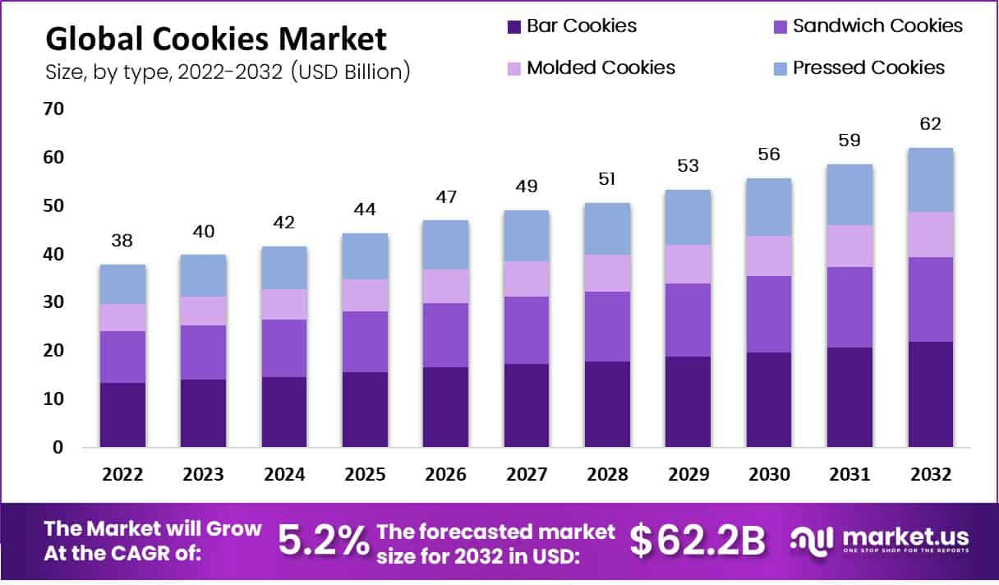
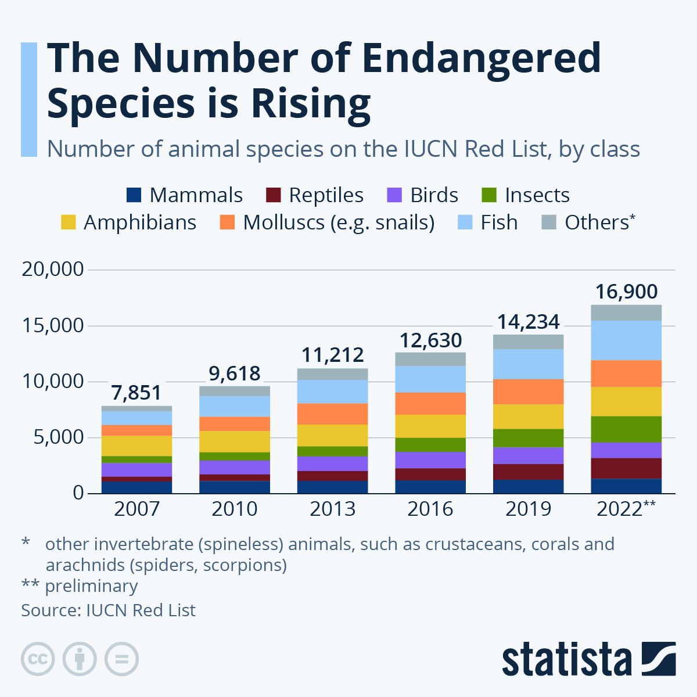
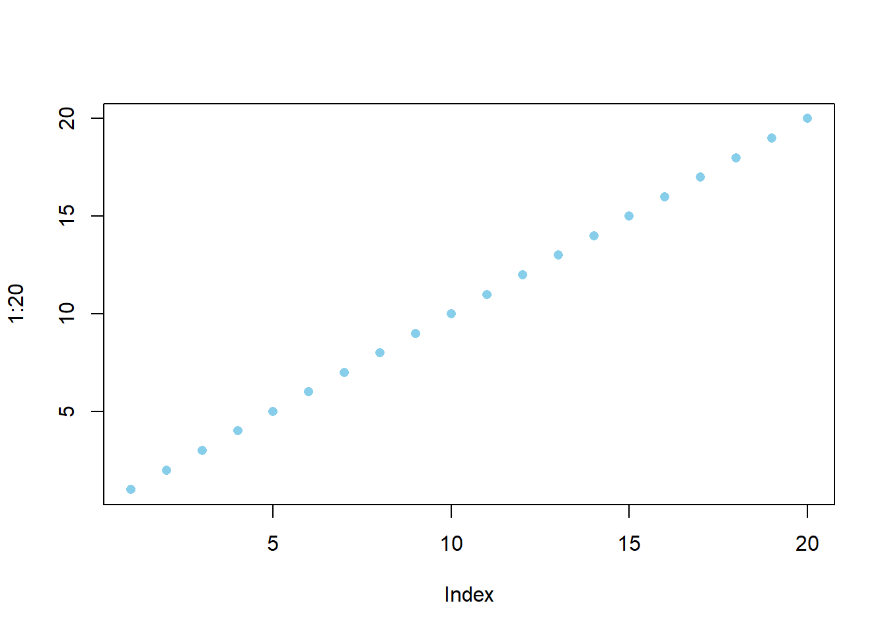

# Cookie Stats

  Earlier this year, Market.us posted [an article]((https://media.market.us/cookies-statistics/)) containing visualizations pertaining to the global cookie market. Here is the visualization:



## What's Unique or Good:

  The colors are pleasing and the chart overall looks fairly sleek. The legend looks pretty nice and allows the chart to be more compact by placing them in the top (even if it does look a bit wonky.)

## What Could Be Improved:

  There is an issue that one might not see at first glance, but is huge when you see it: This chart is showing projected growth, not actual growth, and this is not explicitly stated anywhere. Additionally, the left hand size of the axis is not well explained. It appears to be USD in the Billions, but this is only understood when looking at the bottom of the chart. This could be better labeled on the axis. There is also a lot of sub-information, like what percentage of each year each cookie would take up.

# Endangered Species

  In early January 2023, Statistica published [a chart]((https://www.statista.com/chart/17122/number-of-threatened-species-red-list/)) based on the rise of endangered species. Here is that chart:



## What's Unique or Good

  The chart is very clean, has great colors, and the numbers and information are very legible. It's cool to see the asterisks explaining more about the animals involved. The title is very straightforward and it's clear what is being displayed.

## What Could Be Improved

  The background has a pale blue background that is a bit distracting, I think a plain white could be better. Some years are skipped, which is not a big drawback, but suggests that perhaps a shared line chart showing each year could be shown that would have more information.

# Books Sales Stats

  In mid June of 2023, Wordsrated made [an article](https://wordsrated.com/book-sales-statistics/) sharing statistics and charts about books. Here is the chart:


## What's Unique or Good

  The chart interestingly combines past years with future projections. It's very clean, explains it's units, and also has each book type's share of the market displayed over the bars, which is helpful for visualization.


## What Could Be Improved

  It's not displayed clearly that the chart is mixing past data with future projection, and this could be seen as misleading. The chart also does not contain information for audiobooks before 2020, and it's not clearly stated what the reason is for the absence of that information.
  
  
# Conclusion.

It's noteworthy that these were all different kinds of bar charts, but that they each used bar charts differently, with different locations for labeling, different coloring, and different purposes and timelines. I think that goes to show that every kind of chart can be done well or poorly, with a variety of different styles of execution.


# Code:


::: {.cell}

```{.r .cell-code}
plot(1:20, col="skyblue",pch=16);
```

::: {.cell-output-display}
{width=672}
:::
:::
