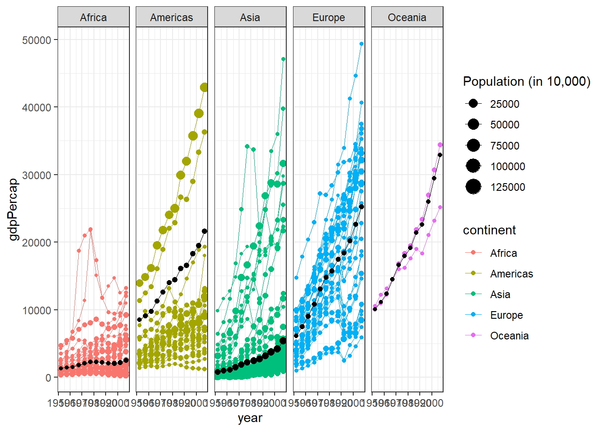

::: {.cell}

:::

::: {.cell}

```{.r .cell-code}
gm_clean <- gapminder %>% filter(country != "Kuwait")

gm3 <- gm_clean %>% group_by(continent,year) %>% summarise(meanGdp = weighted.mean(gdpPercap,pop),pop=mean(pop))
  
gm3 <- gm_clean %>% 
  group_by(continent, year) %>% 
  summarise(meanGdp = weighted.mean(gdpPercap, pop), 
            pop = mean(pop))

ggplot(gm_clean,aes(x=year, y=gdpPercap, group = country, color = continent, size = pop/10000)) +
  geom_point() +
  geom_line(linewidth = .1) +
  facet_grid(~continent) +
  theme_bw()+
  labs(size = "Population (in 10,000)")+
  geom_point(data = gm3, mapping= aes(x = year, y = meanGdp, group = continent, size = pop/10000), color="black")+
  geom_line(data = gm3, mapping = aes(x = year, y = meanGdp, group = continent), color="black", size = .2)
```

::: {.cell-output-display}
{width=672}
:::
:::
