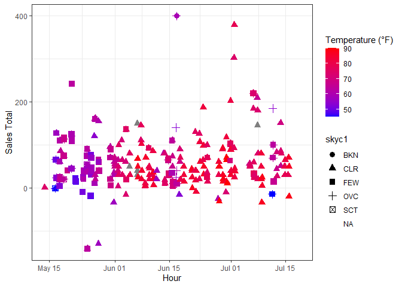

```r
# install.packages("riem")
```


```r
library(readr)
library(lubridate)
```

```
## 
## Attaching package: 'lubridate'
```

```
## The following objects are masked from 'package:base':
## 
##     date, intersect, setdiff, union
```

```r
library(dplyr)
```

```
## 
## Attaching package: 'dplyr'
```

```
## The following objects are masked from 'package:stats':
## 
##     filter, lag
```

```
## The following objects are masked from 'package:base':
## 
##     intersect, setdiff, setequal, union
```

```r
library(riem)
```

```
## Warning: package 'riem' was built under R version 4.3.3
```

```r
library(tidyverse)
```

```
## ── Attaching core tidyverse packages ──────────────────────── tidyverse 2.0.0 ──
## ✔ forcats 1.0.0     ✔ stringr 1.5.1
## ✔ ggplot2 3.4.4     ✔ tibble  3.2.1
## ✔ purrr   1.0.2     ✔ tidyr   1.3.0
```

```
## ── Conflicts ────────────────────────────────────────── tidyverse_conflicts() ──
## ✖ dplyr::filter() masks stats::filter()
## ✖ dplyr::lag()    masks stats::lag()
## ℹ Use the conflicted package (<http://conflicted.r-lib.org/>) to force all conflicts to become errors
```


```r
carwash <- read_csv("https://byuistats.github.io/M335/data/carwash.csv")
```

```
## Rows: 533 Columns: 4
## ── Column specification ────────────────────────────────────────────────────────
## Delimiter: ","
## chr  (2): name, type
## dbl  (1): amount
## dttm (1): time
## 
## ℹ Use `spec()` to retrieve the full column specification for this data.
## ℹ Specify the column types or set `show_col_types = FALSE` to quiet this message.
```


```r
View(carwash)
```


```r
carwash$fixedTime <- ymd_hms(carwash$time)
carwash <- carwash %>%
  mutate(hour = ceiling_date(fixedTime, unit = "hour")
)
```


```r
hourly_carwash <- carwash %>%
  mutate(hour = floor_date(fixedTime, unit = "hour")) %>%
  group_by(name, type, hour) %>%
  summarise(
    salesTotal = sum(amount, na.rm = TRUE),
    .groups = 'drop'  # To ungroup after summarising
  ) %>%
  select(name, type, hour, salesTotal)
```


```r
View(hourly_carwash)
```


```r
carwash <- carwash %>%
  mutate(hour = ceiling_date(fixedTime, unit = "hour")) %>%
  left_join(
    carwash %>%
      group_by(hour) %>%
      summarise(total_sales = sum(amount, na.rm = TRUE)),
    by = "hour"
  ) %>%
  rename(salesTotals = total_sales)
```


```r
earliest_date <- min(carwash$fixedTime, na.rm = TRUE)
latest_date <- max(carwash$fixedTime, na.rm = TRUE)

earliest_date
```

```
## [1] "2016-05-13 20:27:00 UTC"
```

```r
latest_date
```

```
## [1] "2016-07-18 16:58:00 UTC"
```


```r
rextemps <- riem_measures(station = "RXE", date_start = "2016-05-13" , date_end = "2016-07-18")
```


```r
View(rextemps)
```


```r
rextemps <- rextemps %>%
  mutate(
    time = ymd_hms(valid, quiet = TRUE), # Use quiet=TRUE to suppress warnings
    hour = floor_date(time, unit = "hour")
  )
rextemps <- rextemps %>%
  mutate(hour = floor_date(time, unit = "hour"))

merged_data <- hourly_carwash %>%
  left_join(rextemps, by = "hour")
```


```r
View(merged_data)
```


```r
merged_data <- merged_data %>% arrange(hour)
merged_data <- merged_data %>%
  group_by(hour) %>%
  fill(tmpf, .direction = "downup") %>%
  ungroup()
```


```r
ggplot(merged_data, aes(x = hour, y = salesTotal, color = tmpf, shape = skyc1)) +
  geom_point(size = 3) +
  scale_color_gradient(name = "Temperature (°F)", low = "blue", high = "red") +
  labs(x = "Hour", y = "Sales Total") +
  theme_bw()
```

```
## Warning: Removed 41 rows containing missing values (`geom_point()`).
```

<!-- -->


