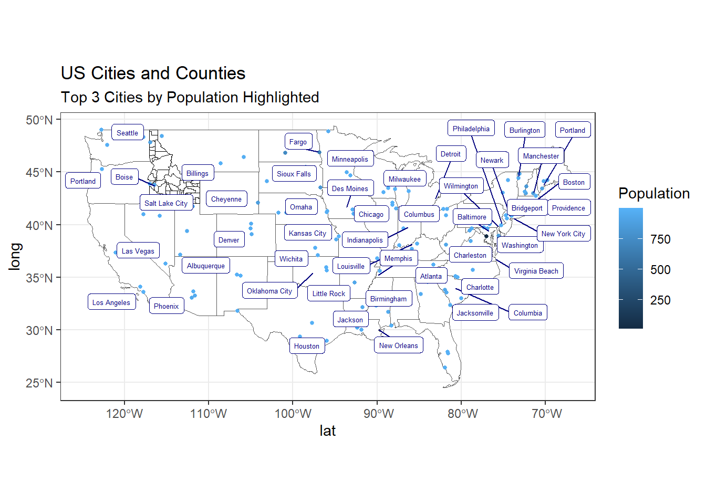

https://spatialreference.org/ 
https://spatialreference.org/ref/epsg/4326/

devtools::install_github('jgcri/rgis')


::: {.cell}

```{.r .cell-code}
install.packages("devtools")
install.packages("sf")

install.packages("USAboundaries", repos = "https://ropensci.r-universe.dev", type = "source")
install.packages("USAboundariesData", repos = "https://ropensci.r-universe.dev", type = "source")

#OR
install.packages("devtools")
devtools::install_github("ropensci/USAboundaries")
devtools::install_github("ropensci/USAboundariesData")

#OR
install.packages("USAboundaries")
```
:::

::: {.cell}

```{.r .cell-code}
library(tidyverse)
library(sf)
library(USAboundaries)
library(USAboundariesData)
library(dplyr)
library(lubridate)
library(ggrepel)
```
:::

::: {.cell}

```{.r .cell-code}
states <- us_states()

lower_48 <- states %>% filter(name %in% state.name, name != "Hawaii", name != "Alaska", name != "Puerto Rico")

us_cities <- us_cities() %>%
  filter(!(state_name %in% c("Alaska", "Hawaii"))) %>%
  mutate(population = sample(1:1000000, n(), replace = TRUE))

us_cities_top3 <- us_cities %>%
  group_by(state_name) %>%
  arrange(desc(population)) %>%  # Arrange by population in descending order
  slice(1:3) %>%  # Select the top 3 cities by population
  mutate(index = row_number()) %>%  # Create an index for top 3 cities
  ungroup()
  
us_cities_top1 <-  us_cities() %>%
  filter(!state_name %in% c("Alaska", "Hawaii", "Puerto Rico")) %>%
    group_by(state_name) %>%
      arrange(desc(population)) %>%
        slice(1) %>%
          mutate(
            lat = st_coordinates(geometry)[,1],
            long = st_coordinates(geometry)[,2]
  )

id_counties <- us_counties(states ="Idaho")


ggplot() +
  geom_sf(data = lower_48, fill = "white") +  # Outline of states
  geom_sf(data = id_counties, fill = "white", color = "black") +
  geom_sf(data = us_cities_top3, aes(color = (population/1000)), size = 1) +
  geom_label_repel(data = us_cities_top1, 
                   aes(
                     label = city,
                     x = lat,
                     y = long),
                   color = "navy",
                   size=1.7,
                   force=1,
                   max.overlaps = 50) +
  labs(title = "US Cities and Counties",
       subtitle = "Top 3 Cities by Population Highlighted",
       color = "Population") +
  theme_bw()# Cities with color based on population
```

::: {.cell-output-display}
{width=672}
:::
:::


```


