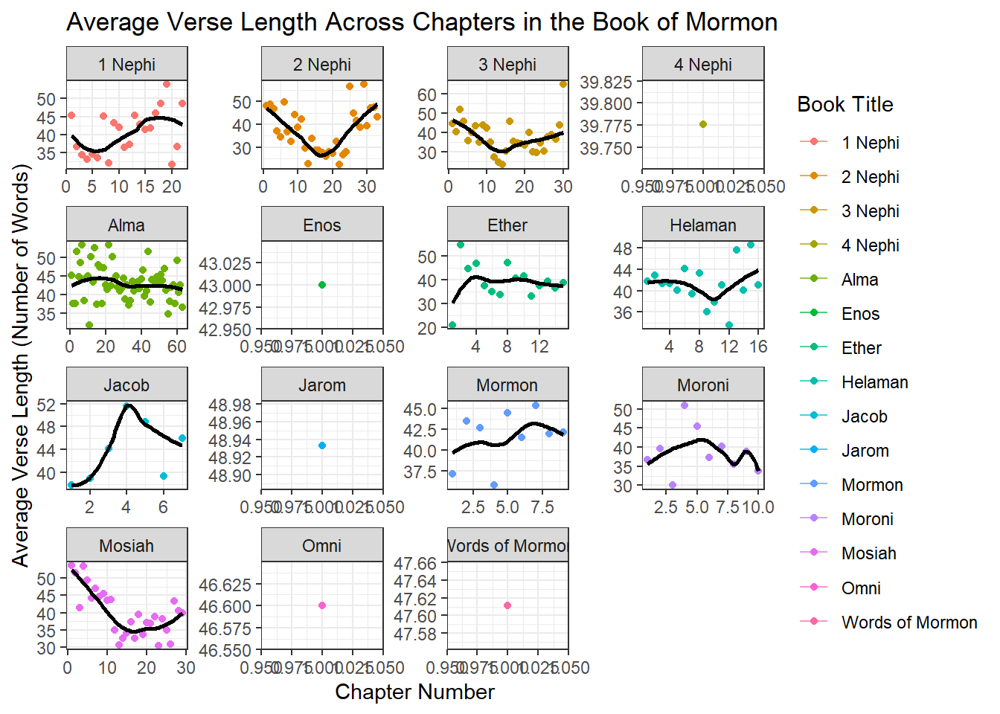

# Comparison of Average Verse Length in the New Testament vs The Book of Mormon


::: {.cell}

```{.r .cell-code}
scriptures_data <- rio::import("http://scriptures.nephi.org/downloads/lds-scriptures.csv.zip") %>% 
  as_tibble()
```
:::

::: {.cell}

```{.r .cell-code}
# Filter for the Book of Mormon
bom_text <- scriptures_data %>%
  filter(volume_title == "Book of Mormon")
```
:::

::: {.cell}

```{.r .cell-code}
# View(scriptures_data)
```
:::

::: {.cell}

```{.r .cell-code}
average_length_nt <- scriptures_data %>%
  filter(volume_title == "New Testament") %>%
  mutate(word_count = str_count(scripture_text, "\\w+")) %>%
  summarize(avg_length = mean(word_count)) %>%
  pull(avg_length)

average_length_bom <- scriptures_data %>%
  filter(volume_title == "Book of Mormon") %>%
  mutate(word_count = str_count(scripture_text, "\\w+")) %>%
  summarize(avg_length = mean(word_count)) %>%
  pull(avg_length)


print("Average Verse Length in the New Testament:")
```

::: {.cell-output .cell-output-stdout}

```
[1] "Average Verse Length in the New Testament:"
```


:::

```{.r .cell-code}
average_length_nt
```

::: {.cell-output .cell-output-stdout}

```
[1] 22.70517
```


:::

```{.r .cell-code}
# --> 22.71

print("Average Verse Length in the Book of Mormon")
```

::: {.cell-output .cell-output-stdout}

```
[1] "Average Verse Length in the Book of Mormon"
```


:::

```{.r .cell-code}
average_length_bom
```

::: {.cell-output .cell-output-stdout}

```
[1] 40.50863
```


:::

```{.r .cell-code}
# 40.51
```
:::


# Number of Times "Jesus" is used in the New Testament Compared to The Book Of Mormon


::: {.cell}

```{.r .cell-code}
jesus_count_nt <- scriptures_data %>%
  filter(volume_title == "New Testament") %>%
  mutate(jesus_count = str_count(scripture_text, "\\bJesus\\b")) %>%
  pull(jesus_count) %>%
  sum()

# Count occurrences of "Jesus" in Book of Mormon
jesus_count_bom <- scriptures_data %>%
  filter(volume_title == "Book of Mormon") %>%
  mutate(jesus_count = str_count(scripture_text, "\\bJesus\\b")) %>%
  pull(jesus_count) %>%
  sum()

# Print the results
print(paste("Count of 'Jesus' in New Testament:", jesus_count_nt))
```

::: {.cell-output .cell-output-stdout}

```
[1] "Count of 'Jesus' in New Testament: 976"
```


:::

```{.r .cell-code}
# --> 976
print(paste("Count of 'Jesus' in Book of Mormon:", jesus_count_bom))
```

::: {.cell-output .cell-output-stdout}

```
[1] "Count of 'Jesus' in Book of Mormon: 184"
```


:::

```{.r .cell-code}
# --> 184
```
:::


# Average Word Count by Verse in the Book of Mormon


::: {.cell}

```{.r .cell-code}
#View(bom_text)

bom_text <- bom_text %>%
  mutate(verse_length = str_extract_all(scripture_text, "\\w+") %>%
                          lengths())
                      

# Calculate verse count within each book_title
bom_text <- bom_text %>%
  group_by(book_title) %>%
  mutate(verse_count = row_number()) %>%
  ungroup()
```
:::

::: {.cell}

```{.r .cell-code}
ggplot(bom_text, aes(x = verse_count, y = verse_length, color = book_title)) +
  geom_point() +
  facet_wrap(~ book_title, scales = "free") +  # Ensure scales are free for each facet
  geom_line() +
  geom_smooth(method = "loess", se = FALSE, color = "black") +
  labs(title = "Verse Length Across Verses in the Book of Mormon",
       x = "Verse Number",
       y = "Verse Length (Number of Words)",
       color = "Book Short Title") +
  theme_bw()
```

::: {.cell-output-display}
{width=672}
:::
:::

::: {.cell}

```{.r .cell-code}
library(ggplot2)
library(dplyr)

# Define sunset color palette
sunset_colors <- colorRampPalette(c("#FFD700", "#FFA500", "#FF6347", "#FF4477","#6622FF"))

# List of book titles to iterate over
book_titles <- unique(bom_text$book_title)

# Create a list to store plots
plots <- list()

# Iterate over each book title
for (title in book_titles) {
  
  # Filter data for current book title
  book_data <- filter(bom_text, book_title == title)
  
  # Plot for current book title
  plot <- ggplot(book_data, aes(x = verse_count, y = verse_length, color = book_title)) +
    geom_point(colour = sunset_colors(length(book_titles))[which(book_titles == title)]) +  # Use custom sunset color
    geom_smooth(method = "loess", se = FALSE, color = "black", alpha = 0.5) +
    labs(title = paste("Verse Length Across Verses in the Book of Mormon (", title, ")", sep = ""),
         x = "Verse Number",
         y = "Verse Length (Number of Words)",
         color = "Book Short Title") +
    theme_bw()
  
  # Store plot in the list
  plots[[title]] <- plot
}

# Display all plots (optional)
print(plots)
```

::: {.cell-output .cell-output-stdout}

```
$`1 Nephi`
```


:::

::: {.cell-output-display}
{width=672}
:::

::: {.cell-output .cell-output-stdout}

```

$`2 Nephi`
```


:::

::: {.cell-output-display}
{width=672}
:::

::: {.cell-output .cell-output-stdout}

```

$Jacob
```


:::

::: {.cell-output-display}
{width=672}
:::

::: {.cell-output .cell-output-stdout}

```

$Enos
```


:::

::: {.cell-output-display}
{width=672}
:::

::: {.cell-output .cell-output-stdout}

```

$Jarom
```


:::

::: {.cell-output-display}
{width=672}
:::

::: {.cell-output .cell-output-stdout}

```

$Omni
```


:::

::: {.cell-output-display}
{width=672}
:::

::: {.cell-output .cell-output-stdout}

```

$`Words of Mormon`
```


:::

::: {.cell-output-display}
{width=672}
:::

::: {.cell-output .cell-output-stdout}

```

$Mosiah
```


:::

::: {.cell-output-display}
{width=672}
:::

::: {.cell-output .cell-output-stdout}

```

$Alma
```


:::

::: {.cell-output-display}
{width=672}
:::

::: {.cell-output .cell-output-stdout}

```

$Helaman
```


:::

::: {.cell-output-display}
{width=672}
:::

::: {.cell-output .cell-output-stdout}

```

$`3 Nephi`
```


:::

::: {.cell-output-display}
{width=672}
:::

::: {.cell-output .cell-output-stdout}

```

$`4 Nephi`
```


:::

::: {.cell-output-display}
{width=672}
:::

::: {.cell-output .cell-output-stdout}

```

$Mormon
```


:::

::: {.cell-output-display}
{width=672}
:::

::: {.cell-output .cell-output-stdout}

```

$Ether
```


:::

::: {.cell-output-display}
{width=672}
:::

::: {.cell-output .cell-output-stdout}

```

$Moroni
```


:::

::: {.cell-output-display}
{width=672}
:::

```{.r .cell-code}
# Access individual plots by book title, e.g., plots$"1 Ne."
```
:::
