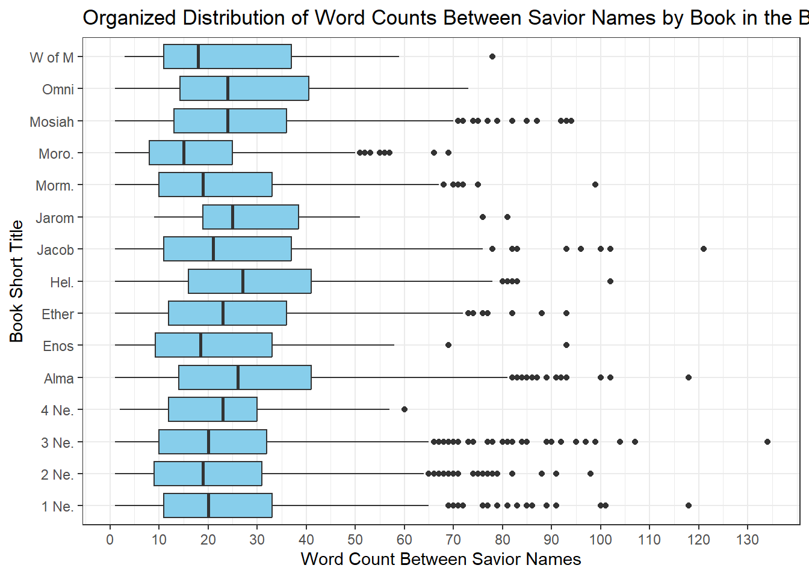
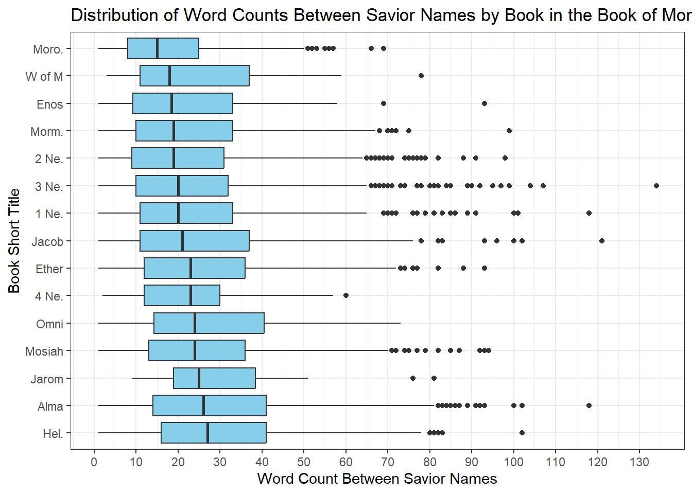

# Comparison of Average Verse Length in the New Testament vs The Book of Mormon


::: {.cell}

```{.r .cell-code}
scriptures_data <- rio::import("http://scriptures.nephi.org/downloads/lds-scriptures.csv.zip") %>% 
  as_tibble()
```
:::

::: {.cell}

```{.r .cell-code}
View(scriptures_data)
```
:::

::: {.cell}

```{.r .cell-code}
average_length_nt <- scriptures_data %>%
  filter(volume_title == "New Testament") %>%
  mutate(word_count = str_count(scripture_text, "\\w+")) %>%
  summarize(avg_length = mean(word_count)) %>%
  pull(avg_length)

average_length_bom <- scriptures_data %>%
  filter(volume_title == "Book of Mormon") %>%
  mutate(word_count = str_count(scripture_text, "\\w+")) %>%
  summarize(avg_length = mean(word_count)) %>%
  pull(avg_length)


print("Average Verse Length in the New Testament:")
```

::: {.cell-output .cell-output-stdout}

```
[1] "Average Verse Length in the New Testament:"
```


:::

```{.r .cell-code}
average_length_nt
```

::: {.cell-output .cell-output-stdout}

```
[1] 22.70517
```


:::

```{.r .cell-code}
# --> 22.71

print("Average Verse Length in the Book of Mormon")
```

::: {.cell-output .cell-output-stdout}

```
[1] "Average Verse Length in the Book of Mormon"
```


:::

```{.r .cell-code}
average_length_bom
```

::: {.cell-output .cell-output-stdout}

```
[1] 40.50863
```


:::

```{.r .cell-code}
# 40.51
```
:::

# Number of Times "Jesus" is used in the New Testament Compared to The Book Of Mormon


::: {.cell}

```{.r .cell-code}
jesus_count_nt <- scriptures_data %>%
  filter(volume_title == "New Testament") %>%
  mutate(jesus_count = str_count(scripture_text, "\\bJesus\\b")) %>%
  pull(jesus_count) %>%
  sum()

# Count occurrences of "Jesus" in Book of Mormon
jesus_count_bom <- scriptures_data %>%
  filter(volume_title == "Book of Mormon") %>%
  mutate(jesus_count = str_count(scripture_text, "\\bJesus\\b")) %>%
  pull(jesus_count) %>%
  sum()

# Print the results
print(paste("Count of 'Jesus' in New Testament:", jesus_count_nt))
```

::: {.cell-output .cell-output-stdout}

```
[1] "Count of 'Jesus' in New Testament: 976"
```


:::

```{.r .cell-code}
# --> 976
print(paste("Count of 'Jesus' in Book of Mormon:", jesus_count_bom))
```

::: {.cell-output .cell-output-stdout}

```
[1] "Count of 'Jesus' in Book of Mormon: 184"
```


:::

```{.r .cell-code}
# --> 184
```
:::


# Savior's Names Distances in the Book of Mormon


::: {.cell}

```{.r .cell-code}
download.file(url = "https://byuistats.github.io/M335/data/BoM_SaviorNames.rds", destfile = "BoM_SaviorNames.rds", mode = "wb")
savior_names <- read_rds("BoM_SaviorNames.rds") %>% as_tibble()

sav_names <- savior_names %>% pull(name) %>% str_c(collapse = "|")
```
:::

::: {.cell}

```{.r .cell-code}
bom_data <- rio::import("http://scriptures.nephi.org/downloads/lds-scriptures.csv.zip") %>%
  as_tibble()

# Filter for the Book of Mormon
bom_text <- bom_data %>%
  filter(volume_title == "Book of Mormon") %>%
  select(book_short_title, scripture_text)
```
:::

::: {.cell}

```{.r .cell-code}
# str_length(bom_text$scripture_text)
```
:::

::: {.cell}

```{.r .cell-code}
# Calculate the number of words between occurrences of Savior names
dist_between <- bom_text %>%
  rowwise() %>%
  mutate(text_split = list(str_split(scripture_text, pattern = sav_names)[[1]])) %>%
  unnest(text_split) %>%
  mutate(word_count = str_count(text_split, "\\w+")) %>%
  filter(word_count > 0) %>%
  select(book_short_title, word_count) %>%
  rename(n.between = word_count)
```
:::

::: {.cell}

```{.r .cell-code}
# Create the box plot
ggplot(dist_between, aes(y = book_short_title, x = n.between)) +
  scale_x_continuous(breaks = seq(0, max(dist_between$n.between), by = 10))+
  geom_boxplot(fill="skyblue") +
  labs(title = "Organized Distribution of Word Counts Between Savior Names by Book in the Book of Mormon",
       x = "Word Count Between Savior Names",
       y = "Book Short Title") +
  
  theme_bw()
```

::: {.cell-output-display}
{width=672}
:::
:::

::: {.cell}

```{.r .cell-code}
median_data <- dist_between %>%
  group_by(book_short_title) %>%
  summarize(median_n_between = median(n.between)) %>%
  arrange(desc(median_n_between)) %>%
  pull(book_short_title)

# Reorder book_short_title factor levels based on median n.between
dist_between$book_short_title <- factor(dist_between$book_short_title, levels = median_data)

# Create the box plot
ggplot(dist_between, aes(y = book_short_title, x = n.between)) +
  geom_boxplot(fill = "skyblue") +
  labs(title = "Distribution of Word Counts Between Savior Names by Book in the Book of Mormon",
       x = "Word Count Between Savior Names",
       y = "Book Short Title") +
  scale_x_continuous(breaks = seq(0, max(dist_between$n.between), by = 10)) +
  theme_bw()
```

::: {.cell-output-display}
{width=672}
:::
:::
