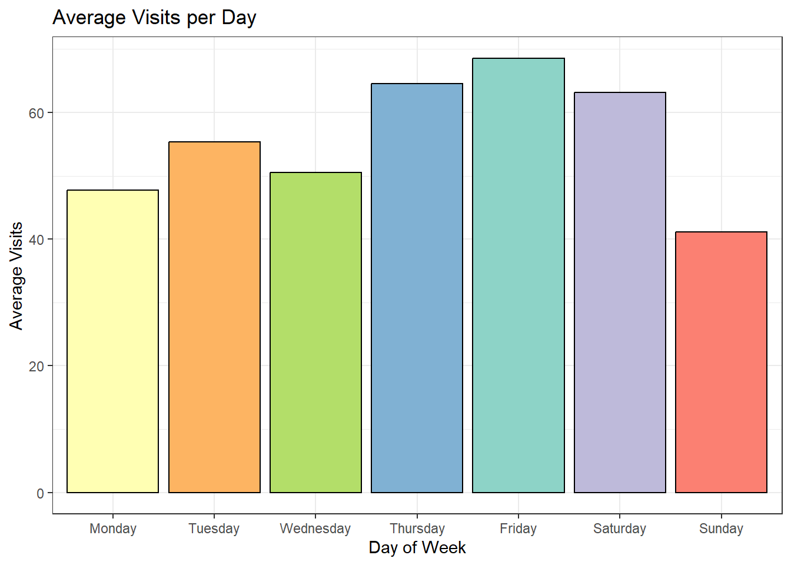
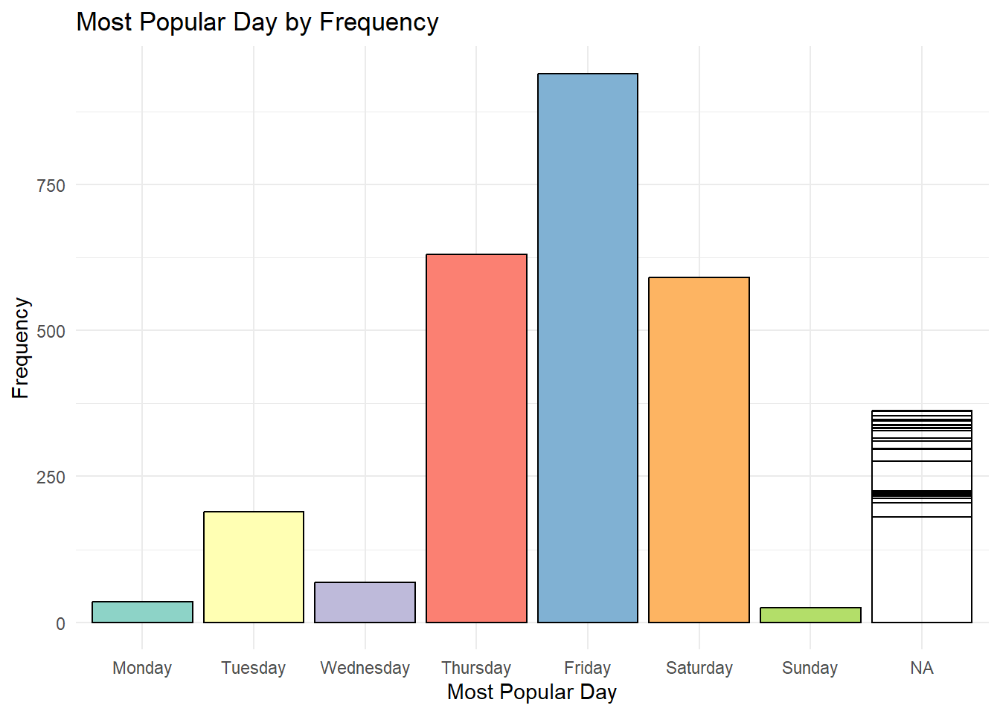

::: {.cell}

```{.r .cell-code}
pacman::p_load(tidyverse,dplyr,lubridate,readr,stringi,stringr,purrr)
```
:::

::: {.cell}

```{.r .cell-code}
chptl <- read_csv('https://byuistats.github.io/M335/data/chipotle_reduced.csv')
```
:::

::: {.cell}

```{.r .cell-code}
glimpse(chptl)
```

::: {.cell-output .cell-output-stdout}

```
Rows: 2,844
Columns: 22
$ placekey                 <chr> "227-222@627-sd6-7dv", "zzw-223@5r8-fqv-xkf",…
$ latitude                 <dbl> 41.03327, 36.14081, 33.72817, 42.10540, 32.91…
$ longitude                <dbl> -73.76443, -95.96862, -116.40305, -80.13165, …
$ street_address           <chr> "250 Main St Ste 101", "1623 E 15th St", "723…
$ city                     <chr> "White Plains", "Tulsa", "Palm Desert", "Erie…
$ region                   <chr> "NY", "OK", "CA", "PA", "TX", "CA", "MN", "CA…
$ postal_code              <dbl> 10601, 74120, 92260, 16505, 76177, 90024, 554…
$ phone_number             <dbl> 19149484826, 19185829005, 17603461838, 181445…
$ open_hours               <chr> "{ \"Mon\": [[\"10:45\", \"22:00\"]], \"Tue\"…
$ date_range_start         <dttm> NA, 2021-07-01 05:00:00, 2021-07-01 07:00:00…
$ date_range_end           <dttm> NA, 2021-08-01 05:00:00, 2021-08-01 07:00:00…
$ raw_visit_counts         <dbl> NA, 2, 173, 452, 486, 9, 275, 42, 521, 612, 7…
$ raw_visitor_counts       <dbl> NA, 2, 157, 344, 419, 6, 206, 40, 351, 383, 5…
$ visits_by_day            <chr> NA, "[0,0,0,0,0,0,0,0,0,1,0,0,0,1,0,0,0,0,0,0…
$ distance_from_home       <dbl> NA, NA, 12908, 9199, 5374, 3979, 9457, 3235, …
$ median_dwell             <dbl> NA, 6, 15, 10, 9, 23, 15, 22, 11, 9, 11, 8, 1…
$ bucketed_dwell_times     <chr> NA, "{\"<5\":0,\"5-10\":2,\"11-20\":0,\"21-60…
$ related_same_day_brand   <chr> NA, "{\"Walmart\":50,\"Buffalo Wild Wings\":5…
$ related_same_month_brand <chr> NA, "{\"Walmart\":100,\"QuikTrip\":100,\"Chur…
$ popularity_by_hour       <chr> NA, "[0,0,0,0,0,0,0,0,0,0,1,1,0,0,0,0,0,0,1,0…
$ popularity_by_day        <chr> NA, "{\"Monday\":0,\"Tuesday\":0,\"Wednesday\…
$ device_type              <chr> NA, "{\"android\":0,\"ios\":0}", "{\"android\…
```


:::
:::

::: {.cell}

```{.r .cell-code}
length(chptl)
```

::: {.cell-output .cell-output-stdout}

```
[1] 22
```


:::
:::

::: {.cell}

```{.r .cell-code}
Extract_Weekly_Visits <- function(string) {
  split_string <- str_remove_all(string, "[{}]") %>%
    str_split(",") %>%
    unlist() # Atomic vector instead of list

  # Split by colon, remove quotes, and create a data frame
  tib <- tibble(
    Day = map_chr(split_string, ~str_split(.x, ":")[[1]][1] %>% str_remove_all('"')),
    Visits = map_int(split_string, ~str_split(.x, ":")[[1]][2] %>% str_remove_all('"') %>% as.integer())
  )

  return(tib)
}
```
:::

::: {.cell}

```{.r .cell-code}
# Add a column where every element in it gets a new tibble

# function takes first data type as input,
#

chptl_day_visits <- chptl %>%
  filter(!is.na(popularity_by_day)) %>%
  mutate(
    n_visits_per_day = map(popularity_by_day, Extract_Weekly_Visits)
  )
```
:::

::: {.cell}

```{.r .cell-code}
# Calculate total visits per day across all weeks
total_visits_per_day <- chptl %>%
  mutate(across(contains("popularity_by_day"), ~map(., Extract_Weekly_Visits))) %>%
  unnest(cols = everything()) %>%
  group_by(Day) %>%
  summarise(total_visits = sum(Visits, na.rm = TRUE)) %>%
  arrange(match(Day, c("Monday", "Tuesday", "Wednesday", "Thursday", "Friday", "Saturday", "Sunday")))  # Arrange by day order
```
:::


## Average Visits Per Day


::: {.cell}

```{.r .cell-code}
# Calculate average visits per day
average_visits_per_day <- total_visits_per_day %>%
  mutate(avg_visits = total_visits / nrow(chptl))

# Plot average visits per day using ggplot
ggplot(average_visits_per_day, aes(x = Day, y = avg_visits, fill = Day)) +
  geom_col(color = "black") +
  labs(x = "Day of Week", y = "Average Visits", title = "Average Visits per Day") +
  scale_x_discrete(limits = c("Monday", "Tuesday", "Wednesday", "Thursday", "Friday", "Saturday", "Sunday")) +  # Ensure correct day order
  scale_fill_brewer(palette = "Set3") +  # Choose a color palette for days
  guides(fill="none") +
  theme_bw()
```

::: {.cell-output-display}
{width=672}
:::
:::


As we can see that the weekend days from Thursday to Saturday are the most popular, it would be smart to even out that frequency by running promotions from Sunday to Wednesday to even out the frequency.


## Most Popular Day by Frequency


::: {.cell}

```{.r .cell-code}
# Function 2
Most_Popular_Day <- function(string) {
  data <- Extract_Weekly_Visits(string)
  
  # Find the maximum number of visits
  max_visits <- max(data$Visits)
  
  # Find the day(s) with the maximum number of visits
  popular_days <- data %>% filter(Visits == max_visits) %>% pull(Day)
  
  # Return the most popular day(s) as a comma-separated string if there are ties
  return(paste(popular_days, collapse = ", "))
}
```
:::

::: {.cell}

```{.r .cell-code}
# Add a column where every element in it gets a new tibble

# function takes first data type as input,
#

chptl_day_visits <- chptl %>%
  filter(!is.na(popularity_by_day)) %>%
  mutate(
    n_visits_per_day = map(popularity_by_day, Extract_Weekly_Visits)
  )
```
:::

::: {.cell}

```{.r .cell-code}
# Calculate total visits per day across all weeks
total_visits_per_day <- chptl %>%
  mutate(across(contains("popularity_by_day"), ~map(., Extract_Weekly_Visits))) %>%
  unnest(cols = everything()) %>%
  group_by(Day) %>%
  summarise(total_visits = sum(Visits, na.rm = TRUE)) %>%
  arrange(match(Day, c("Monday", "Tuesday", "Wednesday", "Thursday", "Friday", "Saturday", "Sunday")))  # Arrange by day order
```
:::

::: {.cell}

```{.r .cell-code}
# Calculate most popular day(s) for each week
most_popular_days <- chptl %>%
  mutate(popular_day = map_chr(popularity_by_day, Most_Popular_Day))
    # filter(!is.na(popular_day) & popular_day != "") # Doesn't work

# Aggregate data to count occurrences of each day
popular_day_counts <- most_popular_days %>%
  group_by(popular_day) %>%
  summarise(count = n()) %>%
  mutate(popular_day = factor(popular_day, levels = c("Monday", "Tuesday", "Wednesday", "Thursday", "Friday", "Saturday", "Sunday")))

# Plot using ggplot
ggplot(popular_day_counts, aes(x = popular_day, y = count, fill = popular_day)) +
  geom_col(color = "black") +
  labs(x = "Most Popular Day", y = "Frequency", title = "Most Popular Day by Frequency") +
  scale_fill_brewer(palette = "Set3") +  # Choose a color palette for days
  guides(fill="none") +
  theme_minimal()
```

::: {.cell-output-display}
{width=672}
:::
:::

According to this graph, we see that for the vast majority of weeks, Friday is the most popular day. While Thursday and Saturday are sometimes the most popular, the other days are almost never the most popular. We should run promotions on Monday, Tuesday, Wednesday, and Sunday to even out the frequency.


## Other Recommendations

As seen before, promotions should run on days that are not Thursday, Friday, or Saturday. We can see that the frequency at which Friday is the most popular, and the average number of visits per week both show how popular Friday is. Ideally we could work to make other days more attended.

We should also look into missing data points to see why that data is missing and how we can make sure we get data for those stores in the future.


::: {.cell}

```{.r .cell-code}
saveRDS(chptl_day_visits, file = "chptl_day_visits.rds")
```
:::
