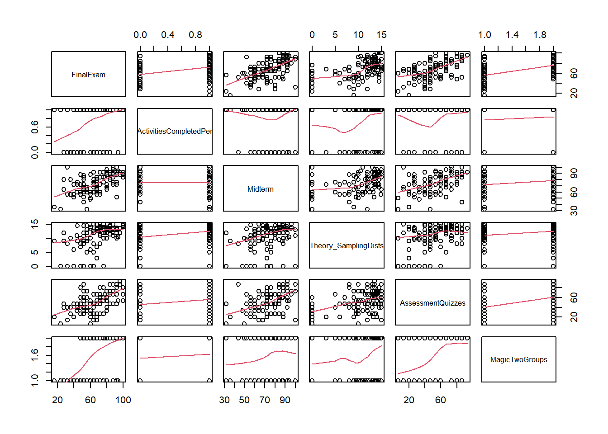
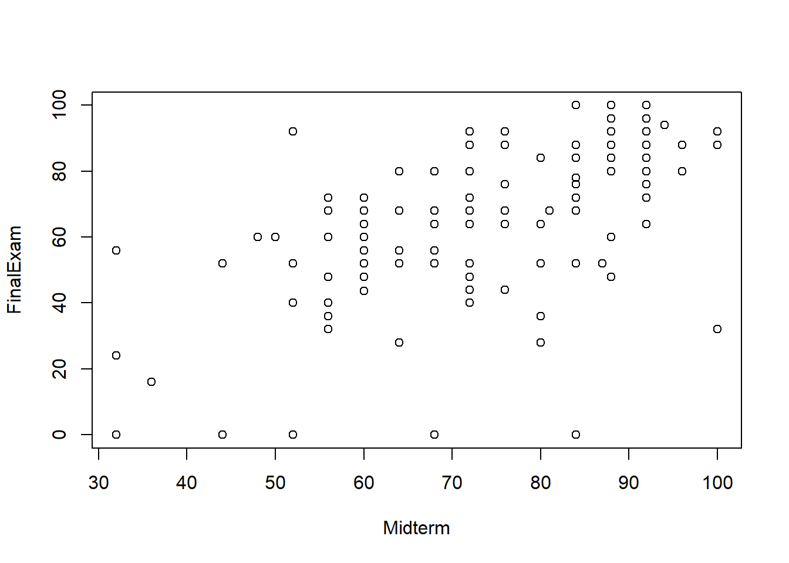
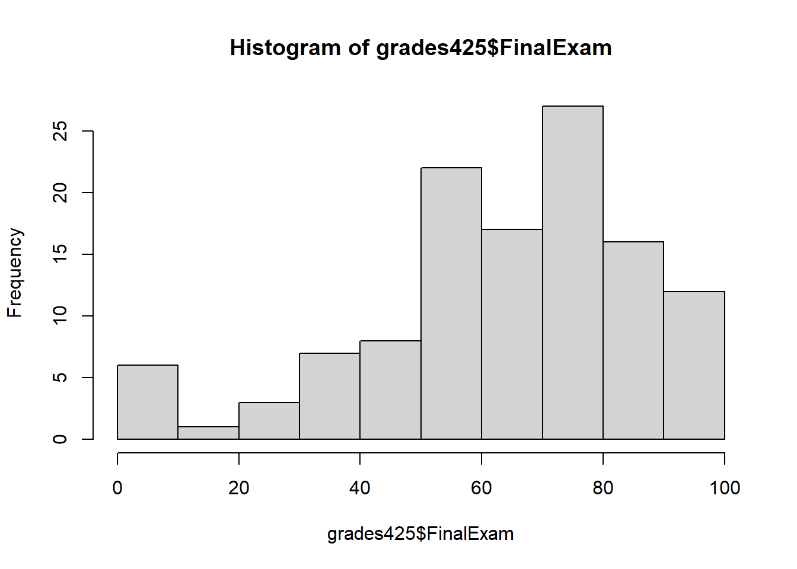
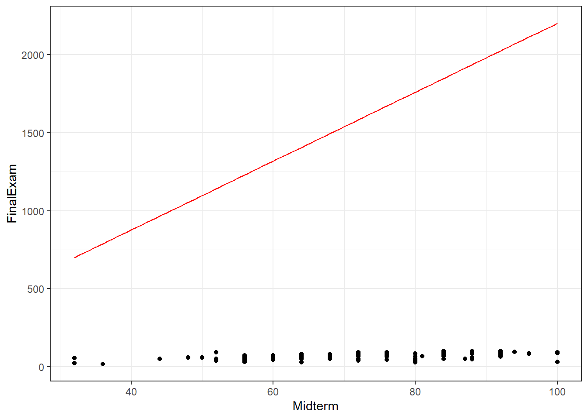
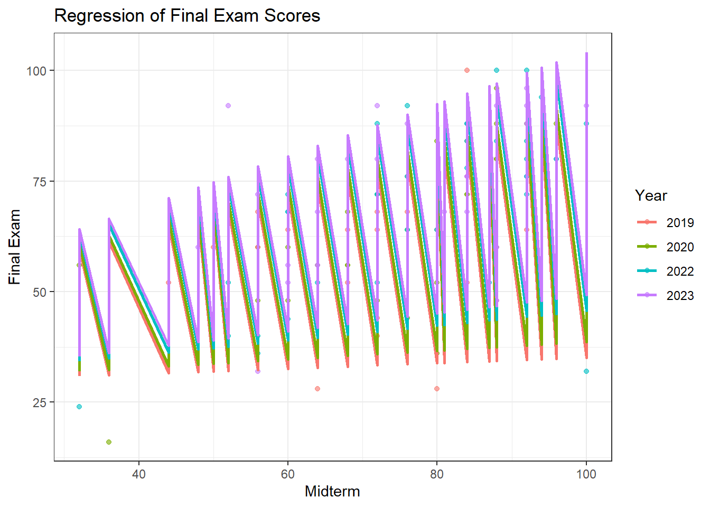

## Midterm Decision Analysis


::: {.cell}

```{.r .cell-code}
pacman::p_load(tidyverse,dplyr,car,readr,purrr,broom,pander)
```
:::

::: {.cell}

```{.r .cell-code}
grades425 <- read_csv("Math425PastGrades.csv")
BenGrades <- data.frame(
  FinalExam = NA,
  Midterm = 76,
  Section = "Spring 2024",
  Gender = "M",
  AttendedAlmostAlways = "Y",
  SpentTimeInOfficeHours = "Y",
  Analysis_PredWeather = 14.2,
  Theory_Residuals = 11,
  Analysis_CarPrices = 13,
  Theory_SamplingDists = 11,
  SkillsQuizzes = 7/9,
  AssessmentQuizzes = 7/9,
  ClassActivitiesCompletedPerfectly = "Y",
  SkillsQuizzesCompletedPerfectly = "N",
  MagicTwoGroups = 1
)
```
:::

::: {.cell}

```{.r .cell-code}
grades425 <- drop_na(grades425)
```
:::

::: {.cell}

```{.r .cell-code}
ConvertColumnToBinary <- function(dataset){
  binary_columns <- c(
    "AttendedAlmostAlways", "SpentTimeInOfficeHours",
    "ClassActivitiesCompletedPerfectly", "SkillsQuizzesCompletedPerfectly"
  )
  
  dataset <- dataset %>% 
    mutate(across(all_of(binary_columns), ~ ifelse(trimws(.) == "Y", 1, 0))) %>% 
    mutate(
      MagicTwoGroups = as.numeric(MagicTwoGroups),
      Gender = ifelse(trimws(Gender) == "M", 1, 0)
    )
  
  return(dataset)
}
```
:::

::: {.cell}

```{.r .cell-code}
SplitSectionColumn <- function(dataset) {
  dataset <- dataset %>%
    separate(Section, into = c("Track", "Year"), sep = " ") %>%
    mutate(
      Track = case_when(
        Track == "Winter" ~ 2,
        Track == "Spring" ~ 1, # Weakest?
        Track == "Fall" ~ 3,
        TRUE ~ NA_real_
      ),
      Year = as.numeric(Year)
    )
  
  return(dataset)
}
```
:::

::: {.cell}

```{.r .cell-code}
grades425 <- ConvertColumnToBinary(grades425)
BenGrades <- ConvertColumnToBinary(BenGrades)

grades425 <- SplitSectionColumn(grades425)
BenGrades <- SplitSectionColumn(BenGrades)
```
:::


### Introduction

Math 425 Students have the decision to keep or drop their midterm score. Using data from past math 425 students, can a model be made that can accurately inform a student as to whether they should keep or drop their midterm score?

Using my model, I chose to keep my midterm. In hindsight, having taken the final exam, keeping my midterm was the wrong decision, as I scored higher on the final than the midterm. I'll show my decision making and the model I used.

### Decision

I decided to keep my midterm because it was over a 75%, and if the score of my final exam was anything over a 60%, getting my grade back up to a passing grade would be easier than if I didn't keep the midterm. My decision to keep my midterm score was to keep it as a safety net instead of to get the best grade possible in the class overall.

In hindsight this was not the best decision because I got an 84 on the final exam, but that wasn't enough to get me to a higher grade level, so in the end the decision to keep my midterm was not meaningful.


### Data

### Pairs Plot

We want to understand how a lot of factors relate to the Final Exam score. We'll use a pairs plot that only shows variables I picked in my final model. We will also exclude data with NA's, and also drop students for which the Final Exam had interesting circumstances that make analysis difficult, like if it was 0 when 0 indicates that the exam was dropped.


::: {.cell}

```{.r .cell-code}
g425no0 <- grades425 %>% filter(FinalExam != 0)
g425 <- g425no0 %>% select(
  FinalExam,
  ClassActivitiesCompletedPerfectly,
  Midterm,
  Theory_SamplingDists,
  AssessmentQuizzes,
  ClassActivitiesCompletedPerfectly,
  MagicTwoGroups)

pairs(g425,panel=panel.smooth)
```

::: {.cell-output-display}
{width=672}
:::
:::


We can see here that there seem to be somewhat meaningful relationships between Final Exam and Midterm, Final Exam and Theory_SamplingDists, and Final Exam and Assessment Quizzes. The binary variables do have a positive correlation, but we don't need to interpret that.

### Final Model and Interpretation


::: {.cell}

```{.r .cell-code}
Final.lm <- lm(FinalExam ~ 0 +
  ClassActivitiesCompletedPerfectly +
  Midterm +
  Theory_SamplingDists +
  AssessmentQuizzes + 
  ClassActivitiesCompletedPerfectly +
  MagicTwoGroups,
  data = g425no0)

pander(summary(switch2.lm))
```

::: {.cell-output-display}

Quitting from lines 191-201 [unnamed-chunk-9] (Analysis---Midterm-Decision.rmarkdown)
Error:
! object 'switch2.lm' not found
Backtrace:
 1. pander::pander(summary(switch2.lm))
 2. base::summary(switch2.lm)
:::
:::


$$
\text{Outcome} =
\beta_0 +
\beta_1 \cdot \text{AttendedAlmostAlways} +
\beta_2 \cdot \text{ClassActivitiesCompletedPerfectly} +
\beta_3 \cdot \text{Midterm} +
\beta_4 \cdot \text{Theory\\SamplingDists} +
\beta_5 \cdot \text{AssessmentQuizzes} +
\beta_6 \cdot \text{MagicTwoGroups}
$$
Here are the coefficients for each beta value:

$$
\begin{array}{rcl}
\text{AttendedAlmostAlways} & : & -3.149 \\
\text{ClassActivitiesCompletedPerfectly} & : & 7.719 \\
\text{Midterm} & : & 0.3352 \\
\text{Theory\\SamplingDists} & : & 1.041  \\
\text{AssessmentQuizzes} & : & 0.1841  \\
\text{MagicTwoGroups} & : & 11.7  \\
\end{array}
$$
Note that AttendedAlmostAlways, ClassActivitiesCompletedPerfectly, and MagicTwoGroups are all binary variables, so they 'drop' in or out of the model depending on if the variable is true for the individual student.

I used this model because it has a very high R^2 (almost questionably high), each p value is significant, and all the terms are individually interpretable.

### My Own Predicted Score According to the Final


::: {.cell}

```{.r .cell-code}
#View(BenGrades)

# Predict FinalExam for BenGrades
predicted_final_exam <- predict(Final.lm, newdata = data.frame(
  Midterm = 76,
  Section = "Spring 2024",
  Gender = "M",
  AttendedAlmostAlways = 1,
  SpentTimeInOfficeHours = 1,
  Analysis_PredWeather = 14.2,
  Theory_Residuals = 11,
  Analysis_CarPrices = 13,
  Theory_SamplingDists = 11,
  SkillsQuizzes = 7/9,
  AssessmentQuizzes = 7/9,
  ClassActivitiesCompletedPerfectly = 1,
  SkillsQuizzesCompletedPerfectly = "N",
  MagicTwoGroups = 1)
  ,interval="prediction",level=.95)

# Output the predicted FinalExam score
predicted_final_exam
```

::: {.cell-output .cell-output-stdout}

```
      fit      lwr      upr
1 55.0518 30.79787 79.30574
```


:::
:::


According to the model, it predicted that I would get a 55, with a low possible score as 30, and a high possible score as a 79. I was outside of the model with a score of 84. So not only was this model wrong, it was also not useful. If I would have gotten what this model predicted, it would have been wise to keep my midterm- but I didn't, so the model was not helpful for the best outcome.

#### Interpreting My Own Predicted Score According to the Model

Here were my grades in the class when I made my model:

###### Grades

Midterm = 76,

AttendedAlmostAlways = "Y",

Theory_SamplingDists = 11,

AssessmentQuizzes = 7/9,

ClassActivitiesCompletedPerfectly = "Y",

MagicTwoGroups = 1

I am assuming I'm in the Magic Group, but since it's not up to me at all, it's a very strange thing to interpret.

In theory my attendance hurt my grade, and negatively effected my Final Exam score, according to the model. Everything else according to the model helped my grade.


### Process

Below is the process for finding a usable lm. It's not important to look at any of it, but it is here to document the process.


::: {.cell}

```{.r .cell-code}
plot(FinalExam ~ Midterm, data=grades425)
```

::: {.cell-output-display}
{width=672}
:::
:::

::: {.cell}

```{.r .cell-code}
hist(grades425$FinalExam)
```

::: {.cell-output-display}
{width=672}
:::
:::

::: {.cell}

```{.r .cell-code}
final1.lm <- lm(FinalExam ~ Midterm + Analysis_PredWeather + Theory_Residuals + Analysis_CarPrices + Theory_SamplingDists + SkillsQuizzes + AssessmentQuizzes + ClassActivitiesCompletedPerfectly + MagicTwoGroups, data=g425no0)
summary(final1.lm)
```

::: {.cell-output .cell-output-stdout}

```

Call:
lm(formula = FinalExam ~ Midterm + Analysis_PredWeather + Theory_Residuals + 
    Analysis_CarPrices + Theory_SamplingDists + SkillsQuizzes + 
    AssessmentQuizzes + ClassActivitiesCompletedPerfectly + MagicTwoGroups, 
    data = g425no0)

Residuals:
    Min      1Q  Median      3Q     Max 
-25.191  -7.208  -1.537   8.383  30.869 

Coefficients:
                                   Estimate Std. Error t value Pr(>|t|)    
(Intercept)                       -25.84151   17.36415  -1.488  0.13975    
Midterm                             0.41333    0.09184   4.500 1.79e-05 ***
Analysis_PredWeather                0.20107    0.96481   0.208  0.83532    
Theory_Residuals                    0.02051    0.62265   0.033  0.97379    
Analysis_CarPrices                  0.07964    0.72750   0.109  0.91304    
Theory_SamplingDists                0.78973    0.35704   2.212  0.02918 *  
SkillsQuizzes                       0.19093    0.12063   1.583  0.11653    
AssessmentQuizzes                   0.14377    0.06971   2.062  0.04169 *  
ClassActivitiesCompletedPerfectly   7.53807    2.66676   2.827  0.00565 ** 
MagicTwoGroups                     11.82342    2.51771   4.696 8.21e-06 ***
---
Signif. codes:  0 '***' 0.001 '**' 0.01 '*' 0.05 '.' 0.1 ' ' 1

Residual standard error: 11.75 on 103 degrees of freedom
Multiple R-squared:  0.6328,	Adjusted R-squared:  0.6007 
F-statistic: 19.72 on 9 and 103 DF,  p-value: < 2.2e-16
```


:::
:::

::: {.cell}

```{.r .cell-code}
final2.lm <- lm(FinalExam ~ Midterm + Theory_SamplingDists + AssessmentQuizzes + ClassActivitiesCompletedPerfectly + MagicTwoGroups, data=g425no0)
summary(final2.lm)
```

::: {.cell-output .cell-output-stdout}

```

Call:
lm(formula = FinalExam ~ Midterm + Theory_SamplingDists + AssessmentQuizzes + 
    ClassActivitiesCompletedPerfectly + MagicTwoGroups, data = g425no0)

Residuals:
    Min      1Q  Median      3Q     Max 
-28.664  -7.693  -0.575   8.429  32.220 

Coefficients:
                                  Estimate Std. Error t value Pr(>|t|)    
(Intercept)                       -6.02258    6.45685  -0.933  0.35305    
Midterm                            0.39166    0.08750   4.476 1.91e-05 ***
Theory_SamplingDists               0.97305    0.30719   3.168  0.00200 ** 
AssessmentQuizzes                  0.16398    0.06683   2.454  0.01576 *  
ClassActivitiesCompletedPerfectly  8.52050    2.55293   3.338  0.00116 ** 
MagicTwoGroups                    12.02488    2.47267   4.863 3.99e-06 ***
---
Signif. codes:  0 '***' 0.001 '**' 0.01 '*' 0.05 '.' 0.1 ' ' 1

Residual standard error: 11.69 on 107 degrees of freedom
Multiple R-squared:  0.6227,	Adjusted R-squared:  0.6051 
F-statistic: 35.33 on 5 and 107 DF,  p-value: < 2.2e-16
```


:::
:::

::: {.cell}

```{.r .cell-code}
final3.lm <- lm(FinalExam ~ Midterm:., data=g425no0)
summary(final3.lm)
```

::: {.cell-output .cell-output-stdout}

```

Call:
lm(formula = FinalExam ~ Midterm:., data = g425no0)

Residuals:
    Min      1Q  Median      3Q     Max 
-29.619  -8.513   1.002   8.446  21.995 

Coefficients:
                                            Estimate Std. Error t value
(Intercept)                                3.593e+01  6.682e+00   5.376
Midterm                                   -7.682e+01  3.022e+01  -2.542
Midterm:Track                              2.821e-02  2.863e-02   0.985
Midterm:Year                               3.776e-02  1.496e-02   2.525
Midterm:Gender                             4.687e-02  3.314e-02   1.414
Midterm:AttendedAlmostAlways              -5.896e-02  4.101e-02  -1.437
Midterm:SpentTimeInOfficeHours            -8.232e-03  2.999e-02  -0.274
Midterm:Analysis_PredWeather               2.029e-03  1.330e-02   0.152
Midterm:Theory_Residuals                   5.639e-03  9.167e-03   0.615
Midterm:Analysis_CarPrices                 4.192e-03  1.124e-02   0.373
Midterm:Theory_SamplingDists               9.755e-03  4.939e-03   1.975
Midterm:SkillsQuizzes                      2.075e-03  1.897e-03   1.093
Midterm:AssessmentQuizzes                  2.118e-03  9.085e-04   2.332
Midterm:ClassActivitiesCompletedPerfectly  3.021e-02  4.175e-02   0.724
Midterm:SkillsQuizzesCompletedPerfectly    4.141e-02  3.750e-02   1.104
Midterm:MagicTwoGroups                     1.629e-01  3.536e-02   4.608
                                          Pr(>|t|)    
(Intercept)                               5.24e-07 ***
Midterm                                     0.0126 *  
Midterm:Track                               0.3269    
Midterm:Year                                0.0132 *  
Midterm:Gender                              0.1605    
Midterm:AttendedAlmostAlways                0.1538    
Midterm:SpentTimeInOfficeHours              0.7843    
Midterm:Analysis_PredWeather                0.8791    
Midterm:Theory_Residuals                    0.5399    
Midterm:Analysis_CarPrices                  0.7101    
Midterm:Theory_SamplingDists                0.0511 .  
Midterm:SkillsQuizzes                       0.2769    
Midterm:AssessmentQuizzes                   0.0218 *  
Midterm:ClassActivitiesCompletedPerfectly   0.4711    
Midterm:SkillsQuizzesCompletedPerfectly     0.2723    
Midterm:MagicTwoGroups                    1.24e-05 ***
---
Signif. codes:  0 '***' 0.001 '**' 0.01 '*' 0.05 '.' 0.1 ' ' 1

Residual standard error: 11.52 on 97 degrees of freedom
Multiple R-squared:  0.6679,	Adjusted R-squared:  0.6165 
F-statistic: 13.01 on 15 and 97 DF,  p-value: < 2.2e-16
```


:::
:::

::: {.cell}

```{.r .cell-code}
midterm.lm <- lm(FinalExam ~ Midterm + Midterm:Year + Midterm:AssessmentQuizzes + Midterm:MagicTwoGroups,data=g425no0)
summary(midterm.lm)
```

::: {.cell-output .cell-output-stdout}

```

Call:
lm(formula = FinalExam ~ Midterm + Midterm:Year + Midterm:AssessmentQuizzes + 
    Midterm:MagicTwoGroups, data = g425no0)

Residuals:
    Min      1Q  Median      3Q     Max 
-27.059  -9.196  -1.026   8.578  25.869 

Coefficients:
                            Estimate Std. Error t value Pr(>|t|)    
(Intercept)                3.383e+01  6.364e+00   5.315 5.78e-07 ***
Midterm                   -7.668e+01  2.025e+01  -3.788 0.000251 ***
Midterm:Year               3.794e-02  1.001e-02   3.790 0.000249 ***
Midterm:AssessmentQuizzes  2.821e-03  8.811e-04   3.202 0.001794 ** 
Midterm:MagicTwoGroups     1.908e-01  3.458e-02   5.519 2.37e-07 ***
---
Signif. codes:  0 '***' 0.001 '**' 0.01 '*' 0.05 '.' 0.1 ' ' 1

Residual standard error: 12.13 on 108 degrees of freedom
Multiple R-squared:  0.5897,	Adjusted R-squared:  0.5745 
F-statistic: 38.81 on 4 and 108 DF,  p-value: < 2.2e-16
```


:::
:::

::: {.cell}

```{.r .cell-code}
combo.lm <- lm(FinalExam ~ Midterm + Theory_SamplingDists + Midterm:Year + Midterm:AssessmentQuizzes + Midterm:MagicTwoGroups,data=g425no0)
summary(combo.lm)
```

::: {.cell-output .cell-output-stdout}

```

Call:
lm(formula = FinalExam ~ Midterm + Theory_SamplingDists + Midterm:Year + 
    Midterm:AssessmentQuizzes + Midterm:MagicTwoGroups, data = g425no0)

Residuals:
     Min       1Q   Median       3Q      Max 
-27.3759  -8.3600  -0.2278   8.6179  27.2632 

Coefficients:
                            Estimate Std. Error t value Pr(>|t|)    
(Intercept)                2.883e+01  6.167e+00   4.675 8.60e-06 ***
Midterm                   -7.146e+01  1.920e+01  -3.722 0.000317 ***
Theory_SamplingDists       1.096e+00  2.956e-01   3.707 0.000334 ***
Midterm:Year               3.533e-02  9.494e-03   3.721 0.000318 ***
Midterm:AssessmentQuizzes  2.406e-03  8.408e-04   2.862 0.005063 ** 
Midterm:MagicTwoGroups     1.764e-01  3.293e-02   5.357 4.88e-07 ***
---
Signif. codes:  0 '***' 0.001 '**' 0.01 '*' 0.05 '.' 0.1 ' ' 1

Residual standard error: 11.47 on 107 degrees of freedom
Multiple R-squared:  0.6364,	Adjusted R-squared:  0.6194 
F-statistic: 37.46 on 5 and 107 DF,  p-value: < 2.2e-16
```


:::
:::

::: {.cell}

```{.r .cell-code}
ß <- coef(final2.lm)
finalfun <- function(x){ß[1] + ß[2] * x + ß[3] * x + ß[4] * x + ß[5] * x + ß[6] * x}

ggplot(g425no0, aes(x = Midterm, y = FinalExam)) +
  geom_point() +
  stat_function(fun = finalfun, color = "red") +
  theme_bw()
```

::: {.cell-output-display}
{width=672}
:::
:::

::: {.cell}

```{.r .cell-code}
# Create a new data frame for predictions
new_data <- g425no0 %>%
  expand(Midterm, Year, AssessmentQuizzes, MagicTwoGroups, Theory_SamplingDists) %>%
  mutate(FinalExam = predict(combo.lm, newdata = .))

# Plot the original data and the predictions
ggplot(g425no0, aes(x = Midterm, y = FinalExam)) +
  geom_point(aes(color = factor(Year)), alpha = 0.6) +  # Original data points
  geom_line(data = new_data, aes(y = FinalExam, color = factor(Year)), size = 1) +  # Predicted lines
  labs(
    title = "Regression of Final Exam Scores",
    x = "Midterm",
    y = "Final Exam",
    color = "Year"
  ) +
  theme_bw()
```

::: {.cell-output-display}
{width=672}
:::
:::

::: {.cell}

```{.r .cell-code}
switch.lm <- lm(FinalExam ~ 
                  .:Gender +
                  .:AttendedAlmostAlways +
                  .:SpentTimeInOfficeHours +
                  .:ClassActivitiesCompletedPerfectly +
                  .:MagicTwoGroups +
                  Midterm + Theory_SamplingDists + AssessmentQuizzes + ClassActivitiesCompletedPerfectly + MagicTwoGroups, data=g425no0)
summary(switch.lm)
```

::: {.cell-output .cell-output-stdout}

```

Call:
lm(formula = FinalExam ~ .:Gender + .:AttendedAlmostAlways + 
    .:SpentTimeInOfficeHours + .:ClassActivitiesCompletedPerfectly + 
    .:MagicTwoGroups + Midterm + Theory_SamplingDists + AssessmentQuizzes + 
    ClassActivitiesCompletedPerfectly + MagicTwoGroups, data = g425no0)

Residuals:
     Min       1Q   Median       3Q      Max 
-16.5515  -3.8748  -0.0403   4.1872  14.9073 

Coefficients:
                                                                    Estimate
(Intercept)                                                       -7.414e+01
Gender                                                            -1.365e+03
AttendedAlmostAlways                                               2.972e+04
SpentTimeInOfficeHours                                             2.647e+03
ClassActivitiesCompletedPerfectly                                 -2.953e+04
MagicTwoGroups                                                    -5.935e+02
Midterm                                                            1.625e+00
Theory_SamplingDists                                               1.170e+00
AssessmentQuizzes                                                 -1.985e-01
Midterm:Gender                                                    -4.257e-01
Track:Gender                                                       2.625e+00
Year:Gender                                                        6.589e-01
Gender:AttendedAlmostAlways                                       -9.751e+00
Gender:SpentTimeInOfficeHours                                      2.367e+00
Gender:Analysis_PredWeather                                       -3.830e+00
Gender:Theory_Residuals                                            2.442e+00
Gender:Analysis_CarPrices                                          3.722e+00
Gender:Theory_SamplingDists                                       -1.313e+00
Gender:SkillsQuizzes                                               4.919e-01
Gender:AssessmentQuizzes                                           1.836e-01
Gender:ClassActivitiesCompletedPerfectly                          -4.122e+00
Gender:SkillsQuizzesCompletedPerfectly                            -9.884e+00
Gender:MagicTwoGroups                                              8.279e+00
Midterm:AttendedAlmostAlways                                      -3.475e-01
Track:AttendedAlmostAlways                                        -1.717e+01
Year:AttendedAlmostAlways                                         -1.468e+01
AttendedAlmostAlways:SpentTimeInOfficeHours                        1.349e+00
AttendedAlmostAlways:Analysis_PredWeather                         -3.047e+00
AttendedAlmostAlways:Theory_Residuals                              7.929e-01
AttendedAlmostAlways:Analysis_CarPrices                            2.522e+00
AttendedAlmostAlways:Theory_SamplingDists                          3.926e-01
AttendedAlmostAlways:SkillsQuizzes                                -2.869e-01
AttendedAlmostAlways:AssessmentQuizzes                             4.031e-01
AttendedAlmostAlways:ClassActivitiesCompletedPerfectly             1.807e+01
AttendedAlmostAlways:SkillsQuizzesCompletedPerfectly               8.283e+00
AttendedAlmostAlways:MagicTwoGroups                               -6.591e-01
Midterm:SpentTimeInOfficeHours                                    -9.398e-02
Track:SpentTimeInOfficeHours                                       4.428e+00
Year:SpentTimeInOfficeHours                                       -1.332e+00
SpentTimeInOfficeHours:Analysis_PredWeather                        5.797e+00
SpentTimeInOfficeHours:Theory_Residuals                            3.215e-01
SpentTimeInOfficeHours:Analysis_CarPrices                         -4.747e+00
SpentTimeInOfficeHours:Theory_SamplingDists                        2.136e+00
SpentTimeInOfficeHours:SkillsQuizzes                              -2.115e-01
SpentTimeInOfficeHours:AssessmentQuizzes                          -3.071e-02
SpentTimeInOfficeHours:ClassActivitiesCompletedPerfectly           7.017e+00
SpentTimeInOfficeHours:SkillsQuizzesCompletedPerfectly            -7.276e-01
SpentTimeInOfficeHours:MagicTwoGroups                              7.349e+00
Midterm:ClassActivitiesCompletedPerfectly                         -4.890e-01
Track:ClassActivitiesCompletedPerfectly                            9.297e+00
Year:ClassActivitiesCompletedPerfectly                             1.464e+01
Analysis_PredWeather:ClassActivitiesCompletedPerfectly            -7.978e+00
Theory_Residuals:ClassActivitiesCompletedPerfectly                 8.415e-01
Analysis_CarPrices:ClassActivitiesCompletedPerfectly               5.140e+00
Theory_SamplingDists:ClassActivitiesCompletedPerfectly             1.807e+00
SkillsQuizzes:ClassActivitiesCompletedPerfectly                   -2.032e-01
AssessmentQuizzes:ClassActivitiesCompletedPerfectly               -1.215e-01
ClassActivitiesCompletedPerfectly:SkillsQuizzesCompletedPerfectly  6.693e+00
ClassActivitiesCompletedPerfectly:MagicTwoGroups                   1.502e+00
Midterm:MagicTwoGroups                                            -1.100e-01
Track:MagicTwoGroups                                              -4.403e-01
Year:MagicTwoGroups                                                2.962e-01
Analysis_PredWeather:MagicTwoGroups                                4.387e+00
Theory_Residuals:MagicTwoGroups                                   -1.142e+00
Analysis_CarPrices:MagicTwoGroups                                 -3.284e+00
Theory_SamplingDists:MagicTwoGroups                               -1.828e+00
SkillsQuizzes:MagicTwoGroups                                       2.374e-01
AssessmentQuizzes:MagicTwoGroups                                   1.951e-02
SkillsQuizzesCompletedPerfectly:MagicTwoGroups                    -1.877e+00
                                                                  Std. Error
(Intercept)                                                        3.909e+01
Gender                                                             6.767e+03
AttendedAlmostAlways                                               9.652e+03
SpentTimeInOfficeHours                                             6.418e+03
ClassActivitiesCompletedPerfectly                                  1.378e+04
MagicTwoGroups                                                     8.381e+03
Midterm                                                            5.794e-01
Theory_SamplingDists                                               1.826e+00
AssessmentQuizzes                                                  4.572e-01
Midterm:Gender                                                     3.946e-01
Track:Gender                                                       6.633e+00
Year:Gender                                                        3.351e+00
Gender:AttendedAlmostAlways                                        1.387e+01
Gender:SpentTimeInOfficeHours                                      6.951e+00
Gender:Analysis_PredWeather                                        4.020e+00
Gender:Theory_Residuals                                            2.682e+00
Gender:Analysis_CarPrices                                          3.068e+00
Gender:Theory_SamplingDists                                        1.378e+00
Gender:SkillsQuizzes                                               5.668e-01
Gender:AssessmentQuizzes                                           2.567e-01
Gender:ClassActivitiesCompletedPerfectly                           1.346e+01
Gender:SkillsQuizzesCompletedPerfectly                             1.002e+01
Gender:MagicTwoGroups                                              8.889e+00
Midterm:AttendedAlmostAlways                                       3.643e-01
Track:AttendedAlmostAlways                                         1.019e+01
Year:AttendedAlmostAlways                                          4.779e+00
AttendedAlmostAlways:SpentTimeInOfficeHours                        9.552e+00
AttendedAlmostAlways:Analysis_PredWeather                          5.245e+00
AttendedAlmostAlways:Theory_Residuals                              2.917e+00
AttendedAlmostAlways:Analysis_CarPrices                            4.945e+00
AttendedAlmostAlways:Theory_SamplingDists                          1.472e+00
AttendedAlmostAlways:SkillsQuizzes                                 5.210e-01
AttendedAlmostAlways:AssessmentQuizzes                             2.442e-01
AttendedAlmostAlways:ClassActivitiesCompletedPerfectly             1.173e+01
AttendedAlmostAlways:SkillsQuizzesCompletedPerfectly               1.026e+01
AttendedAlmostAlways:MagicTwoGroups                                8.563e+00
Midterm:SpentTimeInOfficeHours                                     3.225e-01
Track:SpentTimeInOfficeHours                                       7.603e+00
Year:SpentTimeInOfficeHours                                        3.184e+00
SpentTimeInOfficeHours:Analysis_PredWeather                        3.537e+00
SpentTimeInOfficeHours:Theory_Residuals                            2.090e+00
SpentTimeInOfficeHours:Analysis_CarPrices                          2.541e+00
SpentTimeInOfficeHours:Theory_SamplingDists                        1.397e+00
SpentTimeInOfficeHours:SkillsQuizzes                               6.737e-01
SpentTimeInOfficeHours:AssessmentQuizzes                           1.924e-01
SpentTimeInOfficeHours:ClassActivitiesCompletedPerfectly           8.245e+00
SpentTimeInOfficeHours:SkillsQuizzesCompletedPerfectly             8.291e+00
SpentTimeInOfficeHours:MagicTwoGroups                              7.846e+00
Midterm:ClassActivitiesCompletedPerfectly                          3.398e-01
Track:ClassActivitiesCompletedPerfectly                            1.005e+01
Year:ClassActivitiesCompletedPerfectly                             6.811e+00
Analysis_PredWeather:ClassActivitiesCompletedPerfectly             3.438e+00
Theory_Residuals:ClassActivitiesCompletedPerfectly                 1.733e+00
Analysis_CarPrices:ClassActivitiesCompletedPerfectly               2.911e+00
Theory_SamplingDists:ClassActivitiesCompletedPerfectly             1.244e+00
SkillsQuizzes:ClassActivitiesCompletedPerfectly                    7.231e-01
AssessmentQuizzes:ClassActivitiesCompletedPerfectly                3.287e-01
ClassActivitiesCompletedPerfectly:SkillsQuizzesCompletedPerfectly  9.347e+00
ClassActivitiesCompletedPerfectly:MagicTwoGroups                   1.203e+01
Midterm:MagicTwoGroups                                             3.014e-01
Track:MagicTwoGroups                                               5.922e+00
Year:MagicTwoGroups                                                4.158e+00
Analysis_PredWeather:MagicTwoGroups                                3.762e+00
Theory_Residuals:MagicTwoGroups                                    2.325e+00
Analysis_CarPrices:MagicTwoGroups                                  3.250e+00
Theory_SamplingDists:MagicTwoGroups                                1.240e+00
SkillsQuizzes:MagicTwoGroups                                       4.325e-01
AssessmentQuizzes:MagicTwoGroups                                   2.149e-01
SkillsQuizzesCompletedPerfectly:MagicTwoGroups                     7.209e+00
                                                                  t value
(Intercept)                                                        -1.896
Gender                                                             -0.202
AttendedAlmostAlways                                                3.079
SpentTimeInOfficeHours                                              0.412
ClassActivitiesCompletedPerfectly                                  -2.143
MagicTwoGroups                                                     -0.071
Midterm                                                             2.805
Theory_SamplingDists                                                0.641
AssessmentQuizzes                                                  -0.434
Midterm:Gender                                                     -1.079
Track:Gender                                                        0.396
Year:Gender                                                         0.197
Gender:AttendedAlmostAlways                                        -0.703
Gender:SpentTimeInOfficeHours                                       0.341
Gender:Analysis_PredWeather                                        -0.953
Gender:Theory_Residuals                                             0.910
Gender:Analysis_CarPrices                                           1.213
Gender:Theory_SamplingDists                                        -0.953
Gender:SkillsQuizzes                                                0.868
Gender:AssessmentQuizzes                                            0.715
Gender:ClassActivitiesCompletedPerfectly                           -0.306
Gender:SkillsQuizzesCompletedPerfectly                             -0.987
Gender:MagicTwoGroups                                               0.931
Midterm:AttendedAlmostAlways                                       -0.954
Track:AttendedAlmostAlways                                         -1.685
Year:AttendedAlmostAlways                                          -3.072
AttendedAlmostAlways:SpentTimeInOfficeHours                         0.141
AttendedAlmostAlways:Analysis_PredWeather                          -0.581
AttendedAlmostAlways:Theory_Residuals                               0.272
AttendedAlmostAlways:Analysis_CarPrices                             0.510
AttendedAlmostAlways:Theory_SamplingDists                           0.267
AttendedAlmostAlways:SkillsQuizzes                                 -0.551
AttendedAlmostAlways:AssessmentQuizzes                              1.651
AttendedAlmostAlways:ClassActivitiesCompletedPerfectly              1.541
AttendedAlmostAlways:SkillsQuizzesCompletedPerfectly                0.807
AttendedAlmostAlways:MagicTwoGroups                                -0.077
Midterm:SpentTimeInOfficeHours                                     -0.291
Track:SpentTimeInOfficeHours                                        0.582
Year:SpentTimeInOfficeHours                                        -0.418
SpentTimeInOfficeHours:Analysis_PredWeather                         1.639
SpentTimeInOfficeHours:Theory_Residuals                             0.154
SpentTimeInOfficeHours:Analysis_CarPrices                          -1.868
SpentTimeInOfficeHours:Theory_SamplingDists                         1.528
SpentTimeInOfficeHours:SkillsQuizzes                               -0.314
SpentTimeInOfficeHours:AssessmentQuizzes                           -0.160
SpentTimeInOfficeHours:ClassActivitiesCompletedPerfectly            0.851
SpentTimeInOfficeHours:SkillsQuizzesCompletedPerfectly             -0.088
SpentTimeInOfficeHours:MagicTwoGroups                               0.937
Midterm:ClassActivitiesCompletedPerfectly                          -1.439
Track:ClassActivitiesCompletedPerfectly                             0.925
Year:ClassActivitiesCompletedPerfectly                              2.149
Analysis_PredWeather:ClassActivitiesCompletedPerfectly             -2.320
Theory_Residuals:ClassActivitiesCompletedPerfectly                  0.486
Analysis_CarPrices:ClassActivitiesCompletedPerfectly                1.766
Theory_SamplingDists:ClassActivitiesCompletedPerfectly              1.453
SkillsQuizzes:ClassActivitiesCompletedPerfectly                    -0.281
AssessmentQuizzes:ClassActivitiesCompletedPerfectly                -0.370
ClassActivitiesCompletedPerfectly:SkillsQuizzesCompletedPerfectly   0.716
ClassActivitiesCompletedPerfectly:MagicTwoGroups                    0.125
Midterm:MagicTwoGroups                                             -0.365
Track:MagicTwoGroups                                               -0.074
Year:MagicTwoGroups                                                 0.071
Analysis_PredWeather:MagicTwoGroups                                 1.166
Theory_Residuals:MagicTwoGroups                                    -0.491
Analysis_CarPrices:MagicTwoGroups                                  -1.010
Theory_SamplingDists:MagicTwoGroups                                -1.474
SkillsQuizzes:MagicTwoGroups                                        0.549
AssessmentQuizzes:MagicTwoGroups                                    0.091
SkillsQuizzesCompletedPerfectly:MagicTwoGroups                     -0.260
                                                                  Pr(>|t|)   
(Intercept)                                                        0.06448 . 
Gender                                                             0.84114   
AttendedAlmostAlways                                               0.00357 **
SpentTimeInOfficeHours                                             0.68203   
ClassActivitiesCompletedPerfectly                                  0.03771 * 
MagicTwoGroups                                                     0.94387   
Midterm                                                            0.00746 **
Theory_SamplingDists                                               0.52511   
AssessmentQuizzes                                                  0.66620   
Midterm:Gender                                                     0.28649   
Track:Gender                                                       0.69420   
Year:Gender                                                        0.84504   
Gender:AttendedAlmostAlways                                        0.48582   
Gender:SpentTimeInOfficeHours                                      0.73507   
Gender:Analysis_PredWeather                                        0.34590   
Gender:Theory_Residuals                                            0.36757   
Gender:Analysis_CarPrices                                          0.23158   
Gender:Theory_SamplingDists                                        0.34601   
Gender:SkillsQuizzes                                               0.39015   
Gender:AssessmentQuizzes                                           0.47833   
Gender:ClassActivitiesCompletedPerfectly                           0.76086   
Gender:SkillsQuizzesCompletedPerfectly                             0.32908   
Gender:MagicTwoGroups                                              0.35669   
Midterm:AttendedAlmostAlways                                       0.34536   
Track:AttendedAlmostAlways                                         0.09902 . 
Year:AttendedAlmostAlways                                          0.00364 **
AttendedAlmostAlways:SpentTimeInOfficeHours                        0.88834   
AttendedAlmostAlways:Analysis_PredWeather                          0.56420   
AttendedAlmostAlways:Theory_Residuals                              0.78702   
AttendedAlmostAlways:Analysis_CarPrices                            0.61253   
AttendedAlmostAlways:Theory_SamplingDists                          0.79101   
AttendedAlmostAlways:SkillsQuizzes                                 0.58456   
AttendedAlmostAlways:AssessmentQuizzes                             0.10588   
AttendedAlmostAlways:ClassActivitiesCompletedPerfectly             0.13057   
AttendedAlmostAlways:SkillsQuizzesCompletedPerfectly               0.42402   
AttendedAlmostAlways:MagicTwoGroups                                0.93900   
Midterm:SpentTimeInOfficeHours                                     0.77210   
Track:SpentTimeInOfficeHours                                       0.56328   
Year:SpentTimeInOfficeHours                                        0.67770   
SpentTimeInOfficeHours:Analysis_PredWeather                        0.10831   
SpentTimeInOfficeHours:Theory_Residuals                            0.87841   
SpentTimeInOfficeHours:Analysis_CarPrices                          0.06838 . 
SpentTimeInOfficeHours:Theory_SamplingDists                        0.13355   
SpentTimeInOfficeHours:SkillsQuizzes                               0.75508   
SpentTimeInOfficeHours:AssessmentQuizzes                           0.87391   
SpentTimeInOfficeHours:ClassActivitiesCompletedPerfectly           0.39931   
SpentTimeInOfficeHours:SkillsQuizzesCompletedPerfectly             0.93047   
SpentTimeInOfficeHours:MagicTwoGroups                              0.35408   
Midterm:ClassActivitiesCompletedPerfectly                          0.15717   
Track:ClassActivitiesCompletedPerfectly                            0.35976   
Year:ClassActivitiesCompletedPerfectly                             0.03714 * 
Analysis_PredWeather:ClassActivitiesCompletedPerfectly             0.02502 * 
Theory_Residuals:ClassActivitiesCompletedPerfectly                 0.62972   
Analysis_CarPrices:ClassActivitiesCompletedPerfectly               0.08440 . 
Theory_SamplingDists:ClassActivitiesCompletedPerfectly             0.15325   
SkillsQuizzes:ClassActivitiesCompletedPerfectly                    0.78002   
AssessmentQuizzes:ClassActivitiesCompletedPerfectly                0.71348   
ClassActivitiesCompletedPerfectly:SkillsQuizzesCompletedPerfectly  0.47776   
ClassActivitiesCompletedPerfectly:MagicTwoGroups                   0.90120   
Midterm:MagicTwoGroups                                             0.71677   
Track:MagicTwoGroups                                               0.94106   
Year:MagicTwoGroups                                                0.94353   
Analysis_PredWeather:MagicTwoGroups                                0.24985   
Theory_Residuals:MagicTwoGroups                                    0.62574   
Analysis_CarPrices:MagicTwoGroups                                  0.31788   
Theory_SamplingDists:MagicTwoGroups                                0.14759   
SkillsQuizzes:MagicTwoGroups                                       0.58580   
AssessmentQuizzes:MagicTwoGroups                                   0.92808   
SkillsQuizzesCompletedPerfectly:MagicTwoGroups                     0.79578   
---
Signif. codes:  0 '***' 0.001 '**' 0.01 '*' 0.05 '.' 0.1 ' ' 1

Residual standard error: 10.04 on 44 degrees of freedom
Multiple R-squared:  0.8854,	Adjusted R-squared:  0.7083 
F-statistic: 4.999 on 68 and 44 DF,  p-value: 5.75e-08
```


:::
:::

::: {.cell}

```{.r .cell-code}
switch2.lm <- lm(FinalExam ~
  AttendedAlmostAlways +
  ClassActivitiesCompletedPerfectly +
  Year:AttendedAlmostAlways +
  AttendedAlmostAlways:AssessmentQuizzes +
  AttendedAlmostAlways:ClassActivitiesCompletedPerfectly +
  Year:ClassActivitiesCompletedPerfectly +
  Theory_SamplingDists:MagicTwoGroups +
  Midterm +
  Theory_SamplingDists +
  ClassActivitiesCompletedPerfectly +
  MagicTwoGroups,
  data = g425no0)

summary(switch2.lm)
```

::: {.cell-output .cell-output-stdout}

```

Call:
lm(formula = FinalExam ~ AttendedAlmostAlways + ClassActivitiesCompletedPerfectly + 
    Year:AttendedAlmostAlways + AttendedAlmostAlways:AssessmentQuizzes + 
    AttendedAlmostAlways:ClassActivitiesCompletedPerfectly + 
    Year:ClassActivitiesCompletedPerfectly + Theory_SamplingDists:MagicTwoGroups + 
    Midterm + Theory_SamplingDists + ClassActivitiesCompletedPerfectly + 
    MagicTwoGroups, data = g425no0)

Residuals:
    Min      1Q  Median      3Q     Max 
-29.782  -8.081   0.369   7.322  33.589 

Coefficients:
                                                         Estimate Std. Error
(Intercept)                                            -1.991e+01  1.124e+01
AttendedAlmostAlways                                    1.285e+04  4.136e+03
ClassActivitiesCompletedPerfectly                      -1.703e+04  3.894e+03
Midterm                                                 3.738e-01  8.239e-02
Theory_SamplingDists                                    2.791e+00  8.445e-01
MagicTwoGroups                                          2.696e+01  6.090e+00
AttendedAlmostAlways:Year                              -6.369e+00  2.048e+00
AttendedAlmostAlways:AssessmentQuizzes                  1.878e-01  7.311e-02
AttendedAlmostAlways:ClassActivitiesCompletedPerfectly  1.395e+01  7.085e+00
ClassActivitiesCompletedPerfectly:Year                  8.429e+00  1.926e+00
Theory_SamplingDists:MagicTwoGroups                    -1.055e+00  5.335e-01
                                                       t value Pr(>|t|)    
(Intercept)                                             -1.771  0.07948 .  
AttendedAlmostAlways                                     3.107  0.00245 ** 
ClassActivitiesCompletedPerfectly                       -4.375 2.94e-05 ***
Midterm                                                  4.536 1.57e-05 ***
Theory_SamplingDists                                     3.305  0.00131 ** 
MagicTwoGroups                                           4.427 2.40e-05 ***
AttendedAlmostAlways:Year                               -3.110  0.00243 ** 
AttendedAlmostAlways:AssessmentQuizzes                   2.569  0.01166 *  
AttendedAlmostAlways:ClassActivitiesCompletedPerfectly   1.969  0.05165 .  
ClassActivitiesCompletedPerfectly:Year                   4.377 2.91e-05 ***
Theory_SamplingDists:MagicTwoGroups                     -1.978  0.05062 .  
---
Signif. codes:  0 '***' 0.001 '**' 0.01 '*' 0.05 '.' 0.1 ' ' 1

Residual standard error: 10.81 on 102 degrees of freedom
Multiple R-squared:  0.692,	Adjusted R-squared:  0.6618 
F-statistic: 22.92 on 10 and 102 DF,  p-value: < 2.2e-16
```


:::
:::

::: {.cell}

```{.r .cell-code}
table(g425no0$AttendedAlmostAlways,g425no0$ClassActivitiesCompletedPerfectly)
```

::: {.cell-output .cell-output-stdout}

```
   
     0  1
  0  9 21
  1 23 60
```


:::

```{.r .cell-code}
# Not the same
```
:::
