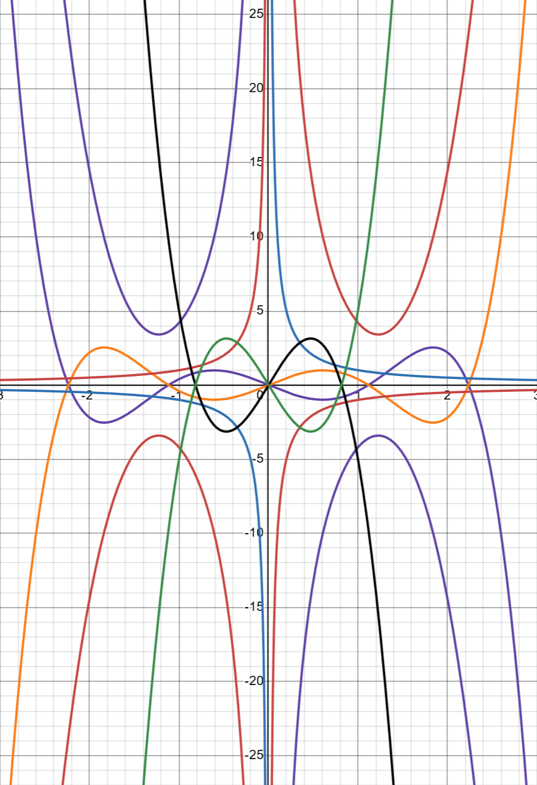

```{r message=FALSE, warning=FALSE}
library(pander)
library(tidyverse)
library(dplyr)
```

# {.tabset .tabset-pills}

## Instructions 

Using [Desmos](https://www.desmos.com/calculator), design a "true linear regression model" that is **2D-Drawable**, and follows all other **Regression Battleship Rules** (listed below), that is of the form 

$$
  Y_i = \beta_0 + \underbrace{\quad\quad\quad\ldots\quad\quad\quad}_\text{Your Model Goes Here} + \epsilon_i \quad \text{where} \ \epsilon_i \sim N(0, \sigma^2)
$$ 

Then, use a simulation in R and your linear regression model to obtain a sample of data saved as `rbdata.csv`. 

Your sample of data will be given to other students and your teacher, but this Rmd file (which contains the secret on how you made your data) will remain hidden until after the competition is complete. Your teacher and two of your peers will use the sample of data your provide, `rbdata.csv`, to try to **guess** the **true linear regression model** you used to create the data. The goal is to hide your model well enough that no one can find it, while keeping the R-squared of your data as high as possible.

### Official Rules {.tabset}

#### Advanced Level Competition

Competing in the *Advanced Level* will allow you the opportunity to earn full credit on the Regression Battleship portion of your grade in Math 425 (which is 15% of your Final Grade). However, if you compete at this level, you cannot ever discuss your actual model with your teacher. You can still ask for help from the TA, tutors, or other students that you are not competing against. And you can ask "vague" questions to your teacher as long as it doesn't give too much away about your model.

There are five official rules your model must abide by. If you break any of the rules, you will be disqualified from winning the competition and a grade penalty will result.

1. Your csv file `rbdata.csv` must contain **11 columns of data**.
    * The first column must be your (1) y-variable (labeled as `y`).
    * The other ten columns must be (10) x-variables (labeled as `x1`, `x2`, ... , `x10`). *Please use all lower-case letters.* It does not matter which x-variables you use in your model, and you don't need to use all 10 x-variables in your model.
   
<br/>
    
2. Your **y-variable** (or some transformation of the y-variable) must have been **created from a linear regression model** using only x-variables (or transformations of those x-variables) **from** within **your data set**.
    * Be very careful with transformations. You must ensure that you do not break the rules of a linear regression if you choose to use transformations.
    * If you choose transformations, only these functions are allowed when transforming X and Y variables: `1/Y^2`, `1/Y`, `log(Y)`, `sqrt(Y)`, `sqrt(sqrt(Y))`, `Y^2`, `Y^3`, `1/X^2`, `1/X`, `log(X)`, `sqrt(X)`, `sqrt(sqrt(X))`, `X^2`, `X^3`, `X^4`, and `X^5`. Don't forget to check Rule #3 carefully if you choose transformations.

<br/>
    
3. Your **sample size** must be sufficiently large so that when the true model is fit to your data using lm(...), **all p-values** of terms found in the `summary(...)` output **are significant** at the $\alpha = 0.05$ level.

4. The $R^2$ value ("Multiple R-squared", not the "Adjusted R-squared") of your true model fit on your `rbdata` sample must be greater than or equal to $0.30$. The higher your $R^2$ value, the more impressive your model.

5. Your true model must be **2D-drawable**. This means that it can be drawn in both Desmos and with a single 2D scatterplot in R.

<br/>
<br/>


#### Intermediate Level Competition

Competing in the *Intermediate Level* will **only** allow you to earn **up to 88%** of the full credit that is possible on the Regression Battleship portion of your grade in Math 425 (which is 15% of your Final Grade). *However, getting 88% of the grade is better than failing* the advanced level competition and getting 0% of the Regression Battleship grade. So choose this option if you are not feeling comfortable with your abilities to compete at the Advanced Level. The good news is that if you choose this option, your teacher can help you with your model to make sure everything is correct before you turn it in.

For the Intermediate Level competition, there are also five official rules your model must abide by. If you break any of the rules, you will be disqualified from winning the Intermediate Level competition and a point penalty will be applied to your grade.

1. Your csv file `rbdata.csv` must contain **6 columns of data**.
    * The first column must be your (1) y-variable (labeled as `y`).
    * The other five columns must be (5) x-variables (labeled as `x1`, `x2`, `x3`, `x4` , `x5`). *Please use all lower-case letters.* It does not matter which x-variables you use in your model, and you don't need to use all 5 x-variables in your model.
   
<br/>
    
2. Your **y-variable** must have been **created from a linear regression model** using only x-variables **from** within **your data set**.
    * No transformations of y-variables or x-variables are allowed in the Intermediate Level competition.

<br/>
    
3. Your **sample size** must be sufficiently large so that when the true model is fit to your data using lm(...), **all p-values** of terms found in the `summary(...)` output **are significant** at the $\alpha = 0.05$ level.

4. The $R^2$ value ("Multiple R-squared", not the "Adjusted R-squared") of your true model fit on your `rbdata` sample must be greater than or equal to $0.80$.

5. Your true model must be **2D-drawable**. This means that it can be drawn in Desmos and with a single 2D scatterplot in R.

<br/>
<br/>


## Desmos 

True Model:

 

## Code

Use the R-chunks below to create your simulated sample of data from your true regression model.


```{r, comment=NA}
set.seed(120)
  
n <- 100000


# Actual X values

# for set 1 ----->
x8 <- runif(n,-2.6, 2.6)

# Positive 1 or Negative 1 - With x5 make second line
x9 <- sample(c(-1,1),n,replace=TRUE)

 # Either positive 1 or - 1 - depending on -1 interaction 
x10 <- sample(c(-1,1),n,replace=TRUE)


# 2 term model is base model.

# y3/4 term 1 β3: .25 x * x1 Modifier
x1 <- sample(c(0,1),n,prob=c(.6667, .3333),replace = TRUE)

# y3/4 term 2 β4 : .1666666666 x^3 * x2 Modifier
x2 <- sample(c(0,1),n,prob=c(.6667, .3333),replace = TRUE)

# y5/6 term1 β5: 8 x^-1 * x3 INSERT
x3 <- sample(c(0,1),n,prob=c(.6667, .3333),replace = TRUE)

# y5/6 term 2 β6: .6 x * x4 Modifier
x4 <- sample(c(0,1),n,prob=c(.6667,.3333),replace = TRUE)

# y5/6 term 3 β7: .13333333333 x^3 * x5
x5 <- sample(c(0,1),n,prob=c(.6667,.3333),replace = TRUE)

# These two together give us our x^5 term.
# Case x6 == 1, x7 == 0
# y3/4 term 4 β8: .4 x^5 * x6
x6 <- sample(c(0,1),n,prob=c(.3333,.6667),replace = TRUE)

# Case x6 == 1, x7 == 1
# y3/4 term 4 β9: .2 x^5 * x7
x7 <- sample(c(0,1),n,prob=c(.5,.5),replace = TRUE)


# Include Cases

# x1 - 7 == 0 (Base Model)
# x1,x2,x6, == 1, x5, x7 == 0 (Line 1)
# x3,x4,x5,x6,x7 = 1, x1, x2 = 0 (Line 2)


# Then, create betas, sigma, normal error terms and y
  sigma <- 4 #change to whatever positive number you want
 
  
 ################################
 # You ARE NOT ALLOWED to change this part:
 epsilon_i <- rnorm(n, 0, sigma)
 ################################ 
 
 # An example of how to make Y...
 # y <-  beta0 + beta1*X1 + beta2*X2 + beta3*X4*X2 + epsilon_i
 
 εi <- epsilon_i
 
# Betas
  
βint <- NA # Not using this

# Line pair 1
β1 <- 10 # x
β2 <- -15 # x^3

# Line pair 2
β3 <- -7.5 # x
β4 <- 12.5 # x^3
β8 <- .4 # x^5

# Line pair 3
β5 <- 8  # x^-1 
β6 <- -16 # x
β7 <- 17 #x^3
β8 <- .4 # x^5
β9 <- -.2 # x^5

# For reference

# y1 <- -10 * x -15 * x ^ 3 + εi
# y2 <- +10 * x + 15 * x ^ 3 + εi

# y3 <- -2.5 * x + 2.5 * x ^ 3 -.4* x ^ 5 + εi
# y4 <- +2.5 * x - 2.5 * x ^ 3 + .4* x ^ 5 + εi

# y5 = 8 * x ^ -1 - 6 * x + 2 * x ^ 3 + .2 * x ^ 5 + εi
# y6 = -8 * x ^ -1 + 6 * x - 2 * x ^ 3 - .2 * x ^ 5 + εi

# β3: x1 ----> -.25 x * x1 Modifier
# β4: x2 ----> .1666666666 x^3 * x2 Modifier
# β5: x3 ----> 8 x^-1 * x3 Addition
# β6: x4 ----> -.6 x * x4 Modifier
# β7: x5 ----> .13333333333 x^3 * x5 Modifier
# β8: x6 ----> .4 x^5 * x6 (Case x6 == 1, x7 == 0) Add
# β9: x7 ----> .2 x^5 * x7 (Case x6 == 1, x7 == 1)

# Very Important
x <- x8

y <- (
  x9 * x10 * (
#   x^-1             x             x^3             x^5
                     β1 * x      + β2 * x^3      +
                     β3 * x * x1 + β4 * x^3 * x2 + β8 * x^5 * x6 +
    β5 * x^-1 * x3 + β6 * x * x4 + β7 * x^3 * x5 + β9 * x^5 * x6 * x7 +
    εi
  )
)
 

# This loads your data into a data set:
data <- data.frame(y, x1, x2, x3, x4, x5, x6, x7, x8, x9, x10)
 
############### Model Engineering ###############

# Line 1 Bounds - Limit X values for specific cases

lb1.1 <- -1.3716
lb1.2 <- 1.3716

lb2.1 <- -2.8572
lb2.2 <- 2.8572

lb3.1 <- -2.2628
lb3.2 <- -.2992
lb3.3 <- .2992
lb3.4 <- 2.2628


# β3: x1 ----> .25 x * x1 Modifier
# β4: x2 ----> .1666666666 x^3 * x2 Modifier
# β5: x3 ----> 8 x^-1 * x3 INSERT
# β6: x4 ----> .6 x * x4 Modifier
# β7: x5 ----> .13333333333 x^3 * x5
# β8: x6 ----> .4 x^5 * x6 (Case x6 == 1, x7 == 0)
# β9: x7 ----> .2 x^5 * x7 (Case x6 == 1, x7 == 1)

# Include Cases
# x1 - 7 == 0 (Base Model)
# x1,x2,x6, == 1, x5, x7 == 0 (Line 1)
# x3,x4,x5,x6,x7 = 1, x1, x2 = 0 (Line 2)

# Limit Permutation Possibilities
condition1 <- data$x1 == 0 & data$x2 == 0 & data$x3 == 0 & data$x4 == 0 & data$x5 == 0 & data$x6 == 0 & data$x7 == 0
condition2 <- data$x1 == 1 & data$x2 == 1 & data$x3 == 0 & data$x4 == 0 & data$x5 == 0 & data$x6 == 1 & data$x7 == 0
condition3 <- data$x1 == 0 & data$x2 == 0 & data$x3 == 1 & data$x4 == 1 & data$x5 == 1 & data$x6 == 1 & data$x7 == 1

# Limit X values for specific cases
condition4 <- condition1 & ((data$x8 >= lb1.1) & (data$x8 <= lb1.2))
condition5 <- condition2 & ((data$x8 >= lb2.1) & (data$x8 <= lb2.2))
condition6 <- condition3 & (((data$x8 >= lb3.1) & (data$x8 <= lb3.2)) | ((data$x8 >= lb3.3) & (data$x8 <= lb3.4)))

# condition4 <- FALSE
# condition5 <- FALSE
# condition6 <- FALSE

# Combine all conditions
include_all <- condition4 | condition5 | condition6

# Filter rows from the model matrix
rbdata <- data[include_all, ]


############### END ENGINEERING ###############
```

```{r}
write.csv(rbdata,"rbdata.csv",row.names=FALSE)
```


```{r}
test.lm <- lm(y ~ x9:x10:(
                     x8 + I(x8^3) + x8:x1 + I(x8^3):x2 + I(x8^5):x6 + I(x8^-1):x3 + x8:x4 + I(x8^3):x5 + I(x8^5):x6:x7),data=rbdata)

summary(test.lm)
```


```{r}
View(rbdata)
nrow(rbdata)
```

```{r}
plot(y~x8,rbdata)
```

## R Plot

Provide a 2D scatterplot that shows both your *true* model (dashed lines) and *estimated* model (solid lines) on the same scatterplot. This should match your Desmos graph. 

```{r}
y1 <- function(x){ 10 * x + 15 * x ^ 3}
y2 <- function(x){-10 * x - 15 * x ^ 3}
y3 <- function(x){-2.5 * x + 2.5 * x ^ 3 - 0.4 * x ^ 5}
y4 <- function(x){2.5 * x - 2.5 * x ^ 3 + 0.4 * x ^ 5}
y5 <- function(x){8 * (x ^-1) - 6 * x + 2 * x ^ 3 + 2 * x ^ 5}
y6 <- function(x){-8 * (x ^ -1) + 6 * x - 2 * x ^ 3 - 2 * x ^ 5}

b <- coef (test.lm)

y7 <- function(x,x9=1,x10=1) {
  b[1] +
  x9 * x10 * (
    b[2] * x + b[3] * x^3)
}

y8 <- function(x,x9=1,x10=1,x1=1,x2=1,x3=0,x4=0,x5=0,x6=1,x7=0) {
  b[1] +
  x9 * x10 * (
    b[2] * x + b[3] * x^3 + b[4] * x * x1 + b[5] * x^3 * x2 + b[6] * x^5 * x6 +
    b[7] * x^-1 * x3 + b[8] * x * x4 + b[10] * x^3 * x5 + b[11] * x^5 * x6 * x7
  )
}

y9 <- function(x,x9=1,x10=1,x1=0,x2=0,x3=1,x4=1,x5=1,x6=1,x7=1) {
  b[1] +
  x9 * x10 * (
    b[2] * x + b[3] * x^3 + b[4] * x * x1 + b[5] * x^3 * x2 + b[6] * x^5 * x6 +
    b[7] * x^-1 * x3 + b[8] * x * x4 + b[10] * x^3 * x5 + b[11] * x^5 * x6 * x7
  )
}

y10 <- function(x,x9=-1,x10=1,x1=0,x2=0,x3=0,x4=0,x5=0,x6=0,x7=0) {
  b[1] +
  x9 * x10 * (
    b[2] * x + b[3] * x^3 + b[4] * x * x1 + b[5] * x^3 * x2 + b[6] * x^5 * x6 +
    b[7] * x^-1 * x3 + b[8] * x * x4 + b[10] * x^3 * x5 + b[11] * x^5 * x6 * x7
  )
}

y11 <- function(x,x9=-1,x10=1,x1=1,x2=1,x3=0,x4=0,x5=0,x6=1,x7=0) {
  b[1] +
  x9 * x10 * (
    b[2] * x + b[3] * x^3 + b[4] * x * x1 + b[5] * x^3 * x2 + b[6] * x^5 * x6 +
    b[7] * x^-1 * x3 + b[8] * x * x4 + b[10] * x^3 * x5 + b[11] * x^5 * x6 * x7
  )
}

y12 <- function(x,x9=-1,x10=1,x1=0,x2=0,x3=1,x4=1,x5=1,x6=1,x7=1) {
  b[1] +
  x9 * x10 * (
    b[2] * x + b[3] * x^3 + b[4] * x * x1 + b[5] * x^3 * x2 + b[6] * x^5 * x6 +
    b[7] * x^-1 * x3 + b[8] * x * x4 + b[10] * x^3 * x5 + b[11] * x^5 * x6 * x7
  )
}

ggplot(rbdata,aes(y=y,x=x8,col=interaction(x1,x2,x3,x4,x5,x6,x7,x9,x10))) +
  geom_point(size=1)+ 
  scale_y_continuous(lim=c(-75,+75)) +
  stat_function(fun=y1, col = "black",size=1.5) +
  stat_function(fun=y2, col = "forestgreen",size=1.5) +
  stat_function(fun=y3, col = "orange",size=1.5) +
  stat_function(fun=y4, col = "purple",size=1.5) +
  stat_function(fun=y5, col = "red",size=1.5) +
  stat_function(fun=y6, col = "purple",size=1.5)
  stat_function(fun=y7, col = "grey",size=2)
  # stat_function(fun=y8, col = "grey",size=100) +
  # stat_function(fun=y9, col = "grey",size=100) +
  # stat_function(fun=y10, col = "grey",size=100) +
  # stat_function(fun=y11, col = "grey",size=100)
  
  
  
  
```


```{r}
test.lm <- lm(y ~ x9:x10:(
                     x8 + I(x8^3) + x8:x1 + I(x8^3):x2 + I(x8^5):x6 + I(x8^-1):x3 + x8:x4 + I(x8^3):x5 + I(x8^5):x6:x7),data=rbdata)


```

```{r}
library(pander)
summary(test.lm)
#pander(b)
```

# Line pair 1
β1 <- 10 # x
β2 <- -15 # x^3

# Line pair 2
β3 <- -7.5 # x
β4 <- 12.5 # x^3
β8 <- .4 # x^5

# Line pair 3
β5 <- 8  # x^-1 
β6 <- -16 # x
β7 <- 17 #x^3
β8 <- .4 # x^5
β9 <- -.2 # x^5

```{r}
rbdatatemp <- rbdata()
```


stat_function(fun=y1) + 
## Math Model

Write out your "true" model in mathematical form. Make sure it matches your code. This could be "painful" if you chose a complicated model.

$$
  \text{EXAMPLE:} \ Y_i = \beta_0 + \beta_1 X_{4i} + \beta_2 X_{2i} + \beta_3 X_{4i} X_{2i} + \epsilon_i
$$


## Results

Once the Regression Battleship competition is completed, you will be given instructions on how to complete this section. The basic idea is to compare the three guesses at your true model (from two peers, and your teacher) to decide who won (i.e., who had the closest guess).

```{r}
set.seed(123) 
  
n <- 100000


# Actual X values

# for set 1 ----->
x8 <- runif(n,-2.6, 2.6)

# Positive 1 or Negative 1 - With x5 make second line
x9 <- sample(c(-1,1),n,replace=TRUE)

 # Either positive 1 or - 1 - depending on -1 interaction 
x10 <- sample(c(-1,1),n,replace=TRUE)


# 2 term model is base model.

# y3/4 term 1 β3: .25 x * x1 Modifier
x1 <- sample(c(0,1),n,prob=c(.6667, .3333),replace = TRUE)

# y3/4 term 2 β4 : .1666666666 x^3 * x2 Modifier
x2 <- sample(c(0,1),n,prob=c(.6667, .3333),replace = TRUE)

# y5/6 term1 β5: 8 x^-1 * x3 INSERT
x3 <- sample(c(0,1),n,prob=c(.6667, .3333),replace = TRUE)

# y5/6 term 2 β6: .6 x * x4 Modifier
x4 <- sample(c(0,1),n,prob=c(.6667,.3333),replace = TRUE)

# y5/6 term 3 β7: .13333333333 x^3 * x5
x5 <- sample(c(0,1),n,prob=c(.6667,.3333),replace = TRUE)

# These two together give us our x^5 term.
# Case x6 == 1, x7 == 0
# y3/4 term 4 β8: .4 x^5 * x6
x6 <- sample(c(0,1),n,prob=c(.3333,.6667),replace = TRUE)

# Case x6 == 1, x7 == 1
# y3/4 term 4 β9: .2 x^5 * x7
x7 <- sample(c(0,1),n,prob=c(.5,.5),replace = TRUE)


# Include Cases

# x1 - 7 == 0 (Base Model)
# x1,x2,x6, == 1, x5, x7 == 0 (Line 1)
# x3,x4,x5,x6,x7 = 1, x1, x2 = 0 (Line 2)


# Then, create betas, sigma, normal error terms and y
  sigma <- 4 #change to whatever positive number you want
 
  
 ################################
 # You ARE NOT ALLOWED to change this part:
 epsilon_i <- rnorm(n, 0, sigma)
 ################################ 
 
 # An example of how to make Y...
 # y <-  beta0 + beta1*X1 + beta2*X2 + beta3*X4*X2 + epsilon_i
 
 εi <- epsilon_i
 
# Betas
  
βint <- NA # Not using this

# Line pair 1
β1 <- 10 # x
β2 <- -15 # x^3

# Line pair 2
β3 <- -7.5 # x
β4 <- 12.5 # x^3
β8 <- .4 # x^5

# Line pair 3
β5 <- 8  # x^-1 
β6 <- -16 # x
β7 <- 17 #x^3
β8 <- .4 # x^5
β9 <- -.2 # x^5

# For reference

# y1 <- -10 * x -15 * x ^ 3 + εi
# y2 <- +10 * x + 15 * x ^ 3 + εi

# y3 <- -2.5 * x + 2.5 * x ^ 3 -.4* x ^ 5 + εi
# y4 <- +2.5 * x - 2.5 * x ^ 3 + .4* x ^ 5 + εi

# y5 = 8 * x ^ -1 - 6 * x + 2 * x ^ 3 + .2 * x ^ 5 + εi
# y6 = -8 * x ^ -1 + 6 * x - 2 * x ^ 3 - .2 * x ^ 5 + εi

# β3: x1 ----> -.25 x * x1 Modifier
# β4: x2 ----> .1666666666 x^3 * x2 Modifier
# β5: x3 ----> 8 x^-1 * x3 Addition
# β6: x4 ----> -.6 x * x4 Modifier
# β7: x5 ----> .13333333333 x^3 * x5 Modifier
# β8: x6 ----> .4 x^5 * x6 (Case x6 == 1, x7 == 0) Add
# β9: x7 ----> .2 x^5 * x7 (Case x6 == 1, x7 == 1)

# Very Important
x <- x8

y <- (
  x9 * x10 * (
#   x^-1             x             x^3             x^5
                     β1 * x      + β2 * x^3      +
                     β3 * x * x1 + β4 * x^3 * x2 + β8 * x^5 * x6 +
    β5 * x^-1 * x3 + β6 * x * x4 + β7 * x^3 * x5 + β9 * x^5 * x6 * x7 +
    εi
  )
)
 

# This loads your data into a data set:
data <- data.frame(y, x1, x2, x3, x4, x5, x6, x7, x8, x9, x10)
 
############### Model Engineering ###############

# Line 1 Bounds - Limit X values for specific cases

lb1.1 <- -1.3716
lb1.2 <- 1.3716

lb2.1 <- -2.8572
lb2.2 <- 2.8572

lb3.1 <- -2.2628
lb3.2 <- -.2992
lb3.3 <- .2992
lb3.4 <- 2.2628


# β3: x1 ----> .25 x * x1 Modifier
# β4: x2 ----> .1666666666 x^3 * x2 Modifier
# β5: x3 ----> 8 x^-1 * x3 INSERT
# β6: x4 ----> .6 x * x4 Modifier
# β7: x5 ----> .13333333333 x^3 * x5
# β8: x6 ----> .4 x^5 * x6 (Case x6 == 1, x7 == 0)
# β9: x7 ----> .2 x^5 * x7 (Case x6 == 1, x7 == 1)

# Include Cases
# x1 - 7 == 0 (Base Model)
# x1,x2,x6, == 1, x5, x7 == 0 (Line 1)
# x3,x4,x5,x6,x7 = 1, x1, x2 = 0 (Line 2)

# Limit Permutation Possibilities
condition1 <- data$x1 == 0 & data$x2 == 0 & data$x3 == 0 & data$x4 == 0 & data$x5 == 0 & data$x6 == 0 & data$x7 == 0
condition2 <- data$x1 == 1 & data$x2 == 1 & data$x3 == 0 & data$x4 == 0 & data$x5 == 0 & data$x6 == 1 & data$x7 == 0
condition3 <- data$x1 == 0 & data$x2 == 0 & data$x3 == 1 & data$x4 == 1 & data$x5 == 1 & data$x6 == 1 & data$x7 == 1

# Limit X values for specific cases
condition4 <- condition1 & ((data$x8 >= lb1.1) & (data$x8 <= lb1.2))
condition5 <- condition2 & ((data$x8 >= lb2.1) & (data$x8 <= lb2.2))
condition6 <- condition3 & (((data$x8 >= lb3.1) & (data$x8 <= lb3.2)) | ((data$x8 >= lb3.3) & (data$x8 <= lb3.4)))

# condition4 <- FALSE
# condition5 <- FALSE
# condition6 <- FALSE

# Combine all conditions
include_all <- condition4 | condition5 | condition6

# Filter rows from the model matrix
rbdata2 <- data[include_all, ]
```

```{r}
benpred <- predict(lm(y ~ x9:x10:(
                     x8 + I(x8^3) + x8:x1 + I(x8^3):x2 + I(x8^5):x6 + I(x8^-1):x3 + x8:x4 + I(x8^3):x5 + I(x8^5):x6:x7),data=rbdata))

zachpred <- predict(lm(y^2 ~ I(x8^2) + I(x1) + I(x1):I(x8^2) + x7 + x9:x7:x8 + x7:I(x8^2), data = rbdata2))

sampred <- predict(lm(y ~ x8 + I(x8^2) + x4 + x8:x4))

rdat2 <- rbdata2 %>%
  mutate(mycolor = case_when(
     x2==0 &  x3==0 &  x9==-1 &  x10==-1 ~ "Cubic Down",
     x2==0 &  x3==0 &  x9==1 &  x10==1 ~ "Cubic Down",
     x2==0 &  x3==0 &  x9==1 &  x10==-1 ~ "Cubic Up",
     x2==0 &  x3==0 &  x9==-1 &  x10==1 ~ "Cubic Up",
     x2==1 &  x3==0 &  x9==-1 &  x10==-1 ~ "Quintic Up",
     x2==1 &  x3==0 &  x9==1 &  x10==1 ~ "Quintic Up",
     x2==1 &  x3==0 &  x9==1 &  x10==-1 ~ "Quintic Down",
     x2==1 &  x3==0 &  x9==-1 &  x10==1 ~ "Quintic Down",
     x2==0 &  x3==1 &  x9==-1 &  x10==-1  &  x8>0 ~ "Quadratic Up Right",
     x2==0 &  x3==1 &  x9==1 &  x10==1 &  x8>0~ "Quadratic Up Right",
     x2==0 &  x3==1 &  x9==1 &  x10==-1  &  x8<0 ~ "Quadratic Up Left",
     x2==0 &  x3==1 &  x9==-1 &  x10==1 &  x8<0~ "Quadratic Up Left",
     x2==0 &  x3==1 &  x9==-1 &  x10==1 &  x8>0~ "Quadratic Down Right",
     x2==0 &  x3==1 &  x9==1 &  x10==-1 &  x8>0~ "Quadratic Down Right",
     x2==0 &  x3==1 &  x9==-1 &  x10==-1 &  x8<0~ "Quadratic Down Left",
     x2==0 &  x3==1 &  x9==1 &  x10==1 &  x8<0~ "Quadratic Down Left",
  ))

rdat2 <- rdat2 %>%
  mutate( x11 = ifelse(mycolor=="Quadratic Down Right", 1, 0),
          x12 = ifelse(mycolor=="Quadratic Up Right", 1, 0),
          x13 = ifelse(mycolor=="Cubic Down", 1, 0),
          x14 = ifelse(mycolor=="Cubic Up", 1, 0),
          x15 = ifelse(mycolor=="Quintic Down", 1, 0),
          x16 = ifelse(mycolor=="Quintic Up", 1, 0),
          x17 = ifelse(mycolor=="Quadratic Down Left", 1, 0),
          x18 = ifelse(mycolor=="Quadratic Up Left", 1, 0))

saunderspred <- predict(lm(y ~  x11 +  x11: x8 +   x11:I( x8^2) + #Quadratic Down Right
             x12 +    x12: x8 +  x12:I( x8^2) +  #Quadratic Up Right
             x17 +  x17: x8 +  x17:I( x8^2) +   #Quadratic Down Left
             x18 +  x18: x8 +  x18:I( x8^2) +   #Quadratic Up Left
             x13: x8 +   x13:I( x8^3) +        #Cubic Down
             x14: x8 +   x14:I( x8^3) +        #Cubic Up
             x15: x8 +   x15:I( x8^3) +    x15:I( x8^5) +     #Quintic Down
             x16: x8 +   x16:I( x8^3) +    x16:I( x8^5)     #Quintic Up
            , data=rdat2))

```

```{r}
summary(benpred)
```

```{r}
summary(zachpred)
```

```{r}
summary(sampred)
```

```{r}
summary(saunderspred)
```


 

 