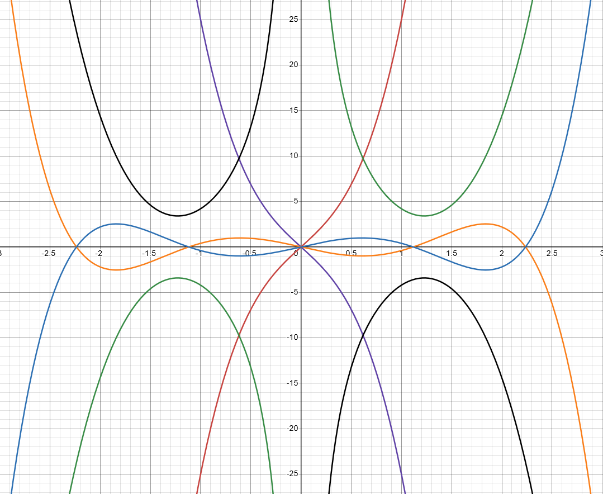
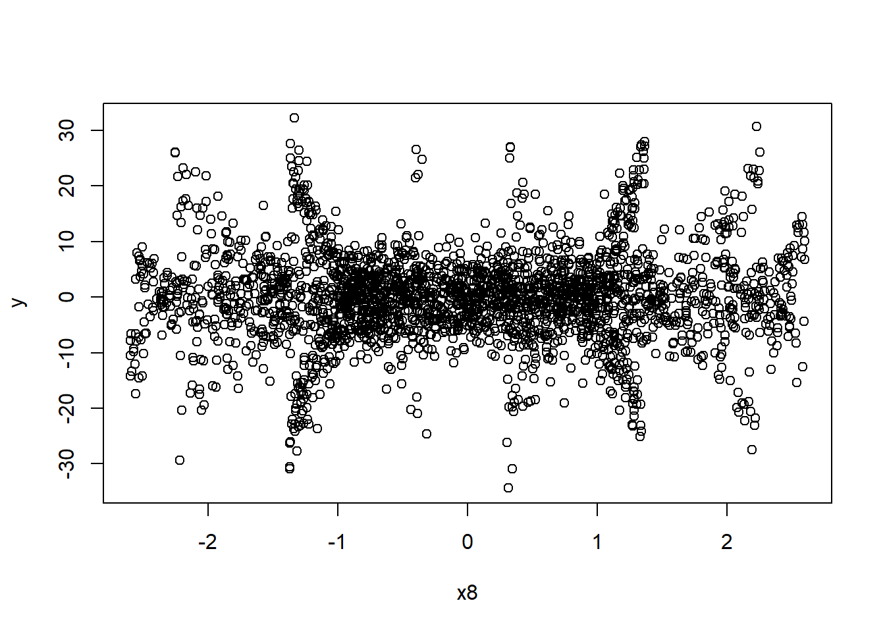
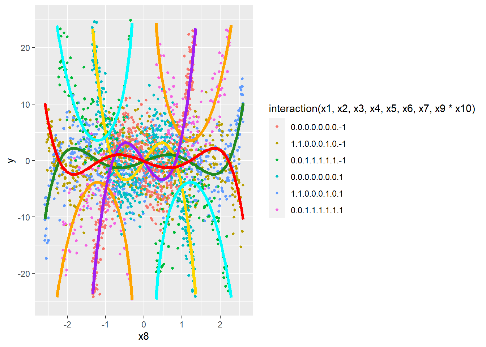
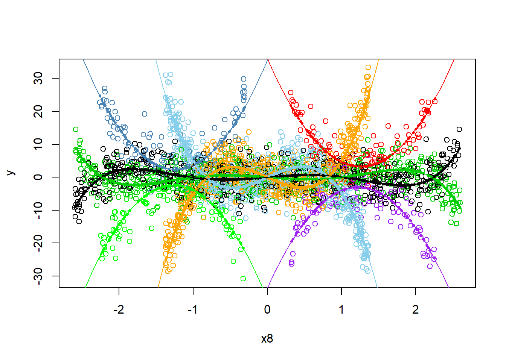

::: {.cell}

```{.r .cell-code}
library(pander)
library(tidyverse)
library(dplyr)
```
:::


#  {.tabset .tabset-pills}

## Desmos

True Model:



## Code

Use the R-chunks below to create your simulated sample of data from your
true regression model.


::: {.cell}

```{.r .cell-code}
set.seed(120)
  
n <- 100000


# Actual X values

# for set 1 ----->
x8 <- runif(n,-2.6, 2.6)

# Positive 1 or Negative 1 - With x5 make second line
x9 <- sample(c(-1,1),n,replace=TRUE)

 # Either positive 1 or - 1 - depending on -1 interaction 
x10 <- sample(c(-1,1),n,replace=TRUE)


# 2 term model is base model.

# y3/4 term 1 β3: .25 x * x1 Modifier
x1 <- sample(c(0,1),n,prob=c(.6667, .3333),replace = TRUE)

# y3/4 term 2 β4 : .1666666666 x^3 * x2 Modifier
x2 <- sample(c(0,1),n,prob=c(.6667, .3333),replace = TRUE)

# y5/6 term1 β5: 8 x^-1 * x3 INSERT
x3 <- sample(c(0,1),n,prob=c(.6667, .3333),replace = TRUE)

# y5/6 term 2 β6: .6 x * x4 Modifier
x4 <- sample(c(0,1),n,prob=c(.6667,.3333),replace = TRUE)

# y5/6 term 3 β7: .13333333333 x^3 * x5
x5 <- sample(c(0,1),n,prob=c(.6667,.3333),replace = TRUE)

# These two together give us our x^5 term.
# Case x6 == 1, x7 == 0
# y3/4 term 4 β8: .4 x^5 * x6
x6 <- sample(c(0,1),n,prob=c(.3333,.6667),replace = TRUE)

# Case x6 == 1, x7 == 1
# y3/4 term 4 β9: .2 x^5 * x7
x7 <- sample(c(0,1),n,prob=c(.5,.5),replace = TRUE)


# Include Cases

# x1 - 7 == 0 (Base Model)
# x1,x2,x6, == 1, x5, x7 == 0 (Line 1)
# x3,x4,x5,x6,x7 = 1, x1, x2 = 0 (Line 2)


# Then, create betas, sigma, normal error terms and y
  sigma <- 4 #change to whatever positive number you want
 
  
 ################################
 # You ARE NOT ALLOWED to change this part:
 epsilon_i <- rnorm(n, 0, sigma)
 ################################ 
 
 # An example of how to make Y...
 # y <-  beta0 + beta1*X1 + beta2*X2 + beta3*X4*X2 + epsilon_i
 
 εi <- epsilon_i
 
# Betas
  
βint <- NA # Not using this

# Line pair 1
β1 <- 10 # x
β2 <- -15 # x^3

# Line pair 2
β3 <- -7.5 # x
β4 <- 12.5 # x^3
β8 <- .4 # x^5

# Line pair 3
β5 <- 8  # x^-1 
β6 <- -16 # x
β7 <- 17 #x^3
β8 <- .4 # x^5
β9 <- -.2 # x^5

# For reference

# y1 <- -10 * x -15 * x ^ 3 + εi
# y2 <- +10 * x + 15 * x ^ 3 + εi

# y3 <- -2.5 * x + 2.5 * x ^ 3 -.4* x ^ 5 + εi
# y4 <- +2.5 * x - 2.5 * x ^ 3 + .4* x ^ 5 + εi

# y5 = 8 * x ^ -1 - 6 * x + 2 * x ^ 3 + .2 * x ^ 5 + εi
# y6 = -8 * x ^ -1 + 6 * x - 2 * x ^ 3 - .2 * x ^ 5 + εi

# β3: x1 ----> -.25 x * x1 Modifier
# β4: x2 ----> .1666666666 x^3 * x2 Modifier
# β5: x3 ----> 8 x^-1 * x3 Addition
# β6: x4 ----> -.6 x * x4 Modifier
# β7: x5 ----> .13333333333 x^3 * x5 Modifier
# β8: x6 ----> .4 x^5 * x6 (Case x6 == 1, x7 == 0) Add
# β9: x7 ----> .2 x^5 * x7 (Case x6 == 1, x7 == 1)

# Very Important
x <- x8

y <- (
  (x9 * x10 * (
#   x^-1             x             x^3             x^5
                     β1 * x      + β2 * x^3      +
                     β3 * x * x1 + β4 * x^3 * x2 + β8 * x^5 * x6 +
    β5 * x^-1 * x3 + β6 * x * x4 + β7 * x^3 * x5 + β9 * x^5 * x6 * x7
  ))  + εi
)
 

# This loads your data into a data set:
data <- data.frame(y, x1, x2, x3, x4, x5, x6, x7, x8, x9, x10)
 
############### Model Engineering ###############

# Line 1 Bounds - Limit X values for specific cases

lb1.1 <- -1.3716
lb1.2 <- 1.3716

lb2.1 <- -2.8572
lb2.2 <- 2.8572

lb3.1 <- -2.2628
lb3.2 <- -.2992
lb3.3 <- .2992
lb3.4 <- 2.2628


# β3: x1 ----> .25 x * x1 Modifier
# β4: x2 ----> .1666666666 x^3 * x2 Modifier
# β5: x3 ----> 8 x^-1 * x3 INSERT
# β6: x4 ----> .6 x * x4 Modifier
# β7: x5 ----> .13333333333 x^3 * x5
# β8: x6 ----> .4 x^5 * x6 (Case x6 == 1, x7 == 0)
# β9: x7 ----> .2 x^5 * x7 (Case x6 == 1, x7 == 1)

# Include Cases
# x1 - 7 == 0 (Base Model)
# x1,x2,x6, == 1, x5, x7 == 0 (Line 1)
# x3,x4,x5,x6,x7 = 1, x1, x2 = 0 (Line 2)

# Limit Permutation Possibilities
condition1 <- data$x1 == 0 & data$x2 == 0 & data$x3 == 0 & data$x4 == 0 & data$x5 == 0 & data$x6 == 0 & data$x7 == 0
condition2 <- data$x1 == 1 & data$x2 == 1 & data$x3 == 0 & data$x4 == 0 & data$x5 == 0 & data$x6 == 1 & data$x7 == 0
condition3 <- data$x1 == 0 & data$x2 == 0 & data$x3 == 1 & data$x4 == 1 & data$x5 == 1 & data$x6 == 1 & data$x7 == 1

# Limit X values for specific cases
condition4 <- condition1 & ((data$x8 >= lb1.1) & (data$x8 <= lb1.2))
condition5 <- condition2 & ((data$x8 >= lb2.1) & (data$x8 <= lb2.2))
condition6 <- condition3 & (((data$x8 >= lb3.1) & (data$x8 <= lb3.2)) | ((data$x8 >= lb3.3) & (data$x8 <= lb3.4)))

# condition4 <- FALSE
# condition5 <- FALSE
# condition6 <- FALSE

# Combine all conditions
include_all <- condition4 | condition5 | condition6

# Filter rows from the model matrix
rbdata <- data[include_all, ]


############### END ENGINEERING ###############
```
:::

::: {.cell}

```{.r .cell-code}
write.csv(rbdata,"rbdata.csv",row.names=FALSE)
```
:::

::: {.cell}

```{.r .cell-code}
test.lm <- lm(y ~ x9:x10:(
                     x8 + I(x8^3) + x8:x1 + I(x8^3):x2 + I(x8^5):x6 + I(x8^-1):x3 + x8:x4 + I(x8^3):x5 + I(x8^5):x6:x7),data=rbdata)

summary(test.lm)
```

::: {.cell-output .cell-output-stdout}

```

Call:
lm(formula = y ~ x9:x10:(x8 + I(x8^3) + x8:x1 + I(x8^3):x2 + 
    I(x8^5):x6 + I(x8^-1):x3 + x8:x4 + I(x8^3):x5 + I(x8^5):x6:x7), 
    data = rbdata)

Residuals:
     Min       1Q   Median       3Q      Max 
-11.9725  -2.6866   0.0741   2.6212  13.1253 

Coefficients:
                      Estimate Std. Error t value Pr(>|t|)    
(Intercept)           -0.13829    0.07730  -1.789  0.07373 .  
x9:x10:x8             10.37749    0.36799  28.200  < 2e-16 ***
x9:x10:I(x8^3)       -15.22979    0.29849 -51.023  < 2e-16 ***
x9:x10:x8:x1          -7.58667    0.51089 -14.850  < 2e-16 ***
x9:x10:I(x8^3):x2     12.66249    0.36295  34.888  < 2e-16 ***
x9:x10:I(x8^5):x6      0.40609    0.02659  15.270  < 2e-16 ***
x9:x10:I(x8^-1):x3     8.24810    0.31546  26.146  < 2e-16 ***
x9:x10:x8:x4         -16.90803    1.09970 -15.375  < 2e-16 ***
x9:x10:I(x8^3):x5     17.81804    0.70455  25.290  < 2e-16 ***
x9:x10:I(x8^5):x6:x7  -0.33408    0.10198  -3.276  0.00107 ** 
---
Signif. codes:  0 '***' 0.001 '**' 0.01 '*' 0.05 '.' 0.1 ' ' 1

Residual standard error: 3.926 on 2590 degrees of freedom
Multiple R-squared:  0.7717,	Adjusted R-squared:  0.7709 
F-statistic: 972.8 on 9 and 2590 DF,  p-value: < 2.2e-16
```


:::
:::

::: {.cell}

```{.r .cell-code}
View(rbdata)
nrow(rbdata)
```

::: {.cell-output .cell-output-stdout}

```
[1] 2600
```


:::
:::

::: {.cell}

```{.r .cell-code}
plot(y~x8,rbdata)
```

::: {.cell-output-display}
{width=672}
:::
:::


## R Plot

Provide a 2D scatterplot that shows both your *true* model (dashed
lines) and *estimated* model (solid lines) on the same scatterplot. This
should match your Desmos graph.


::: {.cell}

```{.r .cell-code}
# Reference

test.lm <- lm(y ~ x9:x10:(
                     x8 + I(x8^3) + x8:x1 + I(x8^3):x2 + I(x8^5):x6 + I(x8^-1):x3 + x8:x4 + I(x8^3):x5 + I(x8^5):x6:x7),data=rbdata)

y1 <- function(x){ 10 * x + 15 * x ^ 3}
y2 <- function(x){-10 * x - 15 * x ^ 3}
y3 <- function(x){-2.5 * x + 2.5 * x ^ 3 - 0.4 * x ^ 5}
y4 <- function(x){2.5 * x - 2.5 * x ^ 3 + 0.4 * x ^ 5}
y5 <- function(x){8 * (x ^-1) - 6 * x + 2 * x ^ 3 + 2 * x ^ 5}
y6 <- function(x){-8 * (x ^ -1) + 6 * x - 2 * x ^ 3 - 2 * x ^ 5}

b <- coef(test.lm)

y7 <- function(x,x9=1,x10=1) {
  b[1] +
  x9 * x10 * (
    b[2] * x + b[3] * x^3)
}

y8 <- function(x,x9=1,x10=1,x1=1,x2=1,x3=0,x4=0,x5=0,x6=1,x7=0) {
  b[1] +
  x9 * x10 * (
    b[2] * x + b[3] * x^3 + b[4] * x * x1 + b[5] * x^3 * x2 + b[6] * x^5 * x6 +
    b[7] * x^-1 * x3 + b[8] * x * x4
  )
}

y9 <- function(x,x9=1,x10=1,x1=0,x2=0,x3=1,x4=1,x5=1,x6=1,x7=1) {
  b[1] +
  x9 * x10 * (
    b[2] * x + b[3] * x^3 + b[4] * x * x1 + b[5] * x^3 * x2 + b[6] * x^5 * x6 +
    b[7] * x^-1 * x3 + b[8] * x * x4 + b[9] * x^3 * x5 + b[10] * x^5 * x6 * x7
  )
}

y10 <- function(x,x9=-1,x10=1) {
  b[1] +
  x9 * x10 * (
    b[2] * x + b[3] * x^3
  )
}

y11 <- function(x,x9=-1,x10=1,x1=1,x2=1,x3=0,x4=0,x5=0,x6=1,x7=0) {
  b[1] +
  x9 * x10 * (
    b[2] * x + b[3] * x^3 + b[4] * x * x1 + b[5] * x^3 * x2 + b[6] * x^5 * x6 +
    b[7] * x^-1 * x3 + b[8] * x * x4
  )
}

y12 <- function(x,x9=-1,x10=1,x1=0,x2=0,x3=1,x4=1,x5=1,x6=1,x7=1) {
  b[1] +
  x9 * x10 * (
    b[2] * x + b[3] * x^3 + b[4] * x * x1 + b[5] * x^3 * x2 + b[6] * x^5 * x6 +
    b[7] * x^-1 * x3 + b[8] * x * x4 + b[9] * x^3 * x5 + b[10] * x^5 * x6 * x7
  )
}

ggplot(rbdata,aes(y=y,x=x8,col=interaction(x1,x2,x3,x4,x5,x6,x7,x9*x10))) +
  geom_point(size=1)+ 
  scale_y_continuous(lim=c(-25,+25)) +
  stat_function(fun=y7, col = "gold",linewidth=1.5) +
  stat_function(fun=y8, col = "forestgreen",linewidth=1.5) +
  stat_function(fun=y9, col = "orange",linewidth=1.5) +
  stat_function(fun=y10, col = "purple",linewidth=1.5) +
  stat_function(fun=y11, col = "red",linewidth=1.5) +
  stat_function(fun=y12, col = "cyan",linewidth=1.5)
```

::: {.cell-output-display}
{width=672}
:::
:::

::: {.cell}

```{.r .cell-code}
test.lm <- lm(y ~ x9:x10:(
                     x8 + I(x8^3) + x8:x1 + I(x8^3):x2 + I(x8^5):x6 + I(x8^-1):x3 + x8:x4 + I(x8^3):x5 + I(x8^5):x6:x7),data=rbdata)
```
:::


### Line pair 1
$$
y = 10x - 15x^3
$$

### Line pair 2
$$
y = -7.5x + 12.5x^3 + 0.4x^5
$$

### Line pair 3
$$
y = 8x^{-1} - 16x + 17x^3 + 0.4x^5 - 0.2x^5
$$


## Math Model

Write out your "true" model in mathematical form. Make sure it matches
your code. This could be "painful" if you chose a complicated model.

$$
y = x_9 x_{10} \left(
    10x + (-15)x^3 +
    (-7.5)x x_1 + 12.5x^3 x_2 + 0.4x^5 x_6 +
    8x^{-1} x_3 + (-16)x x_4 + 17x^3 x_5 + (-0.2)x^5 x_6 x_7 +
    \varepsilon_i
\right)
$$
Note - $x9$ and $x10$ would be, in the long equation, distributed to each term, but for simplicity they will be left factored out.

## Results

Let's compare the three guesses at the true model (from two peers, and
your teacher) to decide who won (i.e., who had the closest guess).


::: {.cell}

```{.r .cell-code}
# Different Seed for Rbdata2
set.seed(123) 
  
n <- 100000

# Actual X values

# for set 1 ----->
x8 <- runif(n,-2.6, 2.6)

# Positive 1 or Negative 1 - With x5 make second line
x9 <- sample(c(-1,1),n,replace=TRUE)

 # Either positive 1 or - 1 - depending on -1 interaction 
x10 <- sample(c(-1,1),n,replace=TRUE)


# 2 term model is base model.

# y3/4 term 1 β3: .25 x * x1 Modifier
x1 <- sample(c(0,1),n,prob=c(.6667, .3333),replace = TRUE)

# y3/4 term 2 β4 : .1666666666 x^3 * x2 Modifier
x2 <- sample(c(0,1),n,prob=c(.6667, .3333),replace = TRUE)

# y5/6 term1 β5: 8 x^-1 * x3 INSERT
x3 <- sample(c(0,1),n,prob=c(.6667, .3333),replace = TRUE)

# y5/6 term 2 β6: .6 x * x4 Modifier
x4 <- sample(c(0,1),n,prob=c(.6667,.3333),replace = TRUE)

# y5/6 term 3 β7: .13333333333 x^3 * x5
x5 <- sample(c(0,1),n,prob=c(.6667,.3333),replace = TRUE)

# These two together give us our x^5 term.
# Case x6 == 1, x7 == 0
# y3/4 term 4 β8: .4 x^5 * x6
x6 <- sample(c(0,1),n,prob=c(.3333,.6667),replace = TRUE)

# Case x6 == 1, x7 == 1
# y3/4 term 4 β9: .2 x^5 * x7
x7 <- sample(c(0,1),n,prob=c(.5,.5),replace = TRUE)


# Include Cases

# x1 - 7 == 0 (Base Model)
# x1,x2,x6, == 1, x5, x7 == 0 (Line 1)
# x3,x4,x5,x6,x7 = 1, x1, x2 = 0 (Line 2)


# Then, create betas, sigma, normal error terms and y
  sigma <- 4 #change to whatever positive number you want
 
  
 ################################
 # You ARE NOT ALLOWED to change this part:
 epsilon_i <- rnorm(n, 0, sigma)
 ################################ 
 
 # An example of how to make Y...
 # y <-  beta0 + beta1*X1 + beta2*X2 + beta3*X4*X2 + epsilon_i
 
 εi <- epsilon_i
 
# Betas
  
βint <- NA # Not using this

# Line pair 1
β1 <- 10 # x
β2 <- -15 # x^3

# Line pair 2
β3 <- -7.5 # x
β4 <- 12.5 # x^3
β8 <- .4 # x^5

# Line pair 3
β5 <- 8  # x^-1 
β6 <- -16 # x
β7 <- 17 #x^3
β8 <- .4 # x^5
β9 <- -.2 # x^5

# For reference

# y1 <- -10 * x -15 * x ^ 3 + εi
# y2 <- +10 * x + 15 * x ^ 3 + εi

# y3 <- -2.5 * x + 2.5 * x ^ 3 -.4* x ^ 5 + εi
# y4 <- +2.5 * x - 2.5 * x ^ 3 + .4* x ^ 5 + εi

# y5 = 8 * x ^ -1 - 6 * x + 2 * x ^ 3 + .2 * x ^ 5 + εi
# y6 = -8 * x ^ -1 + 6 * x - 2 * x ^ 3 - .2 * x ^ 5 + εi

# β3: x1 ----> -.25 x * x1 Modifier
# β4: x2 ----> .1666666666 x^3 * x2 Modifier
# β5: x3 ----> 8 x^-1 * x3 Addition
# β6: x4 ----> -.6 x * x4 Modifier
# β7: x5 ----> .13333333333 x^3 * x5 Modifier
# β8: x6 ----> .4 x^5 * x6 (Case x6 == 1, x7 == 0) Add
# β9: x7 ----> .2 x^5 * x7 (Case x6 == 1, x7 == 1)

# Very Important
x <- x8

y <- (
  x9 * x10 * (
#   x^-1             x             x^3             x^5
                     β1 * x      + β2 * x^3      +
                     β3 * x * x1 + β4 * x^3 * x2 + β8 * x^5 * x6 +
    β5 * x^-1 * x3 + β6 * x * x4 + β7 * x^3 * x5 + β9 * x^5 * x6 * x7 +
    εi
  )
)
 

# This loads your data into a data set:
data <- data.frame(y, x1, x2, x3, x4, x5, x6, x7, x8, x9, x10)
 
############### Model Engineering ###############

# Line 1 Bounds - Limit X values for specific cases

lb1.1 <- -1.3716
lb1.2 <- 1.3716

lb2.1 <- -2.8572
lb2.2 <- 2.8572

lb3.1 <- -2.2628
lb3.2 <- -.2992
lb3.3 <- .2992
lb3.4 <- 2.2628


# β3: x1 ----> .25 x * x1 Modifier
# β4: x2 ----> .1666666666 x^3 * x2 Modifier
# β5: x3 ----> 8 x^-1 * x3 INSERT
# β6: x4 ----> .6 x * x4 Modifier
# β7: x5 ----> .13333333333 x^3 * x5
# β8: x6 ----> .4 x^5 * x6 (Case x6 == 1, x7 == 0)
# β9: x7 ----> .2 x^5 * x7 (Case x6 == 1, x7 == 1)

# Include Cases
# x1 - 7 == 0 (Base Model)
# x1,x2,x6, == 1, x5, x7 == 0 (Line 1)
# x3,x4,x5,x6,x7 = 1, x1, x2 = 0 (Line 2)

# Limit Permutation Possibilities
condition1 <- data$x1 == 0 & data$x2 == 0 & data$x3 == 0 & data$x4 == 0 & data$x5 == 0 & data$x6 == 0 & data$x7 == 0
condition2 <- data$x1 == 1 & data$x2 == 1 & data$x3 == 0 & data$x4 == 0 & data$x5 == 0 & data$x6 == 1 & data$x7 == 0
condition3 <- data$x1 == 0 & data$x2 == 0 & data$x3 == 1 & data$x4 == 1 & data$x5 == 1 & data$x6 == 1 & data$x7 == 1

# Limit X values for specific cases
condition4 <- condition1 & ((data$x8 >= lb1.1) & (data$x8 <= lb1.2))
condition5 <- condition2 & ((data$x8 >= lb2.1) & (data$x8 <= lb2.2))
condition6 <- condition3 & (((data$x8 >= lb3.1) & (data$x8 <= lb3.2)) | ((data$x8 >= lb3.3) & (data$x8 <= lb3.4)))

# condition4 <- FALSE
# condition5 <- FALSE
# condition6 <- FALSE

# Combine all conditions
include_all <- condition4 | condition5 | condition6

# Filter rows from the model matrix
rbdata2 <- data[include_all, ]
```
:::

::: {.cell}

```{.r .cell-code}
ben.lm <- lm(y ~ x9:x10:(
                     x8 + I(x8^3) + x8:x1 + I(x8^3):x2 + I(x8^5):x6 + I(x8^-1):x3 + x8:x4 + I(x8^3):x5 + I(x8^5):x6:x7),data=rbdata)

benpred <- predict(ben.lm)

zach.lm <- lm(y^2 ~ I(x8^2) + I(x1) + I(x1):I(x8^2) + x7 + x9:x7:x8 + x7:I(x8^2), data = rbdata2)
zachpred <- predict(zach.lm)

sam.lm <- lm(y ~ x8 + I(x8^2) + x4 + x8:x4)
sampred <- predict(sam.lm)

rdat2 <- rbdata2 %>%
  mutate(mycolor = case_when(
     x2==0 &  x3==0 &  x9==-1 &  x10==-1 ~ "Cubic Down",
     x2==0 &  x3==0 &  x9==1 &  x10==1 ~ "Cubic Down",
     x2==0 &  x3==0 &  x9==1 &  x10==-1 ~ "Cubic Up",
     x2==0 &  x3==0 &  x9==-1 &  x10==1 ~ "Cubic Up",
     x2==1 &  x3==0 &  x9==-1 &  x10==-1 ~ "Quintic Up",
     x2==1 &  x3==0 &  x9==1 &  x10==1 ~ "Quintic Up",
     x2==1 &  x3==0 &  x9==1 &  x10==-1 ~ "Quintic Down",
     x2==1 &  x3==0 &  x9==-1 &  x10==1 ~ "Quintic Down",
     x2==0 &  x3==1 &  x9==-1 &  x10==-1  &  x8>0 ~ "Quadratic Up Right",
     x2==0 &  x3==1 &  x9==1 &  x10==1 &  x8>0~ "Quadratic Up Right",
     x2==0 &  x3==1 &  x9==1 &  x10==-1  &  x8<0 ~ "Quadratic Up Left",
     x2==0 &  x3==1 &  x9==-1 &  x10==1 &  x8<0~ "Quadratic Up Left",
     x2==0 &  x3==1 &  x9==-1 &  x10==1 &  x8>0~ "Quadratic Down Right",
     x2==0 &  x3==1 &  x9==1 &  x10==-1 &  x8>0~ "Quadratic Down Right",
     x2==0 &  x3==1 &  x9==-1 &  x10==-1 &  x8<0~ "Quadratic Down Left",
     x2==0 &  x3==1 &  x9==1 &  x10==1 &  x8<0~ "Quadratic Down Left",
  ))

rdat2 <- rdat2 %>%
  mutate( x11 = ifelse(mycolor=="Quadratic Down Right", 1, 0),
          x12 = ifelse(mycolor=="Quadratic Up Right", 1, 0),
          x13 = ifelse(mycolor=="Cubic Down", 1, 0),
          x14 = ifelse(mycolor=="Cubic Up", 1, 0),
          x15 = ifelse(mycolor=="Quintic Down", 1, 0),
          x16 = ifelse(mycolor=="Quintic Up", 1, 0),
          x17 = ifelse(mycolor=="Quadratic Down Left", 1, 0),
          x18 = ifelse(mycolor=="Quadratic Up Left", 1, 0))

saunders.lm <- lm(y ~  x11 +  x11: x8 +   x11:I( x8^2) + #Quadratic Down Right
             x12 +    x12: x8 +  x12:I( x8^2) +  #Quadratic Up Right
             x17 +  x17: x8 +  x17:I( x8^2) +   #Quadratic Down Left
             x18 +  x18: x8 +  x18:I( x8^2) +   #Quadratic Up Left
             x13: x8 +   x13:I( x8^3) +        #Cubic Down
             x14: x8 +   x14:I( x8^3) +        #Cubic Up
             x15: x8 +   x15:I( x8^3) +    x15:I( x8^5) +     #Quintic Down
             x16: x8 +   x16:I( x8^3) +    x16:I( x8^5)     #Quintic Up
            , data=rdat2)

saunderspred <- predict(saunders.lm)
```
:::


## Zach's Guess


::: {.cell}

```{.r .cell-code}
summary(zach.lm)
```

::: {.cell-output .cell-output-stdout}

```

Call:
lm(formula = y^2 ~ I(x8^2) + I(x1) + I(x1):I(x8^2) + x7 + x9:x7:x8 + 
    x7:I(x8^2), data = rbdata2)

Residuals:
    Min      1Q  Median      3Q     Max 
-219.15  -41.43   -9.55   30.26  857.46 

Coefficients:
              Estimate Std. Error t value Pr(>|t|)    
(Intercept)    -35.113      4.463  -7.868 5.15e-15 ***
I(x8^2)        189.807      5.183  36.621  < 2e-16 ***
I(x1)           47.596      6.525   7.294 3.90e-13 ***
x7             123.516      9.074  13.613  < 2e-16 ***
I(x8^2):I(x1) -186.684      5.412 -34.494  < 2e-16 ***
I(x8^2):x7    -160.005      6.138 -26.070  < 2e-16 ***
x7:x9:x8         2.786      3.511   0.793    0.428    
---
Signif. codes:  0 '***' 0.001 '**' 0.01 '*' 0.05 '.' 0.1 ' ' 1

Residual standard error: 103.8 on 2757 degrees of freedom
Multiple R-squared:  0.4149,	Adjusted R-squared:  0.4136 
F-statistic: 325.8 on 6 and 2757 DF,  p-value: < 2.2e-16
```


:::
:::

::: {.cell}

```{.r .cell-code}
b <- coef(zach.lm)

y1 <- function(x,x9=1,x10=1,x1=0,x2=0,x3=0,x4=0,x5=0,x6=0,x7=0) {
  b[1] + b[2] * x^2 + b[3] * x1 + b[4] * x7 + b[5]* x^2 * x1 + b[6] * x^2 * x7 + b[7] * x7*x*x9 
}
y2 <- function(x,x9=1,x10=1,x1=0,x2=0,x3=0,x4=0,x5=0,x6=1,x7=0) {
  b[1] + b[2] * x^2 + b[3] * x1 + b[4] * x7 + b[5]* x^2 * x1 + b[6] * x^2 * x7 + b[7] * x7*x*x9 
}
y3 <- function(x,x9=1,x10=1,x1=1,x2=1,x3=1,x4=1,x5=1,x6=1,x7=1) {
  b[1] + b[2] * x^2 + b[3] * x1 + b[4] * x7 + b[5]* x^2 * x1 + b[6] * x^2 * x7 + b[7] * x7*x*x9 
}

y4 <- function(x,x9=-1,x10=1,x1=0,x2=0,x3=0,x4=0,x5=0,x6=0,x7=0) {
  b[1] + b[2] * x^2 + b[3] * x1 + b[4] * x7 + b[5]* x^2 * x1 + b[6] * x^2 * x7 + b[7] * x7*x*x9 
}
y5 <- function(x,x9=-1,x10=1,x1=0,x2=0,x3=0,x4=0,x5=0,x6=1,x7=0) {
  b[1] + b[2] * x^2 + b[3] * x1 + b[4] * x7 + b[5]* x^2 * x1 + b[6] * x^2 * x7 + b[7] * x7*x*x9 
}
y6 <- function(x,x9=-1,x10=1,x1=1,x2=1,x3=1,x4=1,x5=1,x6=1,x7=1) {
  b[1] + b[2] * x^2 + b[3] * x1 + b[4] * x7 + b[5]* x^2 * x1 + b[6] * x^2 * x7 + b[7] * x7*x*x9 
}


ggplot(rbdata,aes(y=y,x=x8,col=interaction(x1,x2,x3,x4,x5,x6,x7,x9*x10))) +
  geom_point(size=1)+ 
  scale_y_continuous(lim=c(-25,+25)) +
  stat_function(fun=y1, col = "gold",linewidth=1.5) +
  stat_function(fun=y2, col = "forestgreen",linewidth=1.5) +
  stat_function(fun=y3, col = "orange",linewidth=1.5)+
  stat_function(fun=y4, col = "blue",linewidth=1.5) +
  stat_function(fun=y5, col = "red",linewidth=1.5) +
  stat_function(fun=y6, col = "purple",linewidth=1.5)
```

::: {.cell-output-display}
{width=672}
:::
:::


# Sam's Guess


::: {.cell}

```{.r .cell-code}
summary(sam.lm)
```

::: {.cell-output .cell-output-stdout}

```

Call:
lm(formula = y ~ x8 + I(x8^2) + x4 + x8:x4)

Residuals:
   Min     1Q Median     3Q    Max 
-50113    -18      1     19  19637 

Coefficients:
            Estimate Std. Error t value Pr(>|t|)
(Intercept)  -1.1173     1.2352  -0.905    0.366
x8            0.2106     0.6085   0.346    0.729
I(x8^2)       0.2011     0.3701   0.543    0.587
x4            1.1513     1.5803   0.729    0.466
x8:x4        -0.1558     1.0537  -0.148    0.882

Residual standard error: 235.6 on 99995 degrees of freedom
Multiple R-squared:  9.504e-06,	Adjusted R-squared:  -3.05e-05 
F-statistic: 0.2376 on 4 and 99995 DF,  p-value: 0.9172
```


:::
:::

::: {.cell}

```{.r .cell-code}
y1 <- function(x,x9=1,x10=1,x1=0,x2=0,x3=0,x4=0,x5=0,x6=0,x7=0) {
  b[1] + b[2] * x + b[3] * x^2 + b[4] * x4 + b[5] * x * x4
}
y2 <- function(x,x9=1,x10=1,x1=0,x2=0,x3=0,x4=0,x5=0,x6=1,x7=0) {
  b[1] + b[2] * x + b[3] * x^2 + b[4] * x4 + b[5] * x * x4
}
y3 <- function(x,x9=1,x10=1,x1=1,x2=1,x3=1,x4=1,x5=1,x6=1,x7=1) {
  b[1] + b[2] * x + b[3] * x^2 + b[4] * x4 + b[5] * x * x4
}

y4 <- function(x,x9=-1,x10=1,x1=0,x2=0,x3=0,x4=0,x5=0,x6=0,x7=0) {
  b[1] + b[2] * x + b[3] * x^2 + b[4] * x4 + b[5] * x * x4
}
y5 <- function(x,x9=-1,x10=1,x1=0,x2=0,x3=0,x4=0,x5=0,x6=1,x7=0) {
  b[1] + b[2] * x + b[3] * x^2 + b[4] * x4 + b[5] * x * x4
}
y6 <- function(x,x9=-1,x10=1,x1=1,x2=1,x3=1,x4=1,x5=1,x6=1,x7=1) {
  b[1] + b[2] * x + b[3] * x^2 + b[4] * x4 + b[5] * x * x4
}


ggplot(rbdata,aes(y=y,x=x8,col=interaction(x1,x2,x3,x4,x5,x6,x7,x9*x10))) +
  geom_point(size=1)+ 
  scale_y_continuous(lim=c(-25,+25)) +
  stat_function(fun=y1, col = "gold",linewidth=1.5) +
  stat_function(fun=y2, col = "forestgreen",linewidth=1.5) +
  stat_function(fun=y3, col = "orange",linewidth=1.5)+
  stat_function(fun=y4, col = "blue",linewidth=1.5) +
  stat_function(fun=y5, col = "red",linewidth=1.5) +
  stat_function(fun=y6, col = "purple",linewidth=1.5)
```

::: {.cell-output-display}
{width=672}
:::
:::


# Saunder's Guess


::: {.cell}

```{.r .cell-code}
summary(saunders.lm)
```

::: {.cell-output .cell-output-stdout}

```

Call:
lm(formula = y ~ x11 + x11:x8 + x11:I(x8^2) + x12 + x12:x8 + 
    x12:I(x8^2) + x17 + x17:x8 + x17:I(x8^2) + x18 + x18:x8 + 
    x18:I(x8^2) + x13:x8 + x13:I(x8^3) + x14:x8 + x14:I(x8^3) + 
    x15:x8 + x15:I(x8^3) + x15:I(x8^5) + x16:x8 + x16:I(x8^3) + 
    x16:I(x8^5), data = rdat2)

Residuals:
     Min       1Q   Median       3Q      Max 
-13.6163  -2.6215  -0.0784   2.6765  14.1680 

Coefficients:
             Estimate Std. Error t value Pr(>|t|)    
(Intercept)   0.01210    0.08346   0.145 0.884728    
x11         -33.67801    1.95746 -17.205  < 2e-16 ***
x12          36.10561    1.99828  18.068  < 2e-16 ***
x17         -36.95060    2.08016 -17.763  < 2e-16 ***
x18          35.50228    1.69884  20.898  < 2e-16 ***
x11:x8       50.11926    3.46566  14.462  < 2e-16 ***
x11:I(x8^2) -20.48120    1.33617 -15.328  < 2e-16 ***
x8:x12      -52.02145    3.45963 -15.037  < 2e-16 ***
I(x8^2):x12  20.61086    1.33478  15.441  < 2e-16 ***
x8:x17      -54.74426    3.50345 -15.626  < 2e-16 ***
I(x8^2):x17 -21.71147    1.31502 -16.510  < 2e-16 ***
x8:x18       53.39005    3.08055  17.331  < 2e-16 ***
I(x8^2):x18  21.53149    1.19970  17.947  < 2e-16 ***
x8:x13       10.17250    0.53536  19.001  < 2e-16 ***
x13:I(x8^3) -15.01533    0.42305 -35.493  < 2e-16 ***
x8:x14       -9.96537    0.51132 -19.490  < 2e-16 ***
I(x8^3):x14  15.05612    0.40753  36.945  < 2e-16 ***
x8:x15       -1.63311    0.49188  -3.320 0.000911 ***
I(x8^3):x15   1.99579    0.28768   6.938 4.96e-12 ***
x15:I(x8^5)  -0.33826    0.03720  -9.094  < 2e-16 ***
x8:x16        1.87970    0.49905   3.767 0.000169 ***
I(x8^3):x16  -2.15789    0.28588  -7.548 5.97e-14 ***
I(x8^5):x16   0.35564    0.03698   9.617  < 2e-16 ***
---
Signif. codes:  0 '***' 0.001 '**' 0.01 '*' 0.05 '.' 0.1 ' ' 1

Residual standard error: 4.001 on 2741 degrees of freedom
Multiple R-squared:  0.7718,	Adjusted R-squared:  0.7699 
F-statistic: 421.3 on 22 and 2741 DF,  p-value: < 2.2e-16
```


:::
:::

::: {.cell}

```{.r .cell-code}
palette(c("skyblue","orange","green","purple","steelblue","red","green3","black"))

plot(y ~  x8, data=rdat2, col=as.factor(mycolor))
points(saunders.lm$fit ~  x8, data=rdat2, col=as.factor(mycolor), pch=16, cex=0.5)

b <- coef(saunders.lm)

drawit <- function( x11=0,  x12=0,  x13=0,  x14=0,  x15=0,  x16=0,  x17=0,  x18=0, i=1){
  curve(b[1] + b[2]* x11 + b[3]* x12 + b[4]* x17 + b[5]* x18 + b[6]* x11* x8 + b[7]* x11* x8^2 + b[8]* x8* x12 + b[9]* x8^2* x12 + b[10]* x8* x17 + b[11]* x8^2* x17 + b[12]* x8* x18 + b[13]* x8^2* x18 + b[14]* x8* x13 + b[15]* x13* x8^3 + b[16]* x8* x14 + b[17]* x8^3* x14 + b[18]* x8* x15 + b[19]* x8^3* x15 + b[20]* x15* x8^5 + b[21]* x8* x16 + b[22]* x8^3* x16 + b[23]* x8^5* x16, add=TRUE,  xname="x8", col=palette()[i])  
}

drawit(1,0,0,0,0,0,0,0,4)
drawit(0,1,0,0,0,0,0,0,6)
drawit(0,0,1,0,0,0,0,0,1)
drawit(0,0,0,1,0,0,0,0,2)
drawit(0,0,0,0,1,0,0,0,7)
drawit(0,0,0,0,0,1,0,0,8)
drawit(0,0,0,0,0,0,1,0,3)
drawit(0,0,0,0,0,0,0,1,5)
```

::: {.cell-output-display}
{width=672}
:::
:::


# Predictions


::: {.cell}

```{.r .cell-code}
summary(benpred)
```

::: {.cell-output .cell-output-stdout}

```
     Min.   1st Qu.    Median      Mean   3rd Qu.      Max. 
-25.36777  -2.43046  -0.21753  -0.04239   2.15116  24.52278 
```


:::
:::

::: {.cell}

```{.r .cell-code}
summary(zachpred)
```

::: {.cell-output .cell-output-stdout}

```
   Min. 1st Qu.  Median    Mean 3rd Qu.    Max. 
 -35.11   13.58   25.97   69.54  121.70  321.91 
```


:::
:::

::: {.cell}

```{.r .cell-code}
summary(sampred)
```

::: {.cell-output .cell-output-stdout}

```
   Min. 1st Qu.  Median    Mean 3rd Qu.    Max. 
-1.1725 -0.9810 -0.4105 -0.2819  0.2695  1.5353 
```


:::
:::

::: {.cell}

```{.r .cell-code}
summary(saunderspred)
```

::: {.cell-output .cell-output-stdout}

```
      Min.    1st Qu.     Median       Mean    3rd Qu.       Max. 
-25.161104  -2.297426   0.006556  -0.042738   2.312966  24.790983 
```


:::
:::

::: {.cell}

```{.r .cell-code}
# This is a hotfix and is not good
rbdata2 <- rdat2
```
:::

::: {.cell}

```{.r .cell-code}
# Compute R-squared for each validation

# Get y-hat for each model on new data.
ben.yh <- predict(test.lm, newdata=rbdata2)
zach.yh <- predict(zach.lm, newdata=rbdata2)
sam.yh <- predict(sam.lm, newdata=rbdata2)
saunders.yh <- predict(saunders.lm, newdata=rdat2) # Fixed variable name

# Compute y-bar
ybar <- mean(rbdata2$y) # Yi is given by Ynew from the new sample of data

# Compute SSTO
SSTO <- sum((rbdata2$y - ybar)^2)

# Compute SSE for each model using y - yhat
ben.SSE <- sum((rbdata2$y - ben.yh)^2)
zach.SSE <- sum((rbdata2$y - zach.yh)^2)
sam.SSE <- sum((rbdata2$y - sam.yh)^2)
saunders.SSE <- sum((rbdata2$y - saunders.yh)^2) # Fixed SSE calculation

# Compute R-squared for each
ben.rs <- 1 - ben.SSE / SSTO
zach.rs <- 1 - zach.SSE / SSTO
sam.rs <- 1 - sam.SSE / SSTO
saunders.rs <- 1 - saunders.SSE / SSTO

# Compute adjusted R-squared for each
n <- length(rbdata2$y) # Sample size corrected to rbdata2
ben.p <- length(coef(test.lm)) # Number of parameters in model
zach.p <- length(coef(zach.lm)) # Number of parameters in model
sam.p <- length(coef(sam.lm)) # Number of parameters in model
saunders.p <- length(coef(saunders.lm)) # Number of parameters in model

ben.rsa <- 1 - (n-1)/(n-ben.p)*ben.SSE / SSTO
zach.rsa <- 1 - (n-1)/(n-zach.p)*zach.SSE / SSTO
sam.rsa <- 1 - (n-1)/(n-sam.p)*sam.SSE / SSTO
saunders.rsa <- 1 - (n-1)/(n-saunders.p)*saunders.SSE / SSTO

my_output_table2 <- data.frame(
  Model = c("Ben", "Zach", "Sam", "Saunders"), 
  `Original R2` = c(summary(test.lm)$r.squared, summary(zach.lm)$r.squared, summary(sam.lm)$r.squared, summary(saunders.lm)$r.squared), 
  `Orig. Adj. R-squared` = c(summary(test.lm)$adj.r.squared, summary(zach.lm)$adj.r.squared, summary(sam.lm)$adj.r.squared, summary(saunders.lm)$adj.r.squared), 
  `Validation R-squared` = c(ben.rs, zach.rs, sam.rs, saunders.rs), 
  `Validation Adj. R^2` = c(ben.rsa, zach.rsa, sam.rsa, saunders.rsa)
)

colnames(my_output_table2) <- c("Model", "Original $R^2$", "Original Adj. $R^2$", "Validation $R^2$", "Validation Adj. $R^2$")

knitr::kable(my_output_table2, escape=TRUE, digits=4)
```

::: {.cell-output-display}


|Model    | Original $R^2$| Original Adj. $R^2$| Validation $R^2$| Validation Adj. $R^2$|
|:--------|--------------:|-------------------:|----------------:|---------------------:|
|Ben      |         0.7717|              0.7709|           0.7718|                0.7711|
|Zach     |         0.4149|              0.4136|        -179.5922|             -179.9852|
|Sam      |         0.0000|              0.0000|          -0.0112|               -0.0126|
|Saunders |         0.7718|              0.7699|           0.7718|                0.7699|


:::
:::


Something is wrong with the validation for Zach and Sam. I am not sure where that problem is arising. The validations should not change that drastically. It likely originates from the fact that Brother Saunder's data has a lot of mutations, but those shouldn't effect the validation...

# Winner:

Definitely Brother Saunders.
