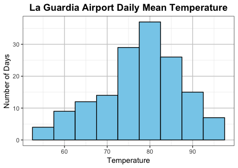
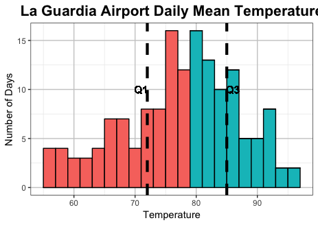
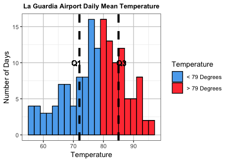
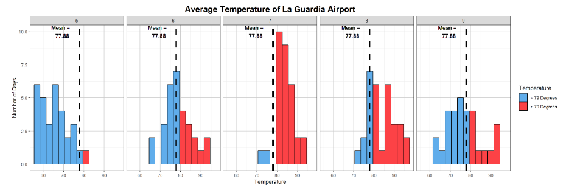
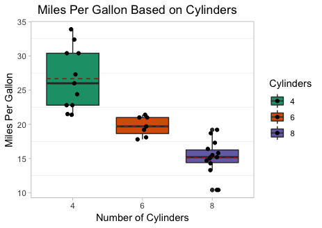
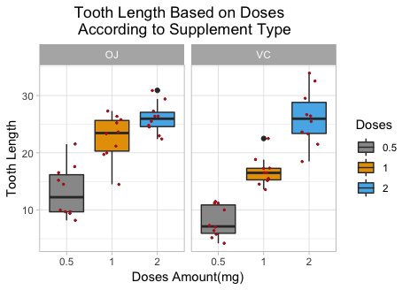

```{r, include=FALSE}
library(tidyverse)
library(plotly)
library(mosaic)
```

```{=html}
<script type="text/javascript">
 function showhide(id) {
    var e = document.getElementById(id);
    e.style.display = (e.style.display == 'block') ? 'none' : 'block';
 }
 
 function openTab(evt, tabName) {
    var i, tabcontent, tablinks;
    tabcontent = document.getElementsByClassName("tabcontent");
    for (i = 0; i < tabcontent.length; i++) {
        tabcontent[i].style.display = "none";
    }
    tablinks = document.getElementsByClassName("tablinks");
    for (i = 0; i < tablinks.length; i++) {
        tablinks[i].className = tablinks[i].className.replace(" active", "");
    }
    document.getElementById(tabName).style.display = "block";
    evt.currentTarget.className += " active";
}
 
</script>
```

------------------------------------------------------------------------

There are many ways to display data. The fundamental idea is that the graphical depiction of data should communicate the truth the data has to offer about the situation of interest.

------------------------------------------------------------------------

### Histograms {.tabset .tabset-fade .tabset-pills}

::: {style="float:left;width:125px;"}
```{r, fig.height=1, fig.width=1, echo=FALSE}
par(mai=c(0,0,0,0))
hist(cars$dist, main="", col='lightgray')
```
:::

**1 Quantitative Variable**

#### Overview

::: {style="padding-left:125px;"}
Great for showing the distribution of data for a single quantitative variable when the sample size is large. Dotplots are a good alternative for smaller sample sizes. Gives a good feel for the [mean](NumericalSummaries.html#mean) and [standard deviation](NumericalSummaries.html#sd) of the data.
:::

------------------------------------------------------------------------

#### R Instructions

::: {style="padding-left:125px;"}
::: tab
<button class="tablinks" onclick="openTab(event, &#39;BaseHistogram&#39;)">

Base R

</button>

<button class="tablinks" onclick="openTab(event, 'ggplot2Histogram')">ggplot2</button> <button class="tablinks" onclick="openTab(event, 'plotlyHistogram')">plotly</button>
:::

::: {#BaseHistogram .tabcontent}
<p>

To make a histogram in R use the function:

`hist(object)`

-   `object` must be quantitative data. R refers to this as a "numeric vector." Usually this will be the column of a dataset accessed with the `$` sign by `hist(dataSetName$columnName)`.

Type `?hist` in your **R Console** to open the help file in R.

<br/>

**Example Code**

Hover your mouse over the example codes to learn more. Click on them to see what they create.

*Basic histogram*

<a href="javascript:showhide('hist1')">

::: hoverchunk
[hist]{.tooltipr}[An R function "hist" used to create a histogram.]{.tooltiprtext} [(]{.tooltipr}[Parenthesis to begin the function. Must touch the last letter of the function.]{.tooltiprtext} [airquality]{.tooltipr}["airquality" is a dataset. Type "View(airquality)" in R to see it.]{.tooltiprtext} [\$]{.tooltipr}[The \$ allows us to access any variable from the airquality dataset.]{.tooltiprtext} [Temp]{.tooltipr}["Temp" is a quantitative variable (numeric vector) from the "airquality" dataset.]{.tooltiprtext} [)\
]{.tooltipr}[Closing parenthsis for the hist function.]{.tooltiprtext} [    \
]{.tooltipr}[Press Enter to run the code.]{.tooltiprtext} [ ... ]{.tooltipr style="float:right;"}[Click to View Output.]{.tooltiprtext}
:::

</a>

::: {#hist1 style="display:none;"}
```{r, echo=FALSE}
hist(airquality$Temp)
```
:::

<br/>

*Change Color*

<a href="javascript:showhide('hist3')">

::: hoverchunk
[hist(airquality\$Temp, ]{.tooltipr}[This code was explained in the first example code.]{.tooltiprtext} [col="skyblue"]{.tooltipr}[col= allows us to specify the color of the plot using a named color. The name of the color must be placed in quotations. Type "colors()" in R to see color options.]{.tooltiprtext} [)]{.tooltipr}[Functions always end with a closing parenthesis.]{.tooltiprtext} [    \
]{.tooltipr}[Press Enter to run the code.]{.tooltiprtext} [ ... ]{.tooltipr style="float:right;"}[Click to View Output.]{.tooltiprtext}
:::

</a>

::: {#hist3 style="display:none;"}
```{r, echo=FALSE}
hist(airquality$Temp, col="skyblue")
```
:::

<br/>

*Add Titles*

<a href="javascript:showhide('hist2')">

::: hoverchunk
[hist(airquality\$Temp]{.tooltipr}[This part was explained in the first example code.]{.tooltiprtext} [, ]{.tooltipr}[The comma allows us to specify optional commands to the function. The space after the comma is not required. It just looks nice.]{.tooltiprtext} [col="skyblue"]{.tooltipr}[col= allows us to specify the color of the plot using a named color. The name of the color must be placed in quotations. Type "colors()" in R to see color options.]{.tooltiprtext} [, ]{.tooltipr}[A comma must always be used to separate additional commands.]{.tooltiprtext} [xlab="Temperature"]{.tooltipr}[xlab= stands for "x label." Use it to specify the text to print on the plot under the x-axis. The desired text must always be in quotations.]{.tooltiprtext} [, ]{.tooltipr}[A comma must always be used to separate additional commands.]{.tooltiprtext} [main="La Guardia Airport Daily Mean Temperatures"]{.tooltipr}[main= lets us specify the "main" title to be placed above the plot. The desired text must always be placed in quotations.]{.tooltiprtext} [)]{.tooltipr}[Functions must always end with a closing parenthesis.]{.tooltiprtext} [    \
]{.tooltipr}[Press Enter to run the code.]{.tooltiprtext} [ ... ]{.tooltipr style="float:right;"}[Click to View Output.]{.tooltiprtext}
:::

</a>

::: {#hist2 style="display:none;"}
```{r, echo=FALSE}
hist(airquality$Temp, col="skyblue", xlab="Temperature", main="La Guardia Airport Daily Mean Temperatures")
```
:::

</p>
:::

::: {#ggplot2Histogram .tabcontent}
<p>

To make a histogram in R using the ggplot approach, first ensure

`library(ggplot2)`

is loaded. Then,

`ggplot(data, aes(x=column)) +`

  `geom_histogram()`

-   `data` is the name of your dataset.
-   `column` is a column of data from your dataset that is quantitative.
-   The aesthetic helper function `aes(x= )` is how you tell the gpplot to make the x-axis become your `column` of data.
-   The geometry helper function `geom_histogram()` causes the ggplot to become a histogram.

<br>

**Example Code**

Hover your mouse over the example codes to learn more. Click on them to see what they create.

*Basic Histogram*

<a href="javascript:showhide('hist1ggplot')">

::: hoverchunk
[ggplot]{.tooltipr}[An R function "ggplot" used to create a framework for a graphic that will have elements added to it with the `+` sign.]{.tooltiprtext} [(]{.tooltipr}[Parenthesis to begin the function. Must touch the last letter of the function.]{.tooltiprtext} [airquality]{.tooltipr}["airquality" is a dataset. Type "View(airquality)" in R to see it.]{.tooltiprtext} [, ]{.tooltipr}[The comma allows us to specify optional commands to the function. The space after the comma is not required. It just looks nice.]{.tooltiprtext} [aes(]{.tooltipr}[The `aes` or "aesthetics" function allows you to tell the ggplot how it should appear. This includes things like what the x-axis or y-axis should become.]{.tooltiprtext} [x=Temp]{.tooltipr}["x=" declares which variable will become the x-axis of the graphic.]{.tooltiprtext} [)\
]{.tooltipr}[Closing parenthsis for the aes function.]{.tooltiprtext} [)\
]{.tooltipr}[Closing parenthsis for the ggplot function.]{.tooltiprtext} [ + ]{.tooltipr}[The addition symbol `+` is used to add further elements to the ggplot.]{.tooltiprtext} <br/>[   geom_histogram()]{.tooltipr}[The "geom_histogram()" function causes the ggplot to become a histogram. There are many other "geom\_" functions that could be used.]{.tooltiprtext} [    \
]{.tooltipr}[Press Enter to run the code.]{.tooltiprtext} [ ... ]{.tooltipr style="float:right;"}[Click to View Output.]{.tooltiprtext}
:::

</a>

::: {#hist1ggplot style="display:none;"}
```{r echo=FALSE, message=FALSE, warning=FALSE}
ggplot(airquality, aes(x=Temp)) + 
  geom_histogram()
```
:::

<br/>

*Change Bin Width and Color*

<a href="javascript:showhide('hist2ggplot')">

::: hoverchunk
[ggplot]{.tooltipr}[An R function "ggplot" used to create a framework for a graphic that will have elements added to it with the `+` sign.]{.tooltiprtext} [(]{.tooltipr}[Parenthesis to begin the function. Must touch the last letter of the function.]{.tooltiprtext} [airquality]{.tooltipr}["airquality" is a dataset. Type "View(airquality)" in R to see it.]{.tooltiprtext} [, ]{.tooltipr}[The comma allows us to specify optional commands to the function. The space after the comma is not required. It just looks nice.]{.tooltiprtext} [aes(]{.tooltipr}[The `aes` or "aesthetics" function allows you to tell the ggplot how it should appear. This includes things like what the x-axis or y-axis should become.]{.tooltiprtext} [x=Temp]{.tooltipr}["x=" declares which variable will become the x-axis of the graphic.]{.tooltiprtext} [)\
]{.tooltipr}[Closing parenthsis for the aes function.]{.tooltiprtext} [)\
]{.tooltipr}[Closing parenthsis for the ggplot function.]{.tooltiprtext} [ + ]{.tooltipr}[The addition symbol `+` is used to add further elements to the ggplot.]{.tooltiprtext} <br/>[   geom_histogram(]{.tooltipr}[The "geom_histogram()" function causes the ggplot to become a histogram. There are many other "geom\_" functions that could be used.]{.tooltiprtext} [binwidth=5, ]{.tooltipr}[The "binwidth" command controls the width of the bars in the histogram.]{.tooltiprtext} [fill="skyblue",]{.tooltipr}[The "fill" command controls the color of the insides of each bar.]{.tooltiprtext} [color="black"]{.tooltipr}[The "color" command controls the color of the edges of each bar.]{.tooltiprtext} [)\
]{.tooltipr}[Closing parenthsis for the geom_histogram function.]{.tooltiprtext} [    \
]{.tooltipr}[Press Enter to run the code.]{.tooltiprtext} [ ... ]{.tooltipr style="float:right;"}[Click to View Output.]{.tooltiprtext}
:::

</a>

::: {#hist2ggplot style="display:none;"}
```{r echo=FALSE, message=FALSE, warning=FALSE}
ggplot(airquality, aes(x=Temp)) + 
  geom_histogram(binwidth = 5, fill = "skyblue", color = "black")
```
:::

<br/>

*Add Titles*

<a href="javascript:showhide('hist3ggplot')">

::: hoverchunk
[ggplot]{.tooltipr}[An R function "ggplot" used to create a framework for a graphic that will have elements added to it with the `+` sign.]{.tooltiprtext} [(]{.tooltipr}[Parenthesis to begin the function. Must touch the last letter of the function.]{.tooltiprtext} [airquality]{.tooltipr}["airquality" is a dataset. Type "View(airquality)" in R to see it.]{.tooltiprtext} [, ]{.tooltipr}[The comma allows us to specify optional commands to the function. The space after the comma is not required. It just looks nice.]{.tooltiprtext} [aes(]{.tooltipr}[The `aes` or "aesthetics" function allows you to tell the ggplot how it should appear. This includes things like what the x-axis or y-axis should become.]{.tooltiprtext} [x=Temp]{.tooltipr}["x=" declares which variable will become the x-axis of the graphic.]{.tooltiprtext} [)\
]{.tooltipr}[Closing parenthsis for the aes function.]{.tooltiprtext} [)\
]{.tooltipr}[Closing parenthsis for the ggplot function.]{.tooltiprtext} [ + ]{.tooltipr}[The addition symbol `+` is used to add further elements to the ggplot.]{.tooltiprtext} <br/>[   geom_histogram(]{.tooltipr}[The "geom_histogram()" function causes the ggplot to become a histogram. There are many other "geom\_" functions that could be used.]{.tooltiprtext} [binwidth=5, ]{.tooltipr}[The "binwidth" command controls the width of the bars in the histogram.]{.tooltiprtext} [fill="skyblue",]{.tooltipr}[The "fill" command controls the color of the insides of each bar.]{.tooltiprtext} [color="black"]{.tooltipr}[The "color" command controls the color of the edges of each bar.]{.tooltiprtext} [)\
]{.tooltipr}[Closing parenthsis for the geom_histogram function.]{.tooltiprtext} [ + ]{.tooltipr}[The addition symbol `+` is used to add further elements to the ggplot.]{.tooltiprtext} <br/>[   labs(]{.tooltipr}[The "labs" function is used to add labels to the plot, like a main title, x-label and y-label.]{.tooltiprtext} [title="La Guardia Airport Daily Mean Temperature", ]{.tooltipr}[The "title=" command allows you to control the main title at the top of the graphic.]{.tooltiprtext} [x="Temperature", ]{.tooltipr}[The "x=" command allows you to control the x-label of the graphic.]{.tooltiprtext} [y="Number of Days"]{.tooltipr}[The "y=" command allows you to control the y-label of the graphic.]{.tooltiprtext} [)\
]{.tooltipr}[Closing parenthsis for the labs function.]{.tooltiprtext} [    \
]{.tooltipr}[Press Enter to run the code.]{.tooltiprtext} [ ... ]{.tooltipr style="float:right;"}[Click to View Output.]{.tooltiprtext}
:::

</a>

::: {#hist3ggplot style="display:none;"}
```{r echo=FALSE, message=FALSE, warning=FALSE}
ggplot(airquality, aes(x=Temp)) + 
  geom_histogram(binwidth = 5, fill = "skyblue", color = "black") + 
  labs(title="La Guardia Airport Daily Mean Temperature", x="Temperature", y="Number of Days")
```
:::

<br/>

**Gallery**

See some ideas from past students...

<a href="javascript:showhide('histogramgalleryggplot')">Show/Hide Gallery</a>

::: {#histogramgalleryggplot style="display:none;"}
Hover to see code. Copy the code into R. Play with it. Modify it to create your own graph.

[\
]{.tooltipgallery}[`ggplot(airquality, aes(x = Temp)) +` <br/> `geom_histogram(binwidth=5, fill = "skyblue", color = "black") +` <br/> `labs(title = "La Guardia Airport Daily Mean Temperature",` <br/>    `x = "Temperature", y = "Number of Days") +` <br/> `theme_bw() +` <br/> `theme(plot.title = element_text(size = 14, face = "bold", hjust = .5),` <br/>    `panel.grid.major = element_line(color = "grey80"))` <br/>]{.tooltipgallerytext}

[\
]{.tooltipgallery}[`ggplot(airquality) +` <br/> `geom_histogram(aes(x = Temp, fill = Temp > median(Temp)), color = "black", binwidth = 2) +` <br/> `labs(title = "La Guardia Airport Daily Mean Temperature",` <br/>    `x = "Temperature", y = "Number of Days") +` <br/> `theme_bw() +` <br/> `theme(plot.title = element_text(size = 14, face = "bold", hjust = .5),` <br/>    `panel.grid.major = element_line(color = "grey80"),` <br/>    `legend.position = "none") +` <br/> `geom_vline(xintercept = 72, linetype = "dashed", size = 1.5, color = "black") +` <br/> `geom_vline(xintercept = 85, linetype = "dashed", size = 1.5, color = "black") +` <br/> `geom_text(x = 71, y = 10, label = "Q1") +` <br/> `geom_text(x = 86, y = 10, label = "Q3")` <br/>]{.tooltipgallerytext}

[\
]{.tooltipgallery}[`ggplot(airquality, aes(x = Temp)) +` <br/> `geom_histogram(aes(fill = Temp > median(Temp)), color = "black", binwidth = 2) +` <br/> `labs(title = "La Guardia Airport Daily Mean Temperature",` <br/>    `x = "Temperature", y = "Number of Days", fill = "Temperature") +` <br/> `theme_bw() +` <br/> `theme(plot.title = element_text(size = 10, face = "bold", hjust = .5),` <br/>    `panel.grid.major = element_line(color = "grey80")) +` <br/> `scale_fill_manual(values = c("steelblue2","brown1"),labels=c("< 79 Degrees","> 79 Degrees")) +` <br/> `geom_vline(xintercept = 72, linetype = "dashed", size = 1.5, color = "black") +` <br/> `geom_vline(xintercept = 85, linetype = "dashed", size = 1.5, color = "black") +` <br/> `geom_text(x = 71, y = 10, label = "Q1") +` <br/> `geom_text(x = 86, y = 10, label = "Q3")` <br/>]{.tooltipgallerytext}

[\
]{.tooltipgallery}[`ggplot(airquality, aes(x = Temp)) +` <br/> `geom_histogram(aes(fill = Temp > median(Temp)), color = "black", binwidth = 3) +` <br/> `labs(title = "Temperature of La Guardia Airport by Month",` <br/>    `x = "Temperature", y = "Number of Days", fill = "Temperature") +` <br/> `theme_bw() +` <br/> `theme(plot.title = element_text(size = 16, face = "bold", hjust = .5),` <br/>    `panel.grid.major = element_line(color = "grey80")) +` <br/> `scale_fill_manual(values = c("steelblue2","brown1"),labels=c("< 79 Degrees","> 79 Degrees")) +` <br/> `facet_grid(~Month) +` <br/> `geom_vline(xintercept = 77.88, linetype = "dashed", size = 1.5, color = "black") +` <br/> `geom_text(x = 69, y = 10, label = "Mean = \n 77.88")` <br/>]{.tooltipgallerytext}
:::

</p>
:::

::: {#plotlyHistogram .tabcontent}
<p>

To make a histogram in plotly first load

`library(plotly)`

Then, use the function:

`plot_ly(dataName, x=~columnName, type="histogram")`

-   `dataName` is the name of a data set
-   `columnName` must be the name of a column of quantitative data. R refers to this as a "numeric vector."
-   `type="histogram"` tells the plot_ly(...) function to create a histogram.

Visit [plotly.com/r/histograms](https://plotly.com/r/histograms/) for more details.

<br/>

**Example Code**

Hover your mouse over the example codes to learn more. Click on them to see what they create.

*Basic histogram*

<a href="javascript:showhide('plotlyhist1')">

::: hoverchunk
[plot_ly]{.tooltipr}[An R function "plot_ly" from library(plotly) used to create any plotly plot.]{.tooltiprtext} [(]{.tooltipr}[Parenthesis to begin the function. Must touch the last letter of the function.]{.tooltiprtext} [airquality, ]{.tooltipr}["airquality" is a dataset. Type "View(airquality)" in R to see it.]{.tooltiprtext} [x=]{.tooltipr}[The x= allows us to declare which column of the data set will become the x-axis of the histogram.]{.tooltiprtext} [\~Temp,  ]{.tooltipr}["Temp" is a quantitative variable (numeric vector) from the "airquality" dataset. The `~` is required before column names inside all plot_ly(...) commands.]{.tooltiprtext} [type="histogram"]{.tooltipr}[This option tells the plot_ly(...) function what "type" of graph to make. In this case, a histogram.]{.tooltiprtext} [)\
]{.tooltipr}[Closing parenthsis for the plot_ly function.]{.tooltiprtext} [    \
]{.tooltipr}[Press Enter to run the code.]{.tooltiprtext} [ ... ]{.tooltipr style="float:right;"}[Click to View Output.]{.tooltiprtext}
:::

</a>

::: {#plotlyhist1 style="display:none;"}
```{r, echo=FALSE, warning=FALSE}
plot_ly(airquality, x=~Temp, type="histogram")
```
:::

<br/>

*Change Color*

<a href="javascript:showhide('plotlyhist3')">

::: hoverchunk
[plot_ly(airquality, x=\~Temp, type="histogram", ]{.tooltipr}[This code was explained in the first example code.]{.tooltiprtext} [marker=list(]{.tooltipr}[this "list(...)" of options that will be specified will effect the bars of the histogram.]{.tooltiprtext} [color = "skyblue", ]{.tooltipr}[this will change the color of the bars to skyblue.]{.tooltiprtext} [line = list(, ]{.tooltipr}[this opens a list of options to specify for the "lines" around the "markers."]{.tooltiprtext} [color = "darkgray", ]{.tooltipr}[this will change the color of the lines around the bars to darkgray.]{.tooltiprtext} [width = 2]{.tooltipr}[this will change the width of the lines around the bars to 2 pixels. Too really see what this does, change it to something crazy like 10.]{.tooltiprtext} [)]{.tooltipr}[Functions always end with a closing parenthesis.]{.tooltiprtext} [)]{.tooltipr}[Functions always end with a closing parenthesis.]{.tooltiprtext} [)]{.tooltipr}[Functions always end with a closing parenthesis.]{.tooltiprtext} [    \
]{.tooltipr}[Press Enter to run the code.]{.tooltiprtext} [ ... ]{.tooltipr style="float:right;"}[Click to View Output.]{.tooltiprtext}
:::

</a>

::: {#plotlyhist3 style="display:none;"}
```{r, echo=FALSE}
plot_ly(airquality, x=~Temp, type="histogram", marker = list( color="skyblue", line = list(color="darkgray", width=2)))
```
:::

<br/>

*Add Titles*

<a href="javascript:showhide('plotlyhist2')">

::: hoverchunk
[plot_ly(airquality\$Temp, type="histogram", ]{.tooltipr}[This code was explained in the first example code.]{.tooltiprtext} [marker=list(]{.tooltipr}[this "list(" of options that will be specified will effect the bars of the histogram.]{.tooltiprtext} [color = "skyblue", ]{.tooltipr}[this will change the color of the bars to skyblue.]{.tooltiprtext} [line = list(, ]{.tooltipr}[this opens a list of options to specify for the "lines" around the "markers."]{.tooltiprtext} [color = "darkgray", ]{.tooltipr}[this will change the color of the lines around the bars to darkgray.]{.tooltiprtext} [width = 10]{.tooltipr}[this will change the width of the lines around the bars to 10 pixels, which is rather large really. Using a width=2 is probably better.]{.tooltiprtext} [)]{.tooltipr}[Functions always end with a closing parenthesis.]{.tooltiprtext} [)]{.tooltipr}[Functions always end with a closing parenthesis.]{.tooltiprtext} [)]{.tooltipr}[Functions always end with a closing parenthesis.]{.tooltiprtext} [ %\>%]{.tooltipr}[The pipe operator passes the completed plot_ly(...) code into the layout(...) function.]{.tooltiprtext} <br/>[layout(]{.tooltipr}[The layout(...) function is used for specifying details about the axes and their labels.]{.tooltiprtext} [title="La Guardia Airport Daily Mean Temperatures"]{.tooltipr}[This declares a main title for the top of the graph.]{.tooltiprtext} [xaxis=list(]{.tooltipr}[This declares a list of options to be specified for the xaxis. The same can be done for the yaxis(...).]{.tooltiprtext} [title="Temperature in Degrees F"]{.tooltipr}[This declares a title underneath the x-axis.]{.tooltiprtext} [)]{.tooltipr}[Functions always end with a closing parenthesis.]{.tooltiprtext} [)]{.tooltipr}[Functions always end with a closing parenthesis.]{.tooltiprtext} [    \
]{.tooltipr}[Press Enter to run the code.]{.tooltiprtext} [ ... ]{.tooltipr style="float:right;"}[Click to View Output.]{.tooltiprtext}
:::

</a>

::: {#plotlyhist2 style="display:none;"}
```{r, echo=FALSE}
plot_ly(airquality, x=~Temp, type="histogram", marker=list( color="skyblue", line=list(color="darkgray", width=10))) %>%
  layout(title="La Guardia Airport Daily Mean Temperatures", xaxis=list(title="Temperature in Degrees F"))
```
:::

</p>
:::
:::

------------------------------------------------------------------------

#### Explanation

::: {style="padding-left:125px;"}
Histograms group data that are close to each other into "bins" (the vertical bars in the plot). The height of a bin is determined by the number of data points that are contained within the bin. For example, if we group together all the sections of the book of scripture known as the [Doctrine and Covenants](https://www.lds.org/scriptures/dc-testament/chron-order?lang=eng) that occurred in a given year (Jan. 1st - Dec. 31st) then we get the following counts.

| Year | Number of Sections |
|------|--------------------|
| 1823 | 1                  |
| 1824 | 0                  |
| 1825 | 0                  |
| 1826 | 0                  |
| 1827 | 0                  |
| 1828 | 1                  |
| 1829 | 16                 |
| 1830 | 19                 |
| 1831 | 37                 |
| 1832 | 16                 |
| 1833 | 12                 |
| 1834 | 5                  |
| 1835 | 3                  |
| 1836 | 4                  |
| 1837 | 1                  |
| 1838 | 8                  |
| 1839 | 3                  |
| 1840 | 0                  |
| 1841 | 3                  |
| 1842 | 2                  |
| 1843 | 4                  |
| 1844 | 1                  |
| 1845 | 0                  |
| 1846 | 0                  |
| 1847 | 1                  |

[ \*Note that Section 138 occurred in 1918 and is removed from this example. ]{style="padding-left:30px; color:#a8a8a8; font-size:.8em;"}

In this example, each "bin" spans 365 days (Jan. 1 - Dec. 31 of each year). Since "dates" can be used as quantitative data, it makes sense to make a histogram of these data. (Remember, histograms are only for quantitative data.)

```{r, echo=FALSE}
revs <- read.csv("./Data/DCRevelationDates.csv", header=TRUE)
revs$Date <- as.Date(revs$Date, "%d %b %Y")
breaks <- c(-53692, -53327, -52961, -52596, -52231, -51866, -51500, 
            -51135, -50770, -50405, -50039, -49674, -49309, -48944, 
            -48578, -48213, -47848, -47483, -47117, -46752, -46387, 
            -46022, -45656, -45291, -44926, -44561)
hist(revs$Date[-length(revs$Date)], "year", las=2, 
     freq=TRUE, xlab="Year", main="Dates of D&C Revelations", right=FALSE,
     include.lowest=FALSE, axes=FALSE)
axis(1,at=breaks,labels=1823:1848, las=2)
axis(2,at=0:19*2, las=2)
```

Notice in the bins above that the left edge of the bin is on the year the data corresponds with. The right edge of the bin lands on the following year. For example, the first bin has left edge on 1823 and right edge on 1824. Since there was one revelation in 1823, this bin has a height of 1. The bin that has 1831 on the left and 1832 on the right shows that 37 revelations occurred in 1831. It is powerful to notice the amount of revelations occurring around 1830, the year the [Church of Jesus Christ of Latter-day Saints](https://www.lds.org/?lang=eng) was organized.
:::

------------------------------------------------------------------------

### Boxplots {.tabset .tabset-fade .tabset-pills}

::: {style="float:left;width:125px;"}
```{r, fig.height=1, fig.width=1, echo=FALSE}
par(mai=c(0,0,0,0))
boxplot(uptake ~ Treatment, data=CO2, yaxt='n', col='lightgray')
```
:::

**1 Quantitative Variable \| 2+ Groups**

#### Overview

::: {style="padding-left:125px;"}
Graphical depiction of the [five-number summary](NumericalSummaries.html#quartiles). Great for comparing the distributions of data across several groups or categories. Provides a quick visual understanding of the location of the median as well as the range of the data. Can be useful in showing outliers. Sample size should be larger than at least five, or computing the *five*-number summary is not very meaningful. Side-by-side dotplots are a good alternative for smaller sample sizes.
:::

------------------------------------------------------------------------

#### R Instructions

::: {style="padding-left:125px;"}
::: tab
<button class="tablinks" onclick="openTab(event, &#39;BaseBoxplot&#39;)">

Base R

</button>

<button class="tablinks" onclick="openTab(event, 'ggplot2Boxplot')">ggplot2</button> <button class="tablinks" onclick="openTab(event, 'plotlyBoxplot')">plotly</button>
:::

::: {#BaseBoxplot .tabcontent}
<p>

To make a boxplot in R use the function:

`boxplot(object)`

To make side-by-side boxplots:

`boxplot(object ~ group, data=NameOfYourData, ...)`

-   `object` must be quantitative data. R refers to this as a "numeric vector."
-   `group` must be qualitative data. R refers to this as either a "character vector" or a "factor." However, a "numeric vector" can also act as a qualitative variable.
-   `NameOfYourData` is the name of the dataset containing `object` and `group`.
-   `...` implies there are many other options that can be given to the `boxplot()` function. Type `?boxplot` in your **R Console** for more details.

**Example Code**

*Basic Single Boxplot*

<a href="javascript:showhide('boxplot0')">

::: hoverchunk
[boxplot]{.tooltipr}[An R function "boxplot" used to create boxplots.]{.tooltiprtext} [(]{.tooltipr}[Parenthesis to begin the function. Must touch the last letter of the function.]{.tooltiprtext} [airquality]{.tooltipr}["airquality" is a dataset. Type "View(airquality)" in R to see it.]{.tooltiprtext} [\$]{.tooltipr}[The \$ allows us to access any variable from the airquality dataset.]{.tooltiprtext} [Temp]{.tooltipr}["Temp" is a quantitative variable (numeric vector) from the "airquality" dataset.]{.tooltiprtext} [)\
]{.tooltipr}[Closing parenthsis for the function.]{.tooltiprtext} [    \
]{.tooltipr}[Press Enter to run the code.]{.tooltiprtext} [ ... ]{.tooltipr style="float:right;"}[Click to View Output.]{.tooltiprtext}
:::

</a>

::: {#boxplot0 style="display:none;"}
```{r, echo=FALSE}
boxplot(airquality$Temp)
```
:::

<br/>

*More Useful... Basic Side-by-Side Boxplot*

<a href="javascript:showhide('boxplot1')">

::: hoverchunk
[boxplot]{.tooltipr}[An R function "boxplot" used to create boxplots.]{.tooltiprtext} [(]{.tooltipr}[Parenthesis to begin the function. Must touch the last letter of the function.]{.tooltiprtext} [Temp]{.tooltipr}["Temp" is a quantitative variable (numeric vector) from the "airquality" dataset.]{.tooltiprtext} [ \~ ]{.tooltipr}[The \~ is used to tell R that you want one boxplot of the quantitative variable ("Temp") for each group found in the qualitative variable ("Month").]{.tooltiprtext} [Month]{.tooltipr}["Month" is a qualitative variable (in this case a "numeric vector" defining months by 5, 6, 7, 8, and 9) from the "airquality" dataset.]{.tooltiprtext} [, \
]{.tooltipr}[The "," is required to start specifying additional commands for the "boxplot()" function.]{.tooltiprtext} [data=airquality]{.tooltipr}[data= is used to tell R that the "Temp" and "Month" variables are located in the]{.tooltiprtext}[airquality]{style="font-weight:bold"} dataset. Without this, R will not know where to find "Temp" and "Month" and the command will give an error. [)]{.tooltipr}[Functions always end with a closing parenthesis.]{.tooltiprtext} [    \
]{.tooltipr}[Press Enter to run the code.]{.tooltiprtext} [ ... ]{.tooltipr style="float:right;"}[Click to View Output.]{.tooltiprtext}
:::

</a>

::: {#boxplot1 style="display:none;"}
```{r, echo=FALSE}
boxplot(Temp ~ Month, data=airquality)
```
:::

<br/>

*Add Names under each Box*

<a href="javascript:showhide('boxplot2a')">

::: hoverchunk
[boxplot]{.tooltipr}[An R function "boxplot" used to create boxplots.]{.tooltiprtext} [(]{.tooltipr}[Parenthesis to begin the function. Must touch the last letter of the function.]{.tooltiprtext} [Temp]{.tooltipr}["Temp" is a quantitative variable (numeric vector) from the "airquality" dataset.]{.tooltiprtext} [ \~ ]{.tooltipr}[The \~ is used to tell R that you want one boxplot of the quantitative variable ("Temp") for each group found in the qualitative variable ("Month").]{.tooltiprtext} [Month]{.tooltipr}["Month" is a qualitative variable (in this case a "numeric vector" defining months by 5, 6, 7, 8, and 9) from the "airquality" dataset.]{.tooltiprtext} [, \
]{.tooltipr}[The "," is required to start specifying additional commands for the "boxplot()" function.]{.tooltiprtext} [data=airquality]{.tooltipr}[data= is used to tell R that the "Temp" and "Month" variables are located in the]{.tooltiprtext}[airquality]{style="font-weight:bold"} dataset. Without this, R will not know where to find "Temp" and "Month" and the command will give an error. [, \
]{.tooltipr}[The "," is required to start specifying additional commands for the "boxplot()" function.]{.tooltiprtext} [names=c("May","June","July","Aug","Sep")]{.tooltipr}[names= is used to tell R what labels to place on the x-axis below each boxplot.]{.tooltiprtext} [)]{.tooltipr}[Functions always end with a closing parenthesis.]{.tooltiprtext} [    \
]{.tooltipr}[Press Enter to run the code.]{.tooltiprtext} [ ... ]{.tooltipr style="float:right;"}[Click to View Output.]{.tooltiprtext}
:::

</a>

::: {#boxplot2a style="display:none;"}
```{r, echo=FALSE}
boxplot(Temp ~ Month, data=airquality, names=c("May","June","July","Aug","Sep"))
```
:::

<br/>

*Add Color and Labels*

<a href="javascript:showhide('boxplot2')">

::: hoverchunk
[boxplot(Temp \~ Month, data=airquality]{.tooltipr}[This code was explained in the previous example code.]{.tooltiprtext} [, ]{.tooltipr}[The comma is used to separate each additional command to a function.]{.tooltiprtext} [xlab="Month of the Year"]{.tooltipr}[xlab= stands for "x label." Use it to specify the text to print on the plot under the x-axis. The desired text must always be contained in quotes.]{.tooltiprtext} [, ]{.tooltipr}[The comma is used to separate each additional command to a function.]{.tooltiprtext} [ylab="Temperature"]{.tooltipr}[ylab= stands for "y label." Use it to specify the text to print on the plot next to the y-axis. The desired text must always be contained in quotes.]{.tooltiprtext} [, ]{.tooltipr}[The comma is used to separate each additional command to a function.]{.tooltiprtext} [main="La Guardia Airport Daily Temperatures"]{.tooltipr}[main= stands for the "main label" of the plot, which is placed at the top center of the plot. The desired text must always be contained in quotes.]{.tooltiprtext} [, ]{.tooltipr}[The comma is used to separate each additional command to a function.]{.tooltiprtext} [col="wheat"]{.tooltipr}[col= stands for the "color" of the plot. The color name "wheat" is an available color in R. Type colors() in the R Console to see more options. The color name must always be placed in quotes.]{.tooltiprtext} [)]{.tooltipr}[Functions always end with a closing parenthesis.]{.tooltiprtext} [    \
]{.tooltipr}[Press Enter to run the code.]{.tooltiprtext} [ ... ]{.tooltipr style="float:right;"}[Click to View Output.]{.tooltiprtext}
:::

</a>

::: {#boxplot2 style="display:none;"}
```{r, echo=FALSE}
boxplot(Temp ~ Month, data=airquality, xlab="Month of the Year", ylab="Temperature",  main="La Guardia Airport Daily Temperatures", col="wheat")
```
:::

</p>
:::

::: {#ggplot2Boxplot .tabcontent}
<p>

To make a boxplot in R using the ggplot approach, first ensure

`library(ggplot2)`

is loaded. Then,

`ggplot(data, aes(x=groupsColumn, y=dataColumn) +`

  `geom_boxplot()`

-   `data` is the name of your dataset.
-   `groupsColumn` is a column of data from your dataset that is qualitative and represents the groups that should each have a boxplot.
-   `dataColumn` is a column of data from your dataset that is quantitative.
-   The aesthetic helper function `aes(x= , y=)` is how you tell the gpplot to make the x-axis have the values in your `groupsColumn` of data, the y-axis become your `dataColumn`. **Note** *if `groupsColumn` is not a factor, use `factor(groupsColumn)` instead.*
-   The geometry helper function `geom_boxplot()` causes the ggplot to become a boxplot.

<br>

**Example Code**

*Basic Single Boxplot*

<a href="javascript:showhide('box1ggplot')">

::: hoverchunk
[ggplot]{.tooltipr}[An R function "ggplot" used to create a framework for a graphic that will have elements added to it with the `+` sign.]{.tooltiprtext} [(]{.tooltipr}[Parenthesis to begin the function. Must touch the last letter of the function.]{.tooltiprtext} [airquality]{.tooltipr}["airquality" is a dataset. Type "View(airquality)" in R to see it.]{.tooltiprtext} [, ]{.tooltipr}[The comma allows us to specify optional commands to the function. The space after the comma is not required. It just looks nice.]{.tooltiprtext} [aes(]{.tooltipr}[The `aes` or "aesthetics" function allows you to tell the ggplot how it should appear. This includes things like what the y-axis should become.]{.tooltiprtext} [y=Temp]{.tooltipr}["y=" declares which variable will become the y-axis of the graphic.]{.tooltiprtext} [)\
]{.tooltipr}[Closing parenthsis for the aes function.]{.tooltiprtext} [)\
]{.tooltipr}[Closing parenthsis for the ggplot function.]{.tooltiprtext} [ + ]{.tooltipr}[The addition symbol `+` is used to add further elements to the ggplot.]{.tooltiprtext} <br/>[   geom_boxplot()]{.tooltipr}[The "geom_boxplot()" function causes the ggplot to become a boxplot. There are many other "geom\_" functions that could be used.]{.tooltiprtext} [    \
]{.tooltipr}[Press Enter to run the code.]{.tooltiprtext} [ ... ]{.tooltipr style="float:right;"}[Click to View Output.]{.tooltiprtext}
:::

</a>

::: {#box1ggplot style="display:none;"}
```{r echo=FALSE, message=FALSE, warning=FALSE}
ggplot(airquality, aes(y=Temp)) + 
  geom_boxplot()
```
:::

<br/> *Side-by-side Boxplot and Color Change*

<a href="javascript:showhide('box2ggplot')">

::: hoverchunk
[ggplot]{.tooltipr}[An R function "ggplot" used to create a framework for a graphic that will have elements added to it with the `+` sign.]{.tooltiprtext} [(]{.tooltipr}[Parenthesis to begin the function. Must touch the last letter of the function.]{.tooltiprtext} [airquality]{.tooltipr}["airquality" is a dataset. Type "View(airquality)" in R to see it.]{.tooltiprtext} [, ]{.tooltipr}[The comma allows us to specify optional commands to the function. The space after the comma is not required. It just looks nice.]{.tooltiprtext} [aes(]{.tooltipr}[The `aes` or "aesthetics" function allows you to tell the ggplot how it should appear. This includes things like what the x-axis or y-axis should become.]{.tooltiprtext} [x=factor(Month), ]{.tooltipr}["x=" declares which variable will become the x-axis of the graphic. Since Month is "numeric" we must use "factor(Month)" instead of just "Month".]{.tooltiprtext} [y=Temp]{.tooltipr}["y=" declares which variable will become the y-axis of the graphic.]{.tooltiprtext} [)\
]{.tooltipr}[Closing parenthsis for the aes function.]{.tooltiprtext} [)\
]{.tooltipr}[Closing parenthsis for the ggplot function.]{.tooltiprtext} [ + ]{.tooltipr}[The addition symbol `+` is used to add further elements to the ggplot.]{.tooltiprtext} <br/>[   geom_boxplot(]{.tooltipr}[The "geom_boxplot()" function causes the ggplot to become a boxplot. There are many other "geom\_" functions that could be used.]{.tooltiprtext} [fill="skyblue", ]{.tooltipr}[The "fill" command controls the color of the insides of each box in the boxplot.]{.tooltiprtext} [color="black"]{.tooltipr}[The "color" command controls the color of the edges of each box.]{.tooltiprtext} [)\
]{.tooltipr}[Closing parenthsis for the geom_boxplot function.]{.tooltiprtext} [    \
]{.tooltipr}[Press Enter to run the code.]{.tooltiprtext} [ ... ]{.tooltipr style="float:right;"}[Click to View Output.]{.tooltiprtext}
:::

</a>

::: {#box2ggplot style="display:none;"}
```{r echo=FALSE, message=FALSE, warning=FALSE}
ggplot(airquality, aes(x=factor(Month), y=Temp)) + 
  geom_boxplot(fill = "skyblue", color = "black")
```
:::

<br/>

*Add Labels* <a href="javascript:showhide('box3ggplot')">

::: hoverchunk
[ggplot]{.tooltipr}[An R function "ggplot" used to create a framework for a graphic that will have elements added to it with the `+` sign.]{.tooltiprtext} [(]{.tooltipr}[Parenthesis to begin the function. Must touch the last letter of the function.]{.tooltiprtext} [airquality]{.tooltipr}["airquality" is a dataset. Type "View(airquality)" in R to see it.]{.tooltiprtext} [, ]{.tooltipr}[The comma allows us to specify optional commands to the function. The space after the comma is not required. It just looks nice.]{.tooltiprtext} [aes(]{.tooltipr}[The `aes` or "aesthetics" function allows you to tell the ggplot how it should appear. This includes things like what the x-axis or y-axis should become.]{.tooltiprtext} [x=factor(Month), ]{.tooltipr}["x=" declares which variable will become the x-axis of the graphic. Since Month is "numeric" we must use "factor(Month)" instead of just "Month".]{.tooltiprtext} [y=Temp]{.tooltipr}["y=" declares which variable will become the y-axis of the graphic.]{.tooltiprtext} [)\
]{.tooltipr}[Closing parenthsis for the aes function.]{.tooltiprtext} [)\
]{.tooltipr}[Closing parenthsis for the ggplot function.]{.tooltiprtext} [ + ]{.tooltipr}[The addition symbol `+` is used to add further elements to the ggplot.]{.tooltiprtext} <br/>[   geom_boxplot(]{.tooltipr}[The "geom_histogram()" function causes the ggplot to become a histogram. There are many other "geom\_" functions that could be used.]{.tooltiprtext} [fill="skyblue", ]{.tooltipr}[The "fill" command controls the color of the insides of each box.]{.tooltiprtext} [color="black"]{.tooltipr}[The "color" command controls the color of the edges of each box.]{.tooltiprtext} [)\
]{.tooltipr}[Closing parenthsis for the geom_boxplot function.]{.tooltiprtext} [ + ]{.tooltipr}[The addition symbol `+` is used to add further elements to the ggplot.]{.tooltiprtext} <br/>[   labs(]{.tooltipr}[The "labs" function is used to add labels to the plot, like a main title, x-label and y-label.]{.tooltiprtext} [title="La Guardia Airport Daily Mean Temperature", ]{.tooltipr}[The "title=" command allows you to control the main title at the top of the graphic.]{.tooltiprtext} [x="Month of the Year", ]{.tooltipr}[The "x=" command allows you to control the x-label of the graphic.]{.tooltiprtext} [y="Daily Mean Temperature"]{.tooltipr}[The "y=" command allows you to control the y-label of the graphic.]{.tooltiprtext} [)\
]{.tooltipr}[Closing parenthsis for the labs function.]{.tooltiprtext} [    \
]{.tooltipr}[Press Enter to run the code.]{.tooltiprtext} [ ... ]{.tooltipr style="float:right;"}[Click to View Output.]{.tooltiprtext}
:::

</a>

::: {#box3ggplot style="display:none;"}
```{r echo=FALSE, message=FALSE, warning=FALSE}
ggplot(airquality, aes(x=factor(Month), y=Temp)) + 
  geom_boxplot(fill = "skyblue", color = "black") + 
  labs(title="La Guardia Airport Daily Mean Temperature", x="Month of Year", y="Daily Mean Temperature")
```
:::

<br/>

**Gallery**

See what past students have done...

<a href="javascript:showhide('boxplotgalleryggplot')">Click to view.</a>

::: {#boxplotgalleryggplot style="display:none;"}
Hover to see code.

[\
]{.tooltipgallery}[`ggplot(data = mtcars, aes(x = as.factor(cyl), y = mpg, fill=as.factor(cyl))) +` <br/> `geom_boxplot()  +` <br/> `stat_summary(fun.y = mean, geom = "errorbar", aes(ymax = ..y.., ymin = ..y..),` <br/>    `width = .75, linetype = "dashed", color="firebrick") +` <br/> `theme_light() +` <br/> `theme(panel.grid.major=element_blank()) +` <br/> `scale_fill_brewer(palette="Dark2") +` <br/> `geom_jitter(width=0.1, height=0) +` <br/> `labs(title = "Miles Per Gallon Based on Cylinders",` <br/>    `x="Number of Cylinders",` <br/>    `fill="Cylinders",` <br/>    `y="Miles Per Gallon")` <br/>]{.tooltipgallerytext}

[\
]{.tooltipgallery}[`ggplot(data = ToothGrowth, aes(x = as.factor(dose), y = len, fill=as.factor(dose))) +` <br/> `geom_boxplot( )  +` <br/> `facet_wrap(~supp) +` <br/> `theme_bw() +` <br/> `scale_fill_manual(values=c("#999999", "#E69F00", "#56B4E9")) +` <br/> `geom_jitter(width=0.1, height=0) +` <br/> `labs(title = "Tooth Length Based on Doses` <br/>    `According to Supplement Type",` <br/>    `fill="Doses",` <br/>    `x="Dosage Amount(mg)",` <br/>    `y="Tooth Length" )` <br/>]{.tooltipgallerytext}
:::

</p>
:::

::: {#plotlyBoxplot .tabcontent}
<p>

To make a histogram in plotly first load

`library(plotly)`

Then, use the function:

`plot_ly(dataName, y=~columnNameY, x=~columnNameX, type="box")`

-   `dataName` is the name of a data set
-   `columnNameY` must be the name of a column of quantitative data. R refers to this as a "numeric vector." This will become the y-axis of the plot.
-   `columnNameX` must be the name of a column of qualitative data. This will provide the "groups" forming each individual box in the boxplot.
-   `type="box"` tells the plot_ly(...) function to create a boxplot.

Visit [plotly.com/r/box-plots](https://plotly.com/r/box-plots/) for more details.

<br/>

**Example Code**

Hover your mouse over the example codes to learn more. Click on them to see what they create.

*Basic Boxplot*

<a href="javascript:showhide('plotlybox1')">

::: hoverchunk
[plot_ly]{.tooltipr}[An R function "plot_ly" from library(plotly) used to create any plotly plot.]{.tooltiprtext} [(]{.tooltipr}[Parenthesis to begin the function. Must touch the last letter of the function.]{.tooltiprtext} [airquality, ]{.tooltipr}["airquality" is a dataset. Type "View(airquality)" in R to see it.]{.tooltiprtext} [y=]{.tooltipr}[The y= allows us to declare which column of the data set will become the y-axis of the boxplot. In other words, the quantitative data we are interested in studying for each group.]{.tooltiprtext} [\~Temp,  ]{.tooltipr}["Temp" is a quantitative variable (numeric vector) from the "airquality" dataset. The `~` is required before column names inside all plot_ly(...) commands.]{.tooltiprtext} [x=]{.tooltipr}[The x= allows us to declare which column of the data set will become the x-axis of the boxplot. In other words, the "groups" forming each separate box in the boxplot.]{.tooltiprtext} [\~as.factor(Month),  ]{.tooltipr}[since "Month" is a quantitative variable (numeric vector) from the "airquality" dataset we have to change it to a "factor" which forces R to treat it as a qualitative (groups) variable. The `~` is required before column names inside all plot_ly(...) commands.]{.tooltiprtext} [type="box"]{.tooltipr}[This option tells the plot_ly(...) function what "type" of graph to make. In this case, a boxplot.]{.tooltiprtext} [)\
]{.tooltipr}[Closing parenthsis for the plot_ly function.]{.tooltiprtext} [    \
]{.tooltipr}[Press Enter to run the code.]{.tooltiprtext} [ ... ]{.tooltipr style="float:right;"}[Click to View Output.]{.tooltiprtext}
:::

</a>

::: {#plotlybox1 style="display:none;"}
```{r, echo=FALSE, warning=FALSE}
plot_ly(airquality, y=~Temp, x=~as.factor(Month), type="box")
```
:::

<br/>

*Change Color*

<a href="javascript:showhide('plotlybox3')">

::: hoverchunk
[plot_ly(airquality, y=\~Temp, x=\~as.factor(Month), type="box", ]{.tooltipr}[This code was explained in the first example code.]{.tooltiprtext} [fillcolor="skyblue", ]{.tooltipr}[this changes the fill color of the boxes in the boxplot to the color specified, in this case "skyblue."]{.tooltiprtext} [line=list(color="darkgray", width=3), ]{.tooltipr}[this "list(...)" of options that will be specified will effect the edges of the boxes in the boxplot. We are changing their color to "darkgray" and their width to 3 pixels wide.]{.tooltiprtext} [marker=list(]{.tooltipr}[this "list(...)" of options that will be specified will effect the outlying dots shown in the boxplots beyond the "fences" of each box.]{.tooltiprtext} [color = "orange", ]{.tooltipr}[this will change the color of the dots to orange.]{.tooltiprtext} [line = list(, ]{.tooltipr}[this opens a list of options to specify for the "lines" around the "markers."]{.tooltiprtext} [color = "red", ]{.tooltipr}[this will change the color of the lines around the outlier dots to red.]{.tooltiprtext} [width = 1]{.tooltipr}[this will change the width of the lines around the outlier dots to 1 pixel.]{.tooltiprtext} [)]{.tooltipr}[Functions always end with a closing parenthesis.]{.tooltiprtext} [)]{.tooltipr}[Functions always end with a closing parenthesis.]{.tooltiprtext} [)]{.tooltipr}[Functions always end with a closing parenthesis.]{.tooltiprtext} [    \
]{.tooltipr}[Press Enter to run the code.]{.tooltiprtext} [ ... ]{.tooltipr style="float:right;"}[Click to View Output.]{.tooltiprtext}
:::

</a>

::: {#plotlybox3 style="display:none;"}
```{r, echo=FALSE}
plot_ly(airquality, y=~Temp, x=~as.factor(Month), type="box", fillcolor="skyblue", line=list(color="darkgray", width=3), marker = list(color="orange", line = list(color="red", width=1)))
```
:::

<br/>

*Add Titles*

<a href="javascript:showhide('plotlybox2')">

::: hoverchunk
[plot_ly(airquality, y=\~Temp, x=\~as.factor(Month), type="box", fillcolor="skyblue", line=list(color="darkgray", width=3), marker = list(color="orange", line = list(color="red", width=1))) ]{.tooltipr}[This code was explained in the above example code.]{.tooltiprtext} [%\>%]{.tooltipr}[the pipe operator sends the completed plot_ly(...) code into the layout function.]{.tooltiprtext} <br/>[layout(]{.tooltipr}[The layout(...) function is used for specifying details about the axes and their labels.]{.tooltiprtext} [title="La Guardia Airport Daily Mean Temperatures"]{.tooltipr}[This declares a main title for the top of the graph.]{.tooltiprtext} [xaxis=list(]{.tooltipr}[This declares a list of options to be specified for the xaxis. The same can be done for the yaxis(...).]{.tooltiprtext} [title="Month of the Year"]{.tooltipr}[This declares a title underneath the x-axis.]{.tooltiprtext} [), ]{.tooltipr}[Functions always end with a closing parenthesis.]{.tooltiprtext} [yaxis=list(]{.tooltipr}[This declares a list of options to be specified for the y-axis.]{.tooltiprtext} [title="Temperature in Degrees F"]{.tooltipr}[This declares a title beside the y-axis.]{.tooltiprtext} [)]{.tooltipr}[Functions always end with a closing parenthesis.]{.tooltiprtext} [)]{.tooltipr}[Functions always end with a closing parenthesis.]{.tooltiprtext} [    \
]{.tooltipr}[Press Enter to run the code.]{.tooltiprtext} [ ... ]{.tooltipr style="float:right;"}[Click to View Output.]{.tooltiprtext}
:::

</a>

::: {#plotlybox2 style="display:none;"}
```{r, echo=FALSE}
plot_ly(airquality, y=~Temp, x=~as.factor(Month), type="box", fillcolor="skyblue", line=list(color="darkgray", width=3), marker = list(color="orange", line = list(color="red", width=1))) %>%
  layout(title="La Guardia Airport Daily Mean Temperatures", yaxis=list(title="Temperature in Degrees F"), xaxis=list(title="Month of the Year"))
```
:::

</p>
:::
:::

------------------------------------------------------------------------

#### Explanation

::: {style="padding-left:125px;"}
Understanding how a boxplot is created is the best way to understand what the boxplot shows.

##### How Boxplots are Made

1.  The five-number summary is computed.
2.  A box is drawn with one edge located at the first quartile and the opposite edge located at the third quartile.
3.  This box is then divided into two boxes by placing another line inside the box at the location of the median.
4.  The maximum value and minimum value are marked on the plot.
5.  Whiskers are drawn from the first quartile out towards the minimum and from the third quartile out towards the maximum.
6.  If the minimum or maximum is too far away, then the whisker is ended early.
7.  Any points beyond the line ending the whisker are marked on the plot as dots. This helps identify possible outliers in the data.
:::

------------------------------------------------------------------------

### Dot Plots {.tabset .tabset-fade .tabset-pills}

::: {style="float:left;width:125px;"}
```{r, fig.height=1, fig.width=1, echo=FALSE}
par(mai=c(0,0,0,0))
stripchart(Wind ~ Month, data=airquality, method="stack", pch=16, cex=0.4)
```
:::

**1 Quantitative Variable \| 2+ Groups**

#### Overview

::: {style="padding-left:125px;"}
Depicts the actual values of each data point. Best for small sample sizes or for datasets where there are lots of repeated values. Histograms or boxplots are better alternatives for large sample sizes when there are few repeated values. Great for comparing the distribution of data across several groups or categories.
:::

------------------------------------------------------------------------

#### R Instructions

::: {style="padding-left:125px;"}
::: tab
<button class="tablinks" onclick="openTab(event, &#39;BaseDotplot&#39;)">

Base R

</button>

<button class="tablinks" onclick="openTab(event, 'ggplot2Dotplot')">ggplot2</button> <button class="tablinks" onclick="openTab(event, 'plotlyDotplot')">plotly</button>
:::

::: {#BaseDotplot .tabcontent}
<p>

To make a dot plot in Base R use the code:

`stripchart(object)`

For side-by-side dotplots:

`stripchart(object ~ group, data=NameOfYourData)`

-   `object` must be a quantitative (or ordinal) variable, what R refers to as a "numeric vector."
-   `group` is a qualitative variable, which in R can be either a "character vector" or a "factor."
-   `NameOfYourData` is the name of the dataset containing `object` and `group`.

**Example Code**

<!-- Example Code 1 -->

<a href="javascript:showhide('dotplot0')">

::: hoverchunk
[stripchart]{.tooltipr}[An R function "stripchart" used to create a dot plot.]{.tooltiprtext} [(]{.tooltipr}[Parenthesis to begin the function. Must touch the last letter of the function.]{.tooltiprtext} [airquality]{.tooltipr}["airquality" is a dataset. Type "View(airquality)" in R to see it.]{.tooltiprtext} [\$]{.tooltipr}[The \$ allows us to access any variable from the airquality dataset.]{.tooltiprtext} [Temp]{.tooltipr}["Temp" is a quantitative variable (numeric vector) from the "airquality" dataset.]{.tooltiprtext} [, \
]{.tooltipr}[The "," is required to start specifying additional commands for the function.]{.tooltiprtext} [method="stack"\
]{.tooltipr}[method= allows us to choose from the options "overplot", "jitter", and "stack". The "stack" option stacks mutliple points that occur at the same location on top of each other. You can try the code yourself to see what "overplot" and "jitter" do.]{.tooltiprtext} [)\
]{.tooltipr}[Closing parenthsis for the function.]{.tooltiprtext} [    \
]{.tooltipr}[Press Enter to run the code.]{.tooltiprtext} [ ... ]{.tooltipr style="float:right;"}[Click to View Output.]{.tooltiprtext}
:::

</a>

::: {#dotplot0 style="display:none;"}
```{r, echo=FALSE}
stripchart(airquality$Temp, method="stack")
```
:::

<!-- Example Code 2 -->

<a href="javascript:showhide('dotplot1')">

::: hoverchunk
[stripchart]{.tooltipr}[An R function "stripchart" used to create dot plots.]{.tooltiprtext} [(]{.tooltipr}[Parenthesis to begin the function. Must touch the last letter of the function.]{.tooltiprtext} [Temp]{.tooltipr}["Temp" is a quantitative variable (numeric vector) from the "airquality" dataset.]{.tooltiprtext} [ \~ ]{.tooltipr}[The \~ is used to tell R that you want a dot plot of the quantitative variable ("Temp") for each group found in the qualitative variable ("Month").]{.tooltiprtext} [Month]{.tooltipr}["Month" is a qualitative variable (in this case a "numeric vector" defining months by 5, 6, 7, 8, and 9) from the "airquality" dataset.]{.tooltiprtext} [, \
]{.tooltipr}[The "," is required to start specifying additional commands for the function.]{.tooltiprtext} [data=airquality]{.tooltipr}[data= is used to tell R that the "Temp" and "Month" variables are located in the]{.tooltiprtext}[airquality]{style="font-weight:bold"} dataset. Without this, R will not know where to find "Temp" and "Month" and the command will give an error. [, \
]{.tooltipr}[The "," is required to start specifying additional commands for the function.]{.tooltiprtext} [method="stack"\
]{.tooltipr}[method= allows us to choose from the options "overplot", "jitter", and "stack". The "stack" option stacks mutliple points that occur at the same location on top of each other. You can try the code yourself to see what "overplot" and "jitter" do.]{.tooltiprtext} [)]{.tooltipr}[Functions always end with a closing parenthesis.]{.tooltiprtext} [    \
]{.tooltipr}[Press Enter to run the code.]{.tooltiprtext} [ ... ]{.tooltipr style="float:right;"}[Click to View Output.]{.tooltiprtext}
:::

</a>

::: {#dotplot1 style="display:none;"}
```{r, echo=FALSE}
stripchart(Temp ~ Month, data=airquality, method="stack")
```
:::

<a href="javascript:showhide('dotplot2')">

::: hoverchunk
[stripchart(Temp \~ Month]{.tooltipr}[This part of the code was explained already in the example code directly above this one.]{.tooltiprtext} [, \
]{.tooltipr}[The "," is required to start specifying additional commands for the function.]{.tooltiprtext} [data=airquality]{.tooltipr}[data= is used to tell R that the "Temp" and "Month" variables are located in the]{.tooltiprtext}[airquality]{style="font-weight:bold"} dataset. Without this, R will not know where to find "Temp" and "Month" and the command will give an error. [, \
]{.tooltipr}[The "," is required to start specifying additional commands for the function.]{.tooltiprtext} [method="stack"\
]{.tooltipr}[method= allows us to choose from the options "overplot", "jitter", and "stack". The "stack" option stacks mutliple points that occur at the same location on top of each other. You can try the code yourself to see what "overplot" and "jitter" do.]{.tooltiprtext} [, ]{.tooltipr}[The comma is used to separate each additional command to a function.]{.tooltiprtext} [ylab="Month of the Year"]{.tooltipr}[ylab= stands for "y label." Use it to specify the text to print on the plot next to the y-axis. The desired text must always be contained in quotes.]{.tooltiprtext} [, ]{.tooltipr}[The comma is used to separate each additional command to a function.]{.tooltiprtext} [xlab="Temperature"]{.tooltipr}[xlab= stands for "x label." Use it to specify the text to print on the plot below the x-axis. The desired text must always be contained in quotes.]{.tooltiprtext} [, ]{.tooltipr}[The comma is used to separate each additional command to a function.]{.tooltiprtext} [main="La Guardia Airport Daily Temperatures"]{.tooltipr}[main= stands for the "main label" of the plot, which is placed at the top center of the plot. The desired text must always be contained in quotes.]{.tooltiprtext} [, ]{.tooltipr}[The comma is used to separate each additional command to a function.]{.tooltiprtext} [col="sienna"]{.tooltipr}[col= stands for the "color" of the plot. The color name "sienna" is an available color in R. Type colors() in the R Console to see more options. The color name must always be placed in quotes.]{.tooltiprtext} [, ]{.tooltipr}[The comma is used to separate each additional command to a function.]{.tooltiprtext} [pch=16]{.tooltipr}[pch= stands for the "plotting character" of the plot. This plot uses the filled circle (option 16) as the plotting character. The options are 0, 1, 2, ..., 25. Type ?pch in the R Console, and scroll down the help file half way to see what each option does.]{.tooltiprtext} [)]{.tooltipr}[Functions always end with a closing parenthesis.]{.tooltiprtext} [    \
]{.tooltipr}[Press Enter to run the code.]{.tooltiprtext} [ ... ]{.tooltipr style="float:right;"}[Click to View Output.]{.tooltiprtext}
:::

</a>

::: {#dotplot2 style="display:none;"}
```{r, echo=FALSE}
stripchart(Temp ~ Month, data=airquality, method="stack", ylab="Month of the Year", xlab="Temperature",  main="La Guardia Airport Daily Temperatures", col="sienna", pch=16)
```
:::

</p>
:::

::: {#ggplot2Dotplot .tabcontent}
<p>

To make a dot plot in R using the ggplot approach, first ensure:

`library(ggplot2)`

is loaded. Then,

`ggplot(data, aes(x=groupsColumn, y=dataColumn) +`

  `geom_dotplot()`

-   `data` is the name of your dataset.
-   `groupsColumn` is a column of data from your dataset that is qualitative and represents the groups that should each have a boxplot.
-   `dataColumn` is a column of data from your dataset that is quantitative.
-   The aesthetic helper function `aes(x= , y=)` is how you tell the gpplot to make the x-axis have the values in your `groupsColumn` of data, the y-axis become your `dataColumn`. **Note** *if `groupsColumn` is not a factor, use `factor(groupsColumn)` instead.*
-   The geometry helper function `geom_dotplot()` causes the ggplot to become a dot plot.

<br>

**Example Code**

Click to view. Hover to learn.

<a href="javascript:showhide('dot1ggplot')">

::: hoverchunk
[ggplot]{.tooltipr}[An R function "ggplot" used to create a framework for a graphic that will have elements added to it with the `+` sign.]{.tooltiprtext} [(]{.tooltipr}[Parenthesis to begin the function. Must touch the last letter of the function.]{.tooltiprtext} [airquality]{.tooltipr}["airquality" is a dataset. Type "View(airquality)" in R to see it.]{.tooltiprtext} [, ]{.tooltipr}[The comma allows us to specify optional commands to the function. The space after the comma is not required. It just looks nice.]{.tooltiprtext} [aes(]{.tooltipr}[The `aes` or "aesthetics" function allows you to tell the ggplot how it should appear. This includes things like what the y-axis should become.]{.tooltiprtext} [x=Temp]{.tooltipr}["x=" declares which variable will become the x-axis of the graphic.]{.tooltiprtext} [)\
]{.tooltipr}[Closing parenthsis for the aes function.]{.tooltiprtext} [)\
]{.tooltipr}[Closing parenthsis for the ggplot function.]{.tooltiprtext} [ + ]{.tooltipr}[The addition symbol `+` is used to add further elements to the ggplot.]{.tooltiprtext} <br/>[   geom_dotplot()]{.tooltipr}[The "geom_dotplot()" function causes the ggplot to become a dot plot. There are many other "geom\_" functions that could be used.]{.tooltiprtext} [    \
]{.tooltipr}[Press Enter to run the code.]{.tooltiprtext} [ ... ]{.tooltipr style="float:right;"}[Click to View Output.]{.tooltiprtext}
:::

</a>

::: {#dot1ggplot style="display:none;"}
```{r echo=FALSE, message=FALSE, warning=FALSE}
ggplot(airquality, aes(x=Temp)) + 
  geom_dotplot()
```
:::

<a href="javascript:showhide('dot2ggplot')">

::: hoverchunk
[ggplot]{.tooltipr}[An R function "ggplot" used to create a framework for a graphic that will have elements added to it with the `+` sign.]{.tooltiprtext} [(]{.tooltipr}[Parenthesis to begin the function. Must touch the last letter of the function.]{.tooltiprtext} [airquality]{.tooltipr}["airquality" is a dataset. Type "View(airquality)" in R to see it.]{.tooltiprtext} [, ]{.tooltipr}[The comma allows us to specify optional commands to the function. The space after the comma is not required. It just looks nice.]{.tooltiprtext} [aes(]{.tooltipr}[The `aes` or "aesthetics" function allows you to tell the ggplot how it should appear. This includes things like what the x-axis or y-axis should become.]{.tooltiprtext} [x=factor(Month), ]{.tooltipr}["x=" declares which variable will become the x-axis of the graphic. Use factor(Month) to change "Month", which is numeric, into categories.]{.tooltiprtext} [y=Temp]{.tooltipr}["y=" declares which variable will become the y-axis of the graphic.]{.tooltiprtext} [)\
]{.tooltipr}[Closing parenthsis for the aes function.]{.tooltiprtext} [)\
]{.tooltipr}[Closing parenthsis for the ggplot function.]{.tooltiprtext} [ + ]{.tooltipr}[The addition symbol `+` is used to add further elements to the ggplot.]{.tooltiprtext} <br/>[   geom_dotplot(]{.tooltipr}[The "geom_dotplot()" function causes the ggplot to become a dot plot. There are many other "geom\_" functions that could be used.]{.tooltiprtext} [binaxis = "y", ]{.tooltipr}[This tells the function that the y=Temp statement should be used as the quantitative data.]{.tooltiprtext} [stackdir = "up", ]{.tooltipr}[This causes the dots to be stacked on top of each other.]{.tooltiprtext} [position = "dodge", ]{.tooltipr}[This causes the dots to not overalap, i.e., "dodge each other."]{.tooltiprtext} [dotsize = 0.75, ]{.tooltipr}[Controls the size of the dots. You can make them larger with numbers greater than 1 and smaller with numbers less than 1.]{.tooltiprtext} [binwidth = 0.5]{.tooltipr}[Controls how the dots are grouped, similar to the bins in a histogram.]{.tooltiprtext} [)\
]{.tooltipr}[Closing parenthsis for the geom_dotplot function.]{.tooltiprtext} [    \
]{.tooltipr}[Press Enter to run the code.]{.tooltiprtext} [ ... ]{.tooltipr style="float:right;"}[Click to View Output.]{.tooltiprtext}
:::

</a>

::: {#dot2ggplot style="display:none;"}
```{r echo=FALSE, message=FALSE, warning=FALSE}
ggplot(airquality, aes(y = Temp, x = factor(Month))) +
  geom_dotplot(binaxis = "y", stackdir = "up", position = "dodge", dotsize = 0.75, binwidth = 0.5)
```
:::

<a href="javascript:showhide('dot3ggplot')">

::: hoverchunk
[ggplot]{.tooltipr}[An R function "ggplot" used to create a framework for a graphic that will have elements added to it with the `+` sign.]{.tooltiprtext} [(]{.tooltipr}[Parenthesis to begin the function. Must touch the last letter of the function.]{.tooltiprtext} [airquality]{.tooltipr}["airquality" is a dataset. Type "View(airquality)" in R to see it.]{.tooltiprtext} [, ]{.tooltipr}[The comma allows us to specify optional commands to the function. The space after the comma is not required. It just looks nice.]{.tooltiprtext} [aes(]{.tooltipr}[The `aes` or "aesthetics" function allows you to tell the ggplot how it should appear. This includes things like what the x-axis or y-axis should become.]{.tooltiprtext} [x=factor(Month), ]{.tooltipr}["x=" declares which variable will become the x-axis of the graphic. Use factor(Month) to change "Month", which is numeric, into categories.]{.tooltiprtext} [y=Temp]{.tooltipr}["y=" declares which variable will become the y-axis of the graphic.]{.tooltiprtext} [)\
]{.tooltipr}[Closing parenthsis for the aes function.]{.tooltiprtext} [)\
]{.tooltipr}[Closing parenthsis for the ggplot function.]{.tooltiprtext} [ + ]{.tooltipr}[The addition symbol `+` is used to add further elements to the ggplot.]{.tooltiprtext} <br/>[   coord_flip( )]{.tooltipr}[The "coord_flip()" function causes the ggplot to reverse the axes when drawing the plot. However, all commands must be given as if the plot were to be drawn without coord_flip(), then coord_flip() is applied.]{.tooltiprtext} [ + ]{.tooltipr}[The addition symbol `+` is used to add further elements to the ggplot.]{.tooltiprtext} <br/>[   geom_dotplot(]{.tooltipr}[The "geom_dotplot()" function causes the ggplot to become a dot plot. There are many other "geom\_" functions that could be used.]{.tooltiprtext} [binaxis = "y", ]{.tooltipr}[This tells the function that the y=Temp statement should be used as the quantitative data.]{.tooltiprtext} [stackdir = "up", ]{.tooltipr}[This causes the dots to be stacked on top of each other.]{.tooltiprtext} [position = "dodge", ]{.tooltipr}[This causes the dots to not overalap, i.e., "dodge each other."]{.tooltiprtext} [dotsize = 0.75, ]{.tooltipr}[Controls the size of the dots. You can make them larger with numbers greater than 1 and smaller with numbers less than 1.]{.tooltiprtext} [binwidth = 0.5]{.tooltipr}[Controls how the dots are grouped, similar to the bins in a histogram.]{.tooltiprtext} [)\
]{.tooltipr}[Closing parenthsis for the geom_dotplot function.]{.tooltiprtext} [ + ]{.tooltipr}[The addition symbol `+` is used to add further elements to the ggplot.]{.tooltiprtext} <br/>[   labs(]{.tooltipr}[The "labs" function is used to add labels to the plot, like a main title, x-label and y-label.]{.tooltiprtext} [title="La Guardia Airport Daily Mean Temperature", ]{.tooltipr}[The "title=" command allows you to control the main title at the top of the graphic.]{.tooltiprtext} [x="Month of the Year", ]{.tooltipr}[The "x=" command allows you to control the x-label of the graphic.]{.tooltiprtext} [y="Daily Mean Temperature"]{.tooltipr}[The "y=" command allows you to control the y-label of the graphic.]{.tooltiprtext} [)\
]{.tooltipr}[Closing parenthsis for the labs function.]{.tooltiprtext} [    \
]{.tooltipr}[Press Enter to run the code.]{.tooltiprtext} [ ... ]{.tooltipr style="float:right;"}[Click to View Output.]{.tooltiprtext}
:::

</a>

::: {#dot3ggplot style="display:none;"}
```{r echo=FALSE, message=FALSE, warning=FALSE}
ggplot(airquality, aes(y = Temp, x = factor(Month))) +
  coord_flip() +
  geom_dotplot(binaxis = "y", stackdir = "up", position = "dodge", dotsize = 0.75, binwidth = 0.5)+ 
  labs(title="La Guardia Airport Daily Mean Temperature", x="Month of Year", y="Daily Mean Temperature")
```
:::

</p>
:::

::: {#plotlyDotplot .tabcontent}
<p>Not yet available.</p>
:::
:::

------------------------------------------------------------------------

### Scatterplots {.tabset .tabset-fade .tabset-pills}

::: {style="float:left;width:125px;"}
```{r, fig.height=1, fig.width=1, echo=FALSE}
par(mai=c(0,0,0,0))
plot(Wind ~ Temp, data=airquality, yaxt='n', pch=16, cex=0.5)
```
:::

**2 Quantitative Variables**

#### Overview

::: {style="padding-left:125px;"}
Depicts the actual values of the data points, which are $(x,y)$ pairs. Works well for small or large sample sizes. Visualizes well the [correlation](NumericalSummaries.html#correlation) between the two variables. Should be used in linear regression contexts whenever possible.
:::

------------------------------------------------------------------------

#### R Instructions

::: {style="padding-left:125px;"}
::: tab
<button class="tablinks" onclick="openTab(event, &#39;BaseScatterplot&#39;)">

Base R

</button>

<button class="tablinks" onclick="openTab(event, 'ggplotScatterplot')">ggplot2</button> <button class="tablinks" onclick="openTab(event, 'plotlyScatterplot')">plotly</button>
:::

::: {#BaseScatterplot .tabcontent}
<p>

To make a scatterplot in R use the code:

`plot(y ~ x, data=NameOfYourData)`

-   `y` is the quantitative response variable, i.e., "numeric vector."
-   `x` is the quantitative explanatory variable, i.e., "numeric vector."
-   `NameOfYourData` is the name of the dataset containing `y` and `x`.

Note: `plot(object)` where `object` is a "numeric vector" will create a time series plot, which is sometimes useful.

**Example Code**

<!-- Example Code 1 -->

<a href="javascript:showhide('scatterplot1')">

::: hoverchunk
[plot]{.tooltipr}[An R function "plot" used to create a scatterplot, or in this case a time series plot because only one quantitative variable is being supplied to the function.]{.tooltiprtext} [(]{.tooltipr}[Parenthesis to begin the function. Must touch the last letter of the function.]{.tooltiprtext} [airquality]{.tooltipr}["airquality" is a dataset. Type "View(airquality)" in R to see it.]{.tooltiprtext} [\$]{.tooltipr}[The \$ allows us to access any variable from the airquality dataset.]{.tooltiprtext} [Temp]{.tooltipr}["Temp" is a quantitative variable (numeric vector) from the "airquality" dataset.]{.tooltiprtext} [, \
]{.tooltipr}[The "," is required to start specifying additional commands for the function.]{.tooltiprtext} [type="l"\
]{.tooltipr}[type= allows us to choose from the options "p" for points, "l" for lines, and "b" for both. There are also other options that could be chosen, type  ?plot in the R Console to learn about them.]{.tooltiprtext} [)\
]{.tooltipr}[Closing parenthsis for the function.]{.tooltiprtext} [    \
]{.tooltipr}[Press Enter to run the code.]{.tooltiprtext} [ ... ]{.tooltipr style="float:right;"}[Click to View Output.]{.tooltiprtext}
:::

</a>

::: {#scatterplot1 style="display:none;"}
```{r, echo=FALSE}
plot(airquality$Temp, type="l")
```
:::

<!-- Example Code 2 -->

<a href="javascript:showhide('scatterplot2')">

::: hoverchunk
[plot]{.tooltipr}[An R function "plot" used to create a scatterplot.]{.tooltiprtext} [(]{.tooltipr}[Parenthesis to begin the function. Must touch the last letter of the function.]{.tooltiprtext} [Temp]{.tooltipr}["Temp" is a quantitative variable (numeric vector) from the "airquality" dataset that is being used as the response variable (y-axis) for this plot.]{.tooltiprtext} [ \~ ]{.tooltipr}[The \~ is used to tell R that you want a scatterplot with the quantitative variable "Temp" on the y-axis and the qauntitative variable "Month" on the x-axis.]{.tooltiprtext} [Wind]{.tooltipr}["Wind" is a quantitative variable (numeric vector) from the "airquality" dataset that is being used as the explanatory variable (x-axis) for this plot.]{.tooltiprtext} [, \
]{.tooltipr}[The "," is required to start specifying additional commands for the function.]{.tooltiprtext} [data=airquality]{.tooltipr}[data= is used to tell R that the "Temp" and "Month" variables are located in the]{.tooltiprtext}[airquality]{style="font-weight:bold"} dataset. Without this, R will not know where to find "Temp" and "Month" and the command will give an error. [, \
]{.tooltipr}[The "," is required to start specifying additional commands for the function.]{.tooltiprtext} [pch=8]{.tooltipr}[pch= stands for the "plotting character" of the plot. This plot uses the star shape (option 8) as the plotting character. The options are 0, 1, 2, ..., 25. Type ?pch in the R Console, and scroll down the help file half way to see what each option does.]{.tooltiprtext} [)]{.tooltipr}[Functions always end with a closing parenthesis.]{.tooltiprtext} [    \
]{.tooltipr}[Press Enter to run the code.]{.tooltiprtext} [ ... ]{.tooltipr style="float:right;"}[Click to View Output.]{.tooltiprtext}
:::

</a>

::: {#scatterplot2 style="display:none;"}
```{r, echo=FALSE}
plot(Temp ~ Wind, data=airquality, pch=8)
```
:::

<a href="javascript:showhide('scatterplot3')">

::: hoverchunk
[plot(Temp \~ Wind]{.tooltipr}[This part of the code was explained already in the example code directly above this one.]{.tooltiprtext} [, \
]{.tooltipr}[The "," is required to start specifying additional commands for the function.]{.tooltiprtext} [data=airquality]{.tooltipr}[data= is used to tell R that the "Temp" and "Month" variables are located in the]{.tooltiprtext}[airquality]{style="font-weight:bold"} dataset. Without this, R will not know where to find "Temp" and "Month" and the command will give an error. [, \
]{.tooltipr}[The "," is required to start specifying additional commands for the function.]{.tooltiprtext} [xlab="Daily Wind Speed (mph)"]{.tooltipr}[xlab= stands for "x label." Use it to specify the text to print on the plot below the x-axis. The desired text must always be contained in quotes.]{.tooltiprtext} [, ]{.tooltipr}[The comma is used to separate each additional command to a function.]{.tooltiprtext} [ylab="Temperature"]{.tooltipr}[ylab= stands for "y label." Use it to specify the text to print on the plot next to the y-axis. The desired text must always be contained in quotes.]{.tooltiprtext} [, ]{.tooltipr}[The comma is used to separate each additional command to a function.]{.tooltiprtext} [main="La Guardia Airport (May - Sep)"]{.tooltipr}[main= stands for the "main label" of the plot, which is placed at the top center of the plot. The desired text must always be contained in quotes.]{.tooltiprtext} [, ]{.tooltipr}[The comma is used to separate each additional command to a function.]{.tooltiprtext} [col="ivory3"]{.tooltipr}[col= stands for the "color" of the plot. The color name "ivory3" is an available color in R. Type colors() in the R Console to see more options. The color name must always be placed in quotes.]{.tooltiprtext} [, ]{.tooltipr}[The comma is used to separate each additional command to a function.]{.tooltiprtext} [pch=18]{.tooltipr}[pch= stands for the "plotting character" of the plot. This plot uses the filled diamond (option 18) as the plotting character. The options are 0, 1, 2, ..., 25. Type ?pch in the R Console, and scroll down the help file half way to see what each option does.]{.tooltiprtext} [)]{.tooltipr}[Functions always end with a closing parenthesis.]{.tooltiprtext} [    \
]{.tooltipr}[Press Enter to run the code.]{.tooltiprtext} [ ... ]{.tooltipr style="float:right;"}[Click to View Output.]{.tooltiprtext}
:::

</a>

::: {#scatterplot3 style="display:none;"}
```{r, echo=FALSE}
plot(Temp ~ Wind, data=airquality, xlab="Daily Wind Speed (mph)", ylab="Temperature",  main="La Guardia Airport (May - Sep)", col="ivory3", pch=18)
```
:::

**pch Options**

```{r, echo=FALSE, fig.height=1}
par(mai=c(.5,0,0,0))
plot(1:25, rep(1,25), pch=1:25, xaxt='n', yaxt='n', xlab="", ylab="")
axis(1, at=1:25, labels=1:25, cex.axis=.7)
```

</p>
:::

::: {#ggplotScatterplot .tabcontent}
<p>

To make a scatterplot in R using the ggplot approach, first ensure:

`library(ggplot2)`

is loaded. Then,

`ggplot(data, aes(x=dataColumn1, y=dataColumn2) +`

  `geom_point()`

-   `data` is the name of your dataset.
-   `dataColumn1` is a column of data from your dataset that is quantitative and will be used as the explanatory variable.
-   `dataColumn2` is a column of data from your dataset that is quantitative and will be used as the response variable.
-   The aesthetic helper function `aes(x= , y=)` is how you tell the gpplot to make the x-axis have the values in your `dataColumn1` of data, the y-axis become your `dataColumn2`.
-   The geometry helper function `geom_point()` causes the ggplot to become a scatterplot.

<br>

**Example Code**

Click to view. Hover to learn.

<a href="javascript:showhide('scatter1ggplot')">

::: hoverchunk
[ggplot]{.tooltipr}[An R function "ggplot" used to create a framework for a graphic that will have elements added to it with the `+` sign.]{.tooltiprtext} [(]{.tooltipr}[Parenthesis to begin the function. Must touch the last letter of the function.]{.tooltiprtext} [airquality]{.tooltipr}["airquality" is a dataset. Type "View(airquality)" in R to see it.]{.tooltiprtext} [, ]{.tooltipr}[The comma allows us to specify optional commands to the function. The space after the comma is not required. It just looks nice.]{.tooltiprtext} [aes(]{.tooltipr}[The `aes` or "aesthetics" function allows you to tell the ggplot how it should appear. This includes things like what the x-axis or y-axis should become.]{.tooltiprtext} [x=Wind, ]{.tooltipr}["x=" declares which variable will become the x-axis of the graphic, the explanatory variable.]{.tooltiprtext} [y=Temp]{.tooltipr}["y=" declares which variable will become the y-axis of the graphic.]{.tooltiprtext} [)\
]{.tooltipr}[Closing parenthsis for the aes function.]{.tooltiprtext} [)\
]{.tooltipr}[Closing parenthsis for the ggplot function.]{.tooltiprtext} [ + ]{.tooltipr}[The addition symbol `+` is used to add further elements to the ggplot.]{.tooltiprtext} <br/>[   geom_point(]{.tooltipr}[The "geom_point()" function causes the ggplot to become a scatterplot. There are many other "geom\_" functions that could be used.]{.tooltiprtext} [)\
]{.tooltipr}[Closing parenthsis for the geom_point function.]{.tooltiprtext} [    \
]{.tooltipr}[Press Enter to run the code.]{.tooltiprtext} [ ... ]{.tooltipr style="float:right;"}[Click to View Output.]{.tooltiprtext}
:::

</a>

::: {#scatter1ggplot style="display:none;"}
```{r echo=FALSE, message=FALSE, warning=FALSE}
ggplot(airquality, aes(x = Wind, y = Temp)) +
  geom_point()
```
:::

<a href="javascript:showhide('scatter2ggplot')">

::: hoverchunk
[ggplot]{.tooltipr}[An R function "ggplot" used to create a framework for a graphic that will have elements added to it with the `+` sign.]{.tooltiprtext} [(]{.tooltipr}[Parenthesis to begin the function. Must touch the last letter of the function.]{.tooltiprtext} [airquality]{.tooltipr}["airquality" is a dataset. Type "View(airquality)" in R to see it.]{.tooltiprtext} [, ]{.tooltipr}[The comma allows us to specify optional commands to the function. The space after the comma is not required. It just looks nice.]{.tooltiprtext} [aes(]{.tooltipr}[The `aes` or "aesthetics" function allows you to tell the ggplot how it should appear. This includes things like what the x-axis or y-axis should become.]{.tooltiprtext} [x=Wind, ]{.tooltipr}["x=" declares which variable will become the x-axis of the graphic, the explanatory variable.]{.tooltiprtext} [y=Temp]{.tooltipr}["y=" declares which variable will become the y-axis of the graphic.]{.tooltiprtext} [)\
]{.tooltipr}[Closing parenthsis for the aes function.]{.tooltiprtext} [)\
]{.tooltipr}[Closing parenthsis for the ggplot function.]{.tooltiprtext} [ + ]{.tooltipr}[The addition symbol `+` is used to add further elements to the ggplot.]{.tooltiprtext} <br/>[   geom_point(]{.tooltipr}[The "geom_point()" function causes the ggplot to become a scatterplot. There are many other "geom\_" functions that could be used.]{.tooltiprtext} [color = "ivory3", ]{.tooltipr}[Controls the color of the dots.]{.tooltiprtext} [pch = 18]{.tooltipr}[Controls the type of plotting character to be used in the plot.]{.tooltiprtext} [)\
]{.tooltipr}[Closing parenthsis for the geom_point function.]{.tooltiprtext} [ + ]{.tooltipr}[The addition symbol `+` is used to add further elements to the ggplot.]{.tooltiprtext} <br/>[   labs(]{.tooltipr}[The "labs" function is used to add labels to the plot, like a main title, x-label and y-label.]{.tooltiprtext} [title="La Guardia Airport (May - Sep)", ]{.tooltipr}[The "title=" command allows you to control the main title at the top of the graphic.]{.tooltiprtext} [x="Daily Average Wind Speed (mph)", ]{.tooltipr}[The "x=" command allows you to control the x-label of the graphic.]{.tooltiprtext} [y="Daily Mean Temperature"]{.tooltipr}[The "y=" command allows you to control the y-label of the graphic.]{.tooltiprtext} [)\
]{.tooltipr}[Closing parenthsis for the labs function.]{.tooltiprtext} [ + ]{.tooltipr}[The addition symbol `+` is used to add further elements to the ggplot.]{.tooltiprtext} <br/>[  theme_bw()\
]{.tooltipr}[Changes the "theme" or look of the plot to "black" and "white".]{.tooltiprtext} [    \
]{.tooltipr}[Press Enter to run the code.]{.tooltiprtext} [ ... ]{.tooltipr style="float:right;"}[Click to View Output.]{.tooltiprtext}
:::

</a>

::: {#scatter2ggplot style="display:none;"}
```{r echo=FALSE, message=FALSE, warning=FALSE}
ggplot(airquality, aes(x = Wind, y = Temp)) +
  geom_point(color = "ivory3", pch = 18) +
  labs(title = "La Guardia Airport (May - Sep)", y = "Daily Mean Temperature", x = "Daily Average Wind Speed (mph)") + 
  theme_bw()
```
:::

</p>
:::

::: {#plotlyScatterplot .tabcontent}
<p>

To make a scatterplot in R using the plotly approach, first ensure:

`library(plotly)`

is loaded. Then,

`plot_ly(data, x= ~dataColumn1, y= ~dataColumn2)`

-   `data` is the name of your dataset.
-   `dataColumn1` is a column of data from your dataset that is quantitative and will be used as the explanatory variable.
-   `dataColumn2` is a column of data from your dataset that is quantitative and will be used as the response variable.

**Example Code**

```{r message=FALSE, warning=FALSE}
plot_ly(airquality, x= ~Wind, y= ~Temp)
```

```{r message=FALSE, warning=FALSE}
plot_ly(KidsFeet, 
        x= ~length, 
        y= ~width, 
        color= ~sex, 
        size= ~birthmonth, 
        text= ~paste("Name:", name, "\n", "Birth-Month:", birthmonth),
        colors=c("skyblue","hotpink")) %>%
  layout(title="KidsFeet dataset", 
         xaxis=list(title="Length of the longer foot in cm"),
         yaxis=list(title="Width of the longer foot in cm"))
```

</p>
:::
:::

------------------------------------------------------------------------

### Bar Charts {.tabset .tabset-fade .tabset-pills}

::: {style="float:left;width:125px;"}
```{r, fig.height=1, fig.width=1, echo=FALSE}
par(mai=c(0,0,0,0))
barplot(HairEyeColor[,"Brown","Female"])
```
:::

**1 (or 2) Qualitative Variable(s)**

#### Overview

::: {style="padding-left:125px;"}
Depicts the number of occurrances for each category, or *level*, of the qualitative variable. Similar to a histogram, but there is no natural way to order the bars. Thus the white-space between each bar. It is called a *Pareto* chart if the bars are ordered from tallest to shortest. Clustered and stacked bar charts are often used to display information for two qualitative variables simultaneously.
:::

------------------------------------------------------------------------

#### R Instructions

::: {style="padding-left:125px;"}
::: tab
<button class="tablinks" onclick="openTab(event, &#39;BaseBarplot&#39;)">

Base R

</button>

<button class="tablinks" onclick="openTab(event, 'ggplotBarplot')">ggplot2</button> <button class="tablinks" onclick="openTab(event, 'plotlyBarplot')">plotly</button>
:::

::: {#BaseBarplot .tabcontent}
<p>

To make a bar chart in R use the code:

`barplot(heights)`

-   `heights` must be a "numeric vector" that contains the heights for each bar that will be drawn in the plot.

Note: both the `c()` and `table()` functions can be used to specify the `heights`. The example codes below demonstrate.

**Example Code**

Using the `c()` function. <!-- Example Code 1 --> <a href="javascript:showhide('barplot0')">

::: hoverchunk
[barplot]{.tooltipr}[barplot is an R function used to create a bar chart.]{.tooltiprtext} [(]{.tooltipr}[Parenthesis to begin the barplot function. Must touch the last letter of the function.]{.tooltiprtext} [c]{.tooltipr}[c is an R function used to concatenate a list of values together into a "vector." It is being used here to specify the heights of the 4 bars in the bar plot.]{.tooltiprtext} [(]{.tooltipr}[Parenthesis to begin the c function. Must touch the last letter of the function.]{.tooltiprtext} [10,5,28,3]{.tooltipr}[This list of numbers will be joined together into a single "vector." There is no limit on the number of entries that can be put into such a list.]{.tooltiprtext} [)\
]{.tooltipr}[Closing parenthsis for the c() function.]{.tooltiprtext} [, \
]{.tooltipr}[The "," is required to start specifying additional commands for the barplot function.]{.tooltiprtext} [col="gray24"]{.tooltipr}[col= stands for the "color" of the plot. The color name "gray24" is an available color in R. Type colors() in the R Console to see more options. The color name must always be placed in quotes.]{.tooltiprtext} [)\
]{.tooltipr}[Closing parenthsis for the barplot function.]{.tooltiprtext} [    \
]{.tooltipr}[Press Enter to run the code.]{.tooltiprtext} [ ... ]{.tooltipr style="float:right;"}[Click to View Output.]{.tooltiprtext}
:::

</a>

::: {#barplot0 style="display:none;"}
```{r, echo=FALSE}
barplot(c(10,5,28,3), col="gray24")
```
:::

<!-- Example Code 2 -->

<a href="javascript:showhide('barplot01')">

::: hoverchunk
[barplot]{.tooltipr}[barplot is an R function used to create a bar chart.]{.tooltiprtext} [(]{.tooltipr}[Parenthesis to begin the barplot function. Must touch the last letter of the function.]{.tooltiprtext} [c]{.tooltipr}[c is an R function used to concatenate a list of values together into a "vector." It is being used here to specify the heights of the 4 bars in the bar plot.]{.tooltiprtext} [(]{.tooltipr}[Parenthesis to begin the c function. Must touch the last letter of the function.]{.tooltiprtext} [Pigs=10,Cats=5,Dogs=28,Roosters=3]{.tooltipr}[This named list of numbers will be joined together into a single "vector." There is no limit on the number of entries that can be put into such a list. Notice how the names show up as the labels for each bin in the bar chart.]{.tooltiprtext} [)\
]{.tooltipr}[Closing parenthsis for the c() function.]{.tooltiprtext} [, \
]{.tooltipr}[The "," is required to start specifying additional commands for the barplot function.]{.tooltiprtext} [col="gray44"]{.tooltipr}[col= stands for the "color" of the plot. The color name "gray44" is an available color in R. Type colors() in the R Console to see more options. The color name must always be placed in quotes.]{.tooltiprtext} [)\
]{.tooltipr}[Closing parenthsis for the barplot function.]{.tooltiprtext} [    \
]{.tooltipr}[Press Enter to run the code.]{.tooltiprtext} [ ... ]{.tooltipr style="float:right;"}[Click to View Output.]{.tooltiprtext}
:::

</a>

::: {#barplot01 style="display:none;"}
```{r, echo=FALSE}
barplot(c(Pigs=10,Cats=5,Dogs=28,Roosters=3), col="gray44")
```
:::

<!-- Example Code 2 -->

<a href="javascript:showhide('barplot02')">

::: hoverchunk
[barplot(]{.tooltipr}[barplot is an R function used to create a bar chart.]{.tooltiprtext} [rbind(]{.tooltipr}[rbind stands for "row bind" and is a function that joins together different c() vectors to make them become rows of a table.]{.tooltiprtext} [\`Farm 1\`=c(Pigs=10,Cats=5,Dogs=28,Roosters=3)]{.tooltipr}[Notice how this c() vector of named values is being named "Farm 1." The tick marks \` \` are required to specify a name of a vector that has a space in it. If the name was just Farm1 (without a space) then the tick marks would not be needed. Since \`Farm 1\` is the first vector in the rbind() function, it will become the first row of the resulting table that rbind() will create.]{.tooltiprtext} [, \
]{.tooltipr}[The "," is required to specify additional c() vectors for the rbind() function.]{.tooltiprtext} [\`Farm 2\`=c(Pigs=15,Cats=3,Dogs=8,Roosters=1)]{.tooltipr}[Notice how this c() vector of named values is being named "Farm 2." It will become the second row of the table created by rbind().]{.tooltiprtext} [)\
]{.tooltipr}[Closing parenthsis for the rbind() function.]{.tooltiprtext} [, \
]{.tooltipr}[The "," is required to specify additional commands for the barplot function.]{.tooltiprtext} [col=c("gray84","gray44")]{.tooltipr}[col= stands for the "color" of the plot. Here two colors: "gray84" and "gray44" are being passed to the col= option by using the c() function. Notice how these two colors are used in the resulting bar chart.]{.tooltiprtext} [, \
]{.tooltipr}[The "," is required to specify additional commands for the barplot function.]{.tooltiprtext} [beside=TRUE]{.tooltipr}[beside= can be set to either TRUE or FALSE. When it is TRUE, the bars are clustered side-by-side. When it is set to FALSE, the bars are stacked on top of each other. Typically, beside=TRUE is preferred.]{.tooltiprtext} [, \
]{.tooltipr}[The "," is required to specify additional commands for the barplot function.]{.tooltiprtext} [legend.text=TRUE]{.tooltipr}[legend.text=TRUE allows for the legend to be placed on the barplot.]{.tooltiprtext} [)\
]{.tooltipr}[Closing parenthsis for the barplot function.]{.tooltiprtext} [    \
]{.tooltipr}[Press Enter to run the code.]{.tooltiprtext} [ ... ]{.tooltipr style="float:right;"}[Click to View Output.]{.tooltiprtext}
:::

</a>

::: {#barplot02 style="display:none;"}
```{r, echo=FALSE}
barplot(rbind(`Farm 1`=c(Pigs=10,Cats=5,Dogs=28,Roosters=3), `Farm 2`=c(Pigs=15,Cats=3,Dogs=8,Roosters=1)), col=c("gray84","gray44"), beside=TRUE, legend.text=TRUE)
```
:::

\

Using the `table()` function. <!-- Example Code 1 --> <a href="javascript:showhide('barplot1')">

::: hoverchunk
[barplot]{.tooltipr}[barplot is an R function used to create a bar chart.]{.tooltiprtext} [(]{.tooltipr}[Parenthesis to begin the function. Must touch the last letter of the function.]{.tooltiprtext} [table]{.tooltipr}[table is an R function used to tabulate how many times each value occurs in a given dataset. It is being used here to specify the heights of the bars in the bar chart.]{.tooltiprtext} [(]{.tooltipr}[Parenthesis to begin the function. Must touch the last letter of the function.]{.tooltiprtext} [mtcars]{.tooltipr}["mtcars" is a dataset. Type "View(mtcars)" in R to see it.]{.tooltiprtext} [\$]{.tooltipr}[The \$ allows us to access any variable from the mtcars dataset.]{.tooltiprtext} [cyl]{.tooltipr}["cyl" is a qualitative variable (in this case actually a numeric vector acting as a qualitative variable) from the "mtcars" dataset. It represents the number of cylinders the vehicle's engine has.]{.tooltiprtext} [)\
]{.tooltipr}[Closing parenthsis for the table() function.]{.tooltiprtext} [, \
]{.tooltipr}[The "," is required to start specifying additional commands for the barplot function.]{.tooltiprtext} [col="cornsilk"]{.tooltipr}[col= stands for the "color" of the plot. The color name "cornsilk" is an available color in R. Type colors() in the R Console to see more options. The color name must always be placed in quotes.]{.tooltiprtext} [)\
]{.tooltipr}[Closing parenthsis for the barplot function.]{.tooltiprtext} [    \
]{.tooltipr}[Press Enter to run the code.]{.tooltiprtext} [ ... ]{.tooltipr style="float:right;"}[Click to View Output.]{.tooltiprtext}
:::

</a>

::: {#barplot1 style="display:none;"}
```{r, echo=FALSE}
barplot(table(mtcars$cyl), col="cornsilk")
```
:::

<!-- Example Code 2 -->

<a href="javascript:showhide('barplot2')">

::: hoverchunk
[barplot(]{.tooltipr}[barplot is an R function used to create a bar chart.]{.tooltiprtext} [table(]{.tooltipr}[table is an R function used to tabulate how many times each pair of values occurs in a given dataset. It is being used here to specify the heights of the bars in this clustered bar chart.]{.tooltiprtext} [mtcars\$am]{.tooltipr}["mtcars" is a dataset and the \$ sign is being used to access the "am" variable from that dataset. Note that "am" is being used as a qualitative variable, but is actually a numeric vector acting as a qualitative variable. It denotes whether the vehicle is an automatic (0) or manual (1) transmission.]{.tooltiprtext} [, \
]{.tooltipr}[The "," is required to specify additional variables for the table() function.]{.tooltiprtext} [mtcars\$cyl]{.tooltipr}["mtcars" is a dataset and the \$ sign is being used to access the "cyl" variable from that dataset. The "cyl" variable gives the cylinders of the vehicle's engine as either 4, 6, or 8. So even though it is numeric, it can be used as a qualitative variable.]{.tooltiprtext} [)\
]{.tooltipr}[Closing parenthsis for the table() function.]{.tooltiprtext} [, \
]{.tooltipr}[The "," is required to start specifying additional commands for the barplot function.]{.tooltiprtext} [beside=TRUE\
]{.tooltipr}[beside= is an optional command to the barplot() function. When TRUE, the bars are placed next to each other. When FALSE, the bars are stacked on top of each other.]{.tooltiprtext} [, \
]{.tooltipr}[The "," is required to specify additional commands for the barplot function.]{.tooltiprtext} [col=c("firebrick","snow1")]{.tooltipr}[col= stands for the "color" of the plot. The colors of "firebrick" and "snow1" are being passed to the col= option using the c() function.]{.tooltiprtext} [, \
]{.tooltipr}[The "," is required to specify additional commands for the barplot function.]{.tooltiprtext} [legend.text=TRUE]{.tooltipr}[legend.text=TRUE allows for the legend to be placed on the barplot.]{.tooltiprtext} [, \
]{.tooltipr}[The "," is required to specify additional commands for the barplot function.]{.tooltiprtext} [xlab="Cylinders"]{.tooltipr}[xlab= stands for "x label." Use it to specify the text to print on the plot below the x-axis. The desired text must always be contained in quotes.]{.tooltiprtext} [)\
]{.tooltipr}[Closing parenthsis for the barplot function.]{.tooltiprtext} [    \
]{.tooltipr}[Press Enter to run the code.]{.tooltiprtext} [ ... ]{.tooltipr style="float:right;"}[Click to View Output.]{.tooltiprtext}
:::

</a>

::: {#barplot2 style="display:none;"}
```{r, echo=FALSE}
barplot(table(mtcars$am, mtcars$cyl), beside=TRUE, col=c("firebrick","snow1"), legend.text=TRUE, xlab="Cylinders")
```
:::

</p>
:::

::: {#ggplotBarplot .tabcontent}
<p>

To make a bar chart in R using the ggplot approach, first ensure:

`library(ggplot2)`

is loaded. Then,

`ggplot(data, aes(x=groupsColumn, y=countsColumn) +`

  `geom_bar()`

-   `data` is the name of your dataset.
-   `groupsColumn` is a column of data from your dataset that is qualitative and represents the groups that should each have a bar in the barplot.
-   `countsColumn` is a column of data from your dataset that contains the counts of how many times each group has been observed.
-   The aesthetic helper function `aes(x= , y=)` is how you tell the gpplot to make the x-axis have the values in your `groupsColumn` of data, the y-axis become your `countsColumn`. **Note** *if `groupsColumn` is not a factor, use `factor(groupsColumn)` instead.*
-   The geometry helper function `geom_bar()` causes the ggplot to become a bar chart.

**Example Code**

Manually building the counts data.

<!-- Example Code 1 -->

<a href="javascript:showhide('ggbarplot01')">

::: hoverchunk
[FarmAnimals \<- data.frame(animal = c("pigs","cats","dogs","Roosters"), count = c(10,5,28,3))]{.tooltipr}[This code creates a data set manually called FarmAnimals using the data.frame() function. Notice that there are two columns in this dataset: "animal" and "count".]{.tooltiprtext} <br/>[ggplot]{.tooltipr}[An R function "ggplot" used to create a framework for a graphic that will have elements added to it with the `+` sign.]{.tooltiprtext} [(]{.tooltipr}[Parenthesis to begin the function. Must touch the last letter of the function.]{.tooltiprtext} [FarmAnimals]{.tooltipr}["FarmAnimals" is a dataset we just created. Type "View(FarmAnimals)" in R after running the above code to see it.]{.tooltiprtext} [, ]{.tooltipr}[The comma allows us to specify optional commands to the function. The space after the comma is not required. It just looks nice.]{.tooltiprtext} [aes(]{.tooltipr}[The `aes` or "aesthetics" function allows you to tell the ggplot how it should appear. This includes things like what the x-axis or y-axis should become.]{.tooltiprtext} [animal, ]{.tooltipr}[Declares which variable will become the x-axis of the graphic, the explanatory variable.]{.tooltiprtext} [count, ]{.tooltipr}[Declares which variable will become the y-axis of the graphic.]{.tooltiprtext} [)\
]{.tooltipr}[Closing parenthsis for the aes function.]{.tooltiprtext} [)\
]{.tooltipr}[Closing parenthsis for the ggplot function.]{.tooltiprtext} [ + ]{.tooltipr}[The addition symbol `+` is used to add further elements to the ggplot.]{.tooltiprtext} <br/>[   geom_col( )]{.tooltipr}[The "geom_col()" function is being used here instead of "geom_bar()" because this is a very simple bar chart for just one groups column.]{.tooltiprtext} [    \
]{.tooltipr}[Press Enter to run the code.]{.tooltiprtext} [ ... ]{.tooltipr style="float:right;"}[Click to View Output.]{.tooltiprtext}
:::

</a>

::: {#ggbarplot01 style="display:none;"}
```{r, echo=FALSE}
FarmAnimals <- data.frame(animal = c("pigs","cats","dogs","Roosters"), count = c(10,5,28,3))
ggplot(FarmAnimals, aes(animal, count)) +
  geom_col()
```
:::

<!-- Example Code 2 -->

<a href="javascript:showhide('ggbarplot02')">

::: hoverchunk
[FarmAnimals \<- data.frame(animal = c("pigs","pigs","cats","cats","dogs","dogs","Roosters","Roosters"), count = c(6,4,2,3,18,10,2,1), farm = c("farm1","farm2","farm1","farm2","farm1","farm2","farm1","farm2"))]{.tooltipr}[This code creates a data set manually called FarmAnimals using the data.frame() function. Notice that there are two columns in this dataset: "animal" and "count".]{.tooltiprtext} <br/>[ggplot]{.tooltipr}[An R function "ggplot" used to create a framework for a graphic that will have elements added to it with the `+` sign.]{.tooltiprtext} [(]{.tooltipr}[Parenthesis to begin the function. Must touch the last letter of the function.]{.tooltiprtext} [FarmAnimals]{.tooltipr}["FarmAnimals" is a dataset we just created. Type "View(FarmAnimals)" in R after running the above code to see it.]{.tooltiprtext} [, ]{.tooltipr}[The comma allows us to specify optional commands to the function. The space after the comma is not required. It just looks nice.]{.tooltiprtext} [aes(]{.tooltipr}[The `aes` or "aesthetics" function allows you to tell the ggplot how it should appear. This includes things like what the x-axis or y-axis should become.]{.tooltiprtext} [x = animal, ]{.tooltipr}[Declares which variable will become the x-axis of the graphic, the explanatory variable.]{.tooltiprtext} [y = count, ]{.tooltipr}[Declares which variable will become the y-axis of the graphic.]{.tooltiprtext} [fill = farm, ]{.tooltipr}[Declares which variable will become the y-axis of the graphic.]{.tooltiprtext} [)\
]{.tooltipr}[Closing parenthsis for the aes function.]{.tooltiprtext} [)\
]{.tooltipr}[Closing parenthsis for the ggplot function.]{.tooltiprtext} [ + ]{.tooltipr}[The addition symbol `+` is used to add further elements to the ggplot.]{.tooltiprtext} <br/>[   geom_bar(]{.tooltipr}[The "geom_bar" function tells the ggplot() to become a bar chart.]{.tooltiprtext} [stat = "identity", \
]{.tooltipr}[Tells the ggplot to use the counts as listed in the counts column.]{.tooltiprtext} [position = "dodge", \
]{.tooltipr}[Causes the bars in the barchart to be side-by-side rather than stacked.]{.tooltiprtext} [color = "black", \
]{.tooltipr}[Controls the colors of the borders of the bars in the plot.]{.tooltiprtext} [)\
]{.tooltipr}[Closing parenthsis for the geom_bar() function.]{.tooltiprtext} [    \
]{.tooltipr}[Press Enter to run the code.]{.tooltiprtext} [ ... ]{.tooltipr style="float:right;"}[Click to View Output.]{.tooltiprtext}
:::

</a>

::: {#ggbarplot02 style="display:none;"}
```{r, echo=FALSE}
FarmAnimals <- data.frame(animal = c("pigs","pigs","cats","cats","dogs","dogs","Roosters","Roosters"), count = c(6,4,2,3,18,10,2,1), farm = c("farm1","farm2","farm1","farm2","farm1","farm2","farm1","farm2"))
ggplot(FarmAnimals, aes(x = animal, y = count, fill = farm)) +
  geom_bar(stat = "identity", position = "dodge", color = "black")
```
:::

\

Using an existing dataset directly. <!-- Example Code 1 --> <a href="javascript:showhide('ggbarplot1')">

::: hoverchunk
[ggplot]{.tooltipr}[An R function "ggplot" used to create a framework for a graphic that will have elements added to it with the `+` sign.]{.tooltiprtext} [(]{.tooltipr}[Parenthesis to begin the function. Must touch the last letter of the function.]{.tooltiprtext} [mtcars]{.tooltipr}["mtcars" is a dataset in R. Type "View(mtcars)" in R to see it.]{.tooltiprtext} [, ]{.tooltipr}[The comma allows us to specify optional commands to the function. The space after the comma is not required. It just looks nice.]{.tooltiprtext} [aes(]{.tooltipr}[The `aes` or "aesthetics" function allows you to tell the ggplot how it should appear. This includes things like what the x-axis or y-axis should become.]{.tooltiprtext} [x = factor(cyl)]{.tooltipr}[Declares which variable will become the x-axis of the graphic. Use factor(columnName) when the column consists of numbers to turn it into groups.]{.tooltiprtext} [)\
]{.tooltipr}[Closing parenthsis for the aes function.]{.tooltiprtext} [)\
]{.tooltipr}[Closing parenthsis for the ggplot function.]{.tooltiprtext} [ + ]{.tooltipr}[The addition symbol `+` is used to add further elements to the ggplot.]{.tooltiprtext} <br/>[   geom_bar(]{.tooltipr}[The "geom_bar" function tells the ggplot() to become a bar chart.]{.tooltiprtext} [fill = "cornsilk", \
]{.tooltipr}[Controls the colors of the insides of the bars in the plot.]{.tooltiprtext} [color = "black"]{.tooltipr}[Controls the colors of the borders of the bars in the plot.]{.tooltiprtext} [)\
]{.tooltipr}[Closing parenthsis for the geom_bar() function.]{.tooltiprtext} [    \
]{.tooltipr}[Press Enter to run the code.]{.tooltiprtext} [ ... ]{.tooltipr style="float:right;"}[Click to View Output.]{.tooltiprtext}
:::

</a>

::: {#ggbarplot1 style="display:none;"}
```{r, echo=FALSE}
ggplot(mtcars, aes(x = factor(cyl))) +
  geom_bar(fill = "cornsilk", colour = "black")
```
:::

<!-- Example Code 2 -->

<a href="javascript:showhide('ggbarplot2')">

::: hoverchunk
[ggplot]{.tooltipr}[An R function "ggplot" used to create a framework for a graphic that will have elements added to it with the `+` sign.]{.tooltiprtext} [(]{.tooltipr}[Parenthesis to begin the function. Must touch the last letter of the function.]{.tooltiprtext} [mtcars]{.tooltipr}["mtcars" is a dataset in R. Type "View(mtcars)" in R to see it.]{.tooltiprtext} [, ]{.tooltipr}[The comma allows us to specify optional commands to the function. The space after the comma is not required. It just looks nice.]{.tooltiprtext} [aes(]{.tooltipr}[The `aes` or "aesthetics" function allows you to tell the ggplot how it should appear. This includes things like what the x-axis or y-axis should become.]{.tooltiprtext} [x = factor(cyl), ]{.tooltipr}[Declares which variable will become the x-axis of the graphic. Use factor(columnName) when the column consists of numbers to turn it into groups.]{.tooltiprtext} [fill = factor(am), ]{.tooltipr}[Declares which variable will become the x-axis of the graphic. Use factor(columnName) when the column consists of numbers to turn it into groups.]{.tooltiprtext} [)\
]{.tooltipr}[Closing parenthsis for the aes function.]{.tooltiprtext} [)\
]{.tooltipr}[Closing parenthsis for the ggplot function.]{.tooltiprtext} [ + ]{.tooltipr}[The addition symbol `+` is used to add further elements to the ggplot.]{.tooltiprtext} <br/>[   geom_bar(]{.tooltipr}[The "geom_bar" function tells the ggplot() to become a bar chart.]{.tooltiprtext} [position = "dodge", \
]{.tooltipr}[Causes the bars to be side-by-side instead of stacked.]{.tooltiprtext} [color = "black"]{.tooltipr}[Controls the colors of the borders of the bars in the plot.]{.tooltiprtext} [)\
]{.tooltipr}[Closing parenthsis for the geom_bar() function.]{.tooltiprtext} [ + ]{.tooltipr}[The addition symbol `+` is used to add further elements to the ggplot.]{.tooltiprtext} <br/>[   labs(x="Cylinders")]{.tooltipr}[The "labs" function is being used to add a title to the x-axis only. title="main title" and y="y title" could also be used.]{.tooltiprtext} [    \
]{.tooltipr}[Press Enter to run the code.]{.tooltiprtext} [ ... ]{.tooltipr style="float:right;"}[Click to View Output.]{.tooltiprtext}
:::

</a>

::: {#ggbarplot2 style="display:none;"}
```{r, echo=FALSE}
ggplot(mtcars, aes(x = factor(cyl), fill = factor(am))) +
  geom_bar(position = 'dodge', colour = "black") +
  labs(x = "Cylinders")
```
:::

</p>
:::

::: {#plotlyBarplot .tabcontent}
<p>Not yet available.</p>
:::
:::

------------------------------------------------------------------------

### Custom Plots {.tabset .tabset-fade .tabset-pills}

::: {style="float:left;width:125px;"}
```{r, fig.height=1, fig.width=1, echo=FALSE}
par(mai=c(0,0,0,0))
plot(density(CO2$uptake[CO2$Type=="Quebec"]), main="", col='skyblue4',
     xlab="", ylab="", xaxt='n', yaxt='n')
lines(density(CO2$uptake[CO2$Type=="Mississippi"]), col='firebrick')
```
:::

**Creativity Required**

#### Overview

::: {style="padding-left:125px;"}
Sometimes no standard plot sufficiently describes the data. In these cases, the only guideline is the one stated originally, "the graphical depiction of data should communicate the truth the data has to offer about the situation of interest."
:::

------------------------------------------------------------------------

#### R Examples

::: {style="padding-left:125px;"}
You should add links to examples you find of interesting plots made in R.

Here is the R Code for the graphic to the left:

```{r, eval=FALSE}
plot(density(CO2$uptake[CO2$Type=="Quebec"]), 
     main="", col='skyblue4',
     xlab="", ylab="", xaxt='n', yaxt='n')
lines(density(CO2$uptake[CO2$Type=="Mississippi"]), 
      col='firebrick')
```
:::

------------------------------------------------------------------------

<footer>

</footer>
