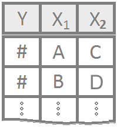
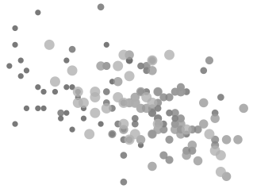

<!-- You can delete the following copyright statement if you wish: -->

::: {style="color:gray;"}
<!-- Code to change the following paragraphs to gray text -->

This page, and all pages of this notebook, are meant to be customized to
become a useful *Guide to Statistical Analysis* in R for your *current*
and *future* self.

::: {style="font-size:.8em;"}
<!-- Code to shrink font-size of following paragraph -->

To begin customizing,
[download](https://github.com/saundersg/Statistics-Notebook) your own
copy of the book [(if you haven't already)]{style="font-size:.8em;"}.
Please note the [GNU General Public
License](https://choosealicense.com/licenses/gpl-3.0/) when downloading.
You are free to delete this commentary in your own copy of the notebook.
:::

<!-- Ends smaller font-size section -->
:::

<!-- End gray text section -->

<!-- End of download and copyright instructions. -->

## Table of Contents

<!-- This is how to comment text out. You can comment out the above instructions if you wish. Comments allow the text to remain in the Rmd file, but not be displayed in the html file. -->

##  {.tabset .tabset-fade}

### Hide

### Show Notes

<!-- This is a great place to add general notes, then "Knit" the file to have your notes show up in your Statistics-Notebook. --------------- -->

Wow! I typed some words. Some [blue words]{style="color:blue;"}, some
[highlighted words]{style="background-color:yellow;"}, some [big
words]{style="font-size:2em;"}.

Make a link to a meaningful page of the Statistics-Notebook:
[Customization Help](RMarkdownHints.html) \<- Read through this page!

Or to a page on the internet: [R
Colors](http://www.stat.columbia.edu/~tzheng/files/Rcolor.pdf)

```{r}
mean(airquality$Temp)
```

Notes Here
................
```
 CO2.chilled = subset(CO2, CO2$Treatment == "chilled")
 t.test(CO2.chilled.250.q$uptake, CO2.chilled.250.m$uptake, alternative = "two.sided")
 datatable(Friendly, options=list(lengthMenu = c(3,10,30)))
 pander(wilcox.test(SFR$correct, Before$correct, paired = FALSE, alternative = "two.sided"))
```

```         
barplot(table(month.name[airquality$Wind])
```

```         
> data(airquality) > filtered_data <- airquality[airquality$Wind >= 8 & airquality$Wind <= 10, ]

> daily_avg_wind <- tapply(filtered_data$Wind, list(filtered_data$Day), mean, na.rm = TRUE)

> num_days_between_8_and_10_mph <- sum(daily_avg_wind >= 8 & daily_avg_wind <= 10, na.rm = TRUE)

> print(paste("Number of days with daily average wind speeds between 8 and 10 mph:", num_days_between_8_and_10_mph)) [1] "Number of days with daily average wind speeds between 8 and 10 mph: 25"
```

```
px.scatter(data,  x="sepal_width", y="sepal_length", color = "species", hover_data=["species", "petal_width"], title = "The relationship between sepal width and sepal length")
```
```
fig = px.scatter(data,
    x="sepal_width", 
    y="sepal_length", 
    color = "species", 
    symbol = "species",
    hover_data=["species", "petal_width"], 
    title = "The relationship between sepal width and sepal length"
)

fig.update_layout(
    xaxis_title = "Sepal Width",
    yaxis_title = "Sepal Length",
    legend_title = "Species"
)
```
<!-- End your notes before here. ------------------------------------- -->

## 

------------------------------------------------------------------------

::: {.tooltipimage style="float:left;width:125px;" align="center"}
 [Y is a single
quantitative variable of interest. This would be like "heights" of
BYU-Idaho students.]{.tooltipimagetext}
:::

## One Quantitative Response Variable Y {.tabset .tabset-pills}

### Graphics

::: {style="padding-left:125px;color:lightgray;"}
<!-- Add your customizations in the area below: -->

Add your own notes about graphics to use for this type of data here.

<a href="GraphicalSummaries.html#histogram">

</a> <a href="GraphicalSummaries.html#dot-plots">

</a> <a href="GraphicalSummaries.html#boxplots">

</a>

<!--- End your notes before here.  ------------------>
:::

### Tests

::: {style="padding-left:125px;color:lightgray;"}
<!-- Add your customizations in the area below: -->

Add your own notes about appropriate inferential procedures for this
type of data here.

<!--- End of Add content area.  ------------------>
:::

# 

::: {style="clear:both;"}
:::

------------------------------------------------------------------------

::: {.tooltipimage style="float:left;width:125px;" align="center"}
 [Y is a single
quantitative variable of interest. This would be like "heights" of
BYU-Idaho students. X is a qualitative (categorical) variable of
interest like "gender" that has just two groups "A" and "B". So this
logo represents situtations where we would want to compare heights of
male (group A) and female (group B) students.]{.tooltipimagetext}
:::

## Quantitative Y \| Categorical X (2 Groups) {.tabset .tabset-pills}

### Graphics

::: {style="padding-left:125px;color:lightgray;"}
<!-- Add your customizations in the area below: -->

Add your own notes about graphics to use for this type of data here.

<a href="GraphicalSummaries.html#boxplots">

</a> <a href="GraphicalSummaries.html#dot-plots">

</a>

<!--- End of Add content area.  ------------------>
:::

### Tests

::: {style="padding-left:125px;color:lightgray;"}
<!-- Add your customizations in the area below: -->

<!--- End of Add content area.  ------------------>
:::

## 

::: {style="clear:both;"}
:::

------------------------------------------------------------------------

::: {.tooltipimage style="float:left;width:125px;" align="center"}
 [Y is a single
quantitative variable of interest, like "heights" of BYU-Idaho students.
X is a categorical (qualitative) variable like which Math 221 you took,
221A, 221B, or 221C. In other words, X has three or more groups. So
"Classrank" could be X, with groups "Freshman", "Sophomore", "Junior",
and "Senior".]{.tooltipimagetext}
:::

## Quantitative Y \| Categorical X (3+ Groups) {.tabset .tabset-pills}

### Graphics

::: {style="padding-left:125px;color:lightgray;"}
<!-- Add your customizations in the area below: -->

Add your own notes about graphics to use for this type of data here.

<a href="GraphicalSummaries.html#boxplots">

</a> <a href="GraphicalSummaries.html#dot-plots">

</a>

<!--- End of Add content area.  ------------------>
:::

### Tests

::: {style="padding-left:125px;color:lightgray;"}
<!-- Add your customizations in the area below: -->

Add your own notes about appropriate inferential procedures for this
type of data here.

<!--- End of Add content area.  ------------------>
:::

# 

::: {style="clear:both;"}
:::

------------------------------------------------------------------------

::: {.tooltipimage style="float:left;width:125px;" align="center"}
 [Y is a single
quantitative variable of interest, like "heights" of BYU-Idaho students.
X1 is a categorical (qualitative) variable like gender, with levels
"boy" and "girl." X2 is another categorical (qualitative) variable like
"Classrank" with levels "Freshman", "Sophomore", and "Junior". Of
course, both X1 and X2 can have as many levels as you want to work with,
but must have at least two levels each.]{.tooltipimagetext}
:::

## Quantitative Y \| Multiple Categorical X {.tabset .tabset-pills}

### Graphics

::: {style="padding-left:125px;color:lightgray;"}
<!-- Add your customizations in the area below: -->

Add your own notes about graphics to use for this type of data here.

<a href="GraphicalSummaries.html#boxplots">

</a> <a href="GraphicalSummaries.html#dot-plots">

</a>

<!--- End of Add content area.  ------------------>
:::

### Tests

::: {style="padding-left:125px;color:lightgray;"}
<!-- Add your customizations in the area below: -->

Add your own notes about appropriate inferential procedures for this
type of data here.

<!--- End of Add content area.  ------------------>
:::

# 

::: {style="clear:both;"}
:::

------------------------------------------------------------------------

::: {.tooltipimage style="float:left;width:125px;" align="center"}
 [Y is a single
quantitative variable of interest, like "height". X is another single
quantitative variable of interest, like "shoe-size". This would imply we
are using "shoe-size" (X) to explain "height" (Y).]{.tooltipimagetext}
:::

## Quantitative Y \| Quantitative X {.tabset .tabset-pills}

### Graphics

::: {style="padding-left:125px;color:lightgray;"}
<!-- Add your customizations in the area below: -->

Add your own notes about graphics to use for this type of data here.

<a href="GraphicalSummaries.html#scatterplots">

</a>

<!--- End of Add content area.  ------------------>
:::

### Tests

::: {style="padding-left:125px;color:lightgray;"}
<!-- Add your customizations in the area below: -->

Add your own notes about appropriate inferential procedures for this
type of data here.

<!--- End of Add content area.  ------------------>
:::

# 

::: {style="clear:both;"}
:::

------------------------------------------------------------------------

::: {.tooltipimage style="float:left;width:125px;" align="center"}
 [Y is a single
quantitative variable of interest, like height. While we could use an X1
of "shoe-size" to explain height, we might also want to use a second
x-variable, X2, like "gender" to help explain height. Further
x-variables could also be used.]{.tooltipimagetext}
:::

## Quantitative Y \| Multiple X {.tabset .tabset-pills}

### Graphics

::: {style="padding-left:125px;color:lightgray;"}
<!-- Add your customizations in the area below: -->

Add your own notes about graphics to use for this type of data here.

<a href="GraphicalSummaries.html#scatterplots">

</a>

<!--- End of Add content area.  ------------------>
:::

### Tests

::: {style="padding-left:125px;color:lightgray;"}
<!-- Add your customizations in the area below: -->

Add your own notes about appropriate inferential procedures for this
type of data here.

<!--- End of Add content area.  ------------------>
:::

# 

::: {style="clear:both;"}
:::

------------------------------------------------------------------------

::: {.tooltipimage style="float:left;width:125px;" align="center"}
 [Y is a single
categorical (qualitative) variable of interest where 1 (success) or 0
(failure) are the only possible values for Y. This would be like
"getting an A in Math 325" where 1 means you got an A and 0 means you
didn't. We might use an explanatory variable X of "height" to see if
taller students are more likely to get an A in Math 325 than shorter
students. (They aren't, if you were wondering.)]{.tooltipimagetext}
:::

## Binomial Y \| Quantitative X {.tabset .tabset-pills}

### Graphics

::: {style="padding-left:125px;color:lightgray;"}
<!-- Add your customizations in the area below: -->

Add your own notes about graphics to use for this type of data here.

<a href="GraphicalSummaries.html#scatterplots">

</a>

<!--- End of Add content area.  ------------------>
:::

### Tests

::: {style="padding-left:125px;color:lightgray;"}
<!-- Add your customizations in the area below: -->

Add your own notes about appropriate inferential procedures for this
type of data here.

<!--- End of Add content area.  ------------------>
:::

# 

::: {style="clear:both;"}
:::

------------------------------------------------------------------------

::: {.tooltipimage style="float:left;width:125px;" align="center"}
 [Y is a single
categorical (qualitative) variable of interest where 1 (success) or 0
(failure) are the only possible values for Y. This would be like
"getting an A in Math 325" where 1 means you got an A and 0 means you
didn't. We might use an explanatory variable X1 of "height" and a second
explanatory variable X2 of "gender" to try to predict whether or not a
student will get an A in Math 325.]{.tooltipimagetext}
:::

## Binomial Y \| Multiple X {.tabset .tabset-pills}

### Graphics

::: {style="padding-left:125px;color:lightgray;"}
<!-- Add your customizations in the area below: -->

Add your own notes about graphics to use for this type of data here.

<a href="GraphicalSummaries.html#scatterplots">

</a>

<!--- End of Add content area.  ------------------>
:::

### Tests

::: {style="padding-left:125px;color:lightgray;"}
<!-- Add your customizations in the area below: -->

Add your own notes about appropriate inferential procedures for this
type of data here.

<!--- End of Add content area.  ------------------>
:::

# 

::: {style="clear:both;"}
:::

------------------------------------------------------------------------

::: {.tooltipimage style="float:left;width:125px;" align="center"}
 [Y is a single
categorical variable of interest, like gender. X is another categorical
variable of interest, like "hair color". This type of data would help us
understand if men or women are more likely to have certain hair colors
than the other gender.]{.tooltipimagetext}
:::

## Categorical Y \| Categorical X {.tabset .tabset-pills}

### Graphics

::: {style="padding-left:125px;color:lightgray;"}
<!-- Add your customizations in the area below: -->

Add your own notes about graphics to use for this type of data here.

<a href="GraphicalSummaries.html#bar-charts">

</a>

<!--- End of Add content area.  ------------------>
:::

### Tests

::: {style="padding-left:125px;color:lightgray;"}
<!-- Add your customizations in the area below: -->

Add your own notes about appropriate inferential procedures for this
type of data here.

<!--- End of Add content area.  ------------------>
:::

# 

::: {style="clear:both;"}
:::

------------------------------------------------------------------------

<footer>

</footer>
